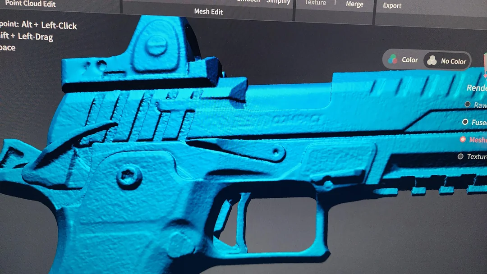
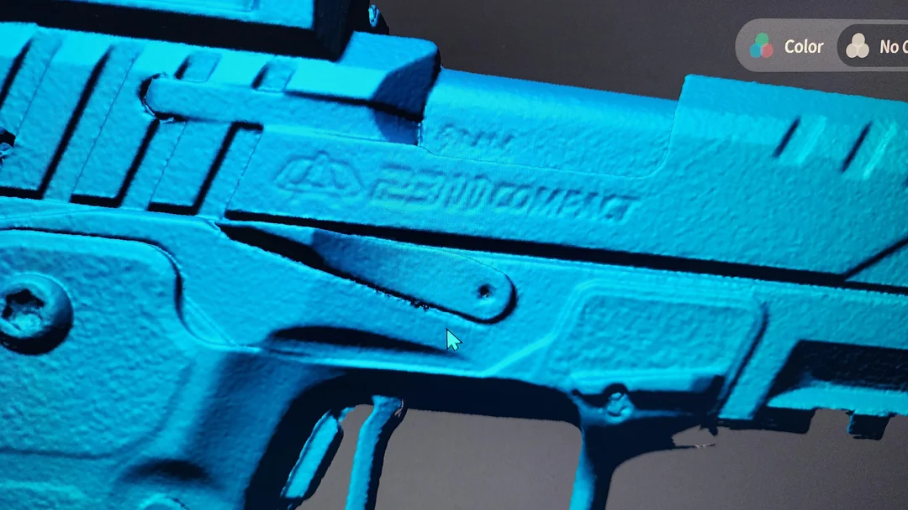
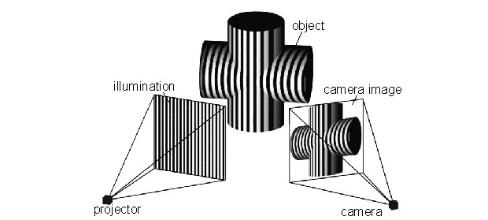

3D Scanner Assignment - Cutting Board (?)[[a]](<#cmnt1>)

Machine Name: Creality Raptor Pro 3D Scanner

Location: The Fab Lab

Version: v1.0

Last Updated: 03/27/2026

Responsible Student Worker: Aidan Stewart

Linked Operations Manual: [Fab Lab 3D Scanner Operations Manual](<../Operations & Safety Manuals/3D Scanner Operations Manual.md>)

Linked Safety Manual: [Praxis PS 3D Scanner Safety Manual](<../Operations & Safety Manuals/3D Scanner Safety Manual.md>)

Assignment: Understand the use cases of a 3D scanner and scan an object.

## Part 1 – When should I use 3D scanning?

## Understanding when a 3D scanner is the right tool for the job—and when it’s not—will save you time and effort.

## 3D scanning is best used in cases where metrology using manual instruments such as calipers, micrometers, or even Coordinate Measuring Machines (CMMs) becomes impractical — particularly when dealing with complex geometries, large volumes of measurement points, or freeform surfaces. 

## An important distinction between calipers and a 3D scanner is accuracy. While even cheap calipers can reliably perform with an accuracy of 0.0005” or 0.01mm”, the Creality Raptor Pro 3D scanner has been tested to produce 0.1–0.2mm accuracy in practical scanning settings. [Unpacking the 20 Micron Accuracy Claim - Creality Scan Raptor PRO](<https://www.google.com/url?q=https://www.youtube.com/watch?v%3DUYjavPonUaE&sa=D&source=editors&ust=1776804255913668&usg=AOvVaw3iFjcS5vHsD88FUx18adbK>) For many cases, accuracy this low is unusable.

Still, there are many cases in which precise geometric tolerance is not the goal. One job where 3D scanning excels is in freeform scanning. When measuring things like automotive body panels or objects with various angles, it can often be difficult or entirely impossible to determine measurements using calipers and protractors. In these cases, 3D scanning can be quite precise. [It’s Time To Put A 3D Scanner In Your Toolbox](<https://www.google.com/url?q=https://www.youtube.com/watch?v%3DrORuE8Oyxd0&sa=D&source=editors&ust=1776804255914246&usg=AOvVaw1cbGhSkPIl1iE_SyNMElHF>)

## Below is a simple tradeoff table between calipers and 3D scanners.

Criteria| Digital Calipers| 3D Scanner  
---|---|---  
Typical Accuracy| ±0.01 mm| ±0.05–0.2 mm (Hobby-class)  
Measurement Range| 0–150 mm (typical)| ~5 mm – several meters  
Cost| $$ ($20–$500)| $$$$ ($500–$10,000)  
Freeform-Capable?| No| Yes  
Contact Required?| Yes| No  
Speed| Moderate (one point at a time)| Fast capture; slow post-processing  
Skill Required| Low–Moderate| Moderate–High  
Output| Single discrete measurements| Full 3D surface mesh  
Best For| Diameters, depths, steps, simple geometry| Organic shapes, reverse engineering, full-surface inspection  
Limitations| Cannot characterize curves or complex surfaces| Expensive; requires software; requires powerful computer; cannot measure hidden/internal features  
  
# Part 2 – Infrared vs. LASER

## The Creality Raptor Pro operates in three scanning modes: NIR (Near-Infrared) Structured Light, 7 Parallel Blue Laser Lines, and 22 Cross Blue Laser Lines. Understanding when to use each mode is important for getting a useful scan on your first attempt.

## Infrared (NIR) Structured Light works by projecting an invisible speckle pattern of infrared light onto the object. Two cameras observe how that pattern deforms across the surface, and the scanner reconstructs a 3D mesh from those deformations. Because the entire field of view is captured at once, NIR mode is fast — the Raptor Pro captures up to 3,580,000 measurements per second at 30 fps in this mode.

## Laser scanning works similarly: the scanner projects one or more lines of blue laser light across the object while cameras measure where the line bends or shifts. The Raptor Pro's blue lasers (405 nm wavelength) trace these lines across the part at up to 60 fps, building up a point cloud row by row.

## 

(Left) Scan using cross lines. (Right) Scan using Parallel lines.  
([https://www.reddit.com/r/3DScanning/comments/1knrtgo/metrox_cross_laser_vs_parallel/](<https://www.google.com/url?q=https://www.reddit.com/r/3DScanning/comments/1knrtgo/metrox_cross_laser_vs_parallel/&sa=D&source=editors&ust=1776804255921666&usg=AOvVaw0yh2qq59TaEG_rLQxEA_vR>))

## 

Structured Light 3D Scanning 

([https://bitfab.io/blog/3d-scanning-with-structured-light/](<https://www.google.com/url?q=https://bitfab.io/blog/3d-scanning-with-structured-light/&sa=D&source=editors&ust=1776804255922094&usg=AOvVaw0MUK9eqET9POdB85AOL6sz>))

Note: Both modes use structured light — they project a known pattern and measure its deformation. The difference is the light source: NIR uses a broadband infrared projector casting a dot/speckle pattern, while the laser modes use coherent blue laser diodes casting precise lines.

For your convenience, I have created yet another tradeoff table to help you easily compare these modes.

* * *

Criteria| NIR Structured Light| 7 Parallel Laser Lines| 22 Cross Laser Lines  
---|---|---|---  
Pattern shape| Dot/speckle field| 7 parallel lines| 22 crossed lines (grid)  
Advertised accuracy| 0.075 mm| 0.02 mm| 0.02 mm  
Real-world accuracy (user-reported)| ~0.1–0.2 mm in practice [Unpacking the 20 Micron Accuracy Claim - Creality Scan Raptor PRO](<https://www.google.com/url?q=https://www.youtube.com/watch?v%3DUYjavPonUaE&sa=D&source=editors&ust=1776804255924905&usg=AOvVaw3pqb_XDxiPkvS2pmuf8CF8>)| ~0.04–0.1 mm under good conditions ([Hackster.io](<https://www.google.com/url?q=https://www.hackster.io/news/the-maker-s-toolbox-creality-raptor-pro-3d-scanner-review-b3dfd160afa9&sa=D&source=editors&ust=1776804255925331&usg=AOvVaw34QkC3EhB746s-KChZKY5m>))| ~0.04–0.1 mm under good conditions[ ](<https://www.google.com/url?q=https://www.hackster.io/news/the-maker-s-toolbox-creality-raptor-pro-3d-scanner-review-b3dfd160afa9&sa=D&source=editors&ust=1776804255925659&usg=AOvVaw0CCSan_q8YLjjfChsdVoao>)([Hackster.io](<https://www.google.com/url?q=https://www.hackster.io/news/the-maker-s-toolbox-creality-raptor-pro-3d-scanner-review-b3dfd160afa9&sa=D&source=editors&ust=1776804255925803&usg=AOvVaw1X5yHYmG9fK6rdSrkHkFA3>))  
Single capture area| 630 × 550 mm| 397 × 290 mm| 397 × 290 mm  
Best object size| Medium–large| Small–medium| Medium–large  
Color texture capture?| Yes (24-bit)| No| No  
  
# Part 3 – Tracking Modes

The Raptor Pro supports three tracking modes in the Creality Scan software: Geometry, Texture, and Marker. Tracking mode determines how the scanner knows where it is in space relative to the object — it is a separate choice from your scanning light mode. Choosing the wrong tracking mode is one of the most common reasons a scan fails, so understanding each option is important.

## Geometry Mode

Geometry mode tracks by analyzing the shape of the object itself. The scanner identifies unique, irregular surface features — edges, curves, corners — and uses them as landmarks to navigate around the object.

Best for: Objects with complex, distinct 3D geometry — things with lots of varying angles, curves, protrusions, or recesses.

Limitations: Geometry mode struggles with objects that have regular, repetitive, or symmetrical shapes. A cube, cylinder, or flat panel looks nearly identical from every angle, so the scanner can lose its position or, worse, silently produce wildly incorrect geometry.

## Texture Mode

Texture mode tracks by analyzing the surface appearance of the object — its color patterns, markings, grain, or printed graphics — rather than its shape.

Best for: Objects with rich surface detail but limited geometric variation, such as decorated pottery, painted objects, fabrics, or artwork.

Limitations: Texture mode requires a visually distinct surface. Plain or uniform surfaces give the scanner nothing to lock onto. It also works best with the NIR (color-capable) mode since the infrared sensor captures surface color; blue laser modes have less success with texture tracking because blue light interacts poorly with certain surface colors.

## Marker Mode

Marker mode tracks using small reflective adhesive dots (reference markers) placed on or around the object. The scanner detects these precisely positioned circles and uses them as fixed reference points in 3D space.

Best for: Objects with smooth, plain, or geometrically regular surfaces where neither shape nor texture provides reliable features — as well as large objects (up to 4 meters) that require consistent tracking across long distances.

Key tips:

  * Use 6 mm markers for larger objects and 3 mm markers for smaller ones.
  * Place markers irregularly (not in a grid pattern) so the scanner can distinguish one region from another.
  * The scanner must see at least four markers at any given time to maintain tracking — denser placement means fewer gaps.
  * You do not need to put markers on very small objects. Instead, place a dense field of markers on the mat or table surface around the object.

Limitations: Applying and removing markers takes time. In laser mode, markers are required.

Important Distinction: Just because markers are required in laser mode doesn’t necessarily mean you need to apply markers to the object itself. You can place the supplied movable markers around and on top of objects and remove them in post-processing. Refer to the [Fab Lab 3D Scanner Operations Manual](<../Operations & Safety Manuals/3D Scanner Operations Manual.md>).

# Part 4 – The Assignment

Generate a model of the cutting board. Use [Fab Lab 3D Scanner Operations Manual](<../Operations & Safety Manuals/3D Scanner Operations Manual.md>) to guide you through the process.

Hint: You will need more than one scan to complete this assignment, which must then be aligned to create a single model. Pay attention to what tracking mode you use for each scan.

## Questions or Help

If you have questions or need assistance at any point, ask a Fab Lab staff member. Staff are always present during operating hours.

* * *

End of Assignment

## 

[[a]](<#cmnt_ref1>)Need to make a run to goodwill and see what I can find