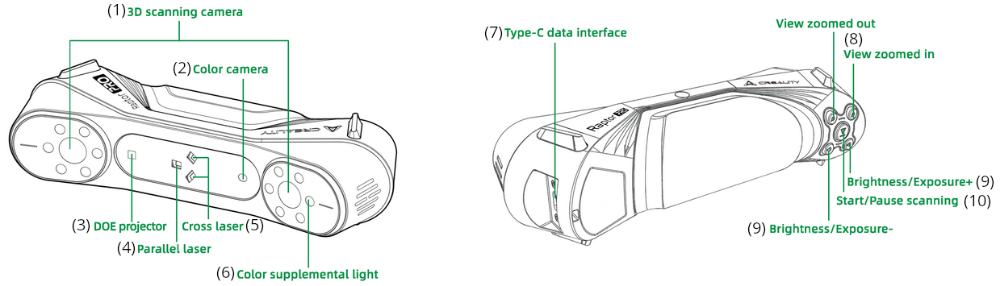
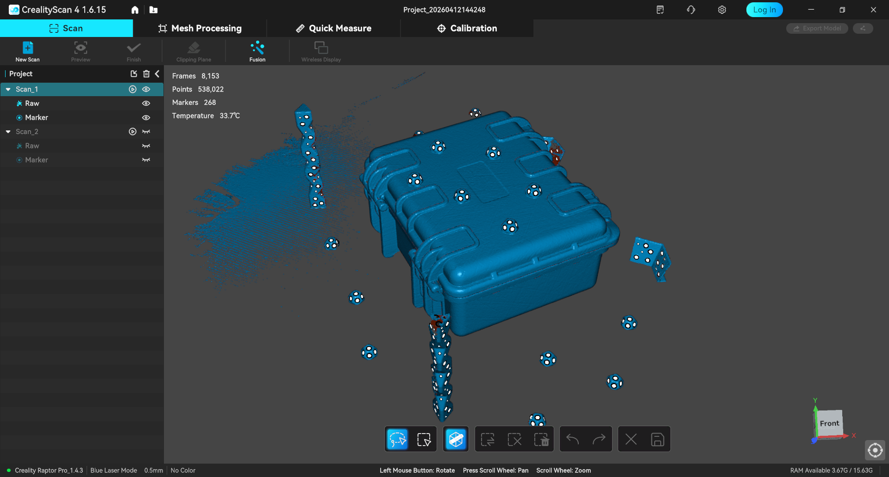
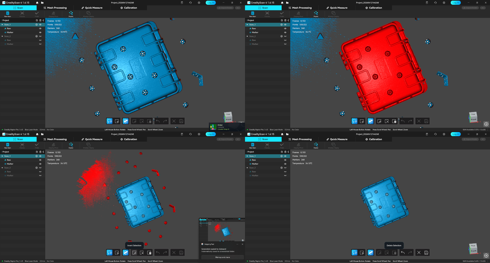

## What This Machine Is For

* Gathering point-cloud and photogrammetry data of real-world geometry
* Generating texture-mapped mesh models of an object(s) using gathered point-cloud data

## What This Machine Is Not For

* Real-time LiDAR/infrared scanning (for example, on an autonomous robot)
* Geometry or tolerances smaller than 0.1mm
* Laser pointer

## What You Need Before You Start

* A clear space to maneuver the scanner around the object
* The plane the object is resting on is not black, reflective, or transparent
* The object you’re scanning is not black, reflective, or transparent. If it is, refer to Section 8.
* You have an [adequately-powered](https://wiki.creality.com/en/3d-scanner/tutorials/general/performance) laptop or other computer next to the scanning area. Also be aware of the amount of disk space left on your computer. These files get decently large.

## Machine Overview

1. 3D Scanning Camera: The cameras used to capture geometric data
2. Color Camera: The cameras used to capture color textures to map to the scanned model
3. DOE Projector: Projects the structured infrared light pattern onto the object
4. Parallel Laser: Projects the parallel laser lines
5. Cross Laser: Projects the crossed laser lines
6. Color Supplemental Light: Illuminators for color camera (basically just flash)
7. Type-C Data Interface: Interface to the computer and power supply
8. View Zoom Out/In: Increase/decrease FOV on the scan preview window
9. Brightness/Exposure +/-: Manual adjustment of scanning camera’s brightness
10.  Works equivalently to the start/pause scanning button in CrealityScan

## Basic Operating Workflow

> [!Note]
> For additional reference, please refer to the Raptor Pro’s [user manual](https://wiki.creality.com/en/3d-scanner/raptorpro/manual).

> [!Caution]
> When handling the scanner, take extreme care. Avoid smudging the glass. If you do, please clean it off with the included microfiber rag.

### Start-Up

1. Slide the American wall plug adapter into the DC power supply.
2. Insert the USB Type-C port into the Type-C Data Interface (7) and hand-tighten the screws.
3. Connect the female and male ends of the DC power supply cable together.
4. Plug the USB Type-A data cable into a USB 3.0 port on your computer.
5. Plug the DC power supply into a standard 110V wall outlet.
6. Start the CrealityScan 4 software. Once you get past whatever popups and dialogues, it should say “Scanner Connected” at the top left.

### Running a Job

1. In CrealityScan 4, click “New Project”, and complete the dialogue.
2. At the top center of the screen, enter the Calibration tab. Follow the on-screen instructions to complete calibration. You really only need to perform calibration once.
3. Once calibration is complete, go back to the scan tab.
4. Choose your desired mode—blue laser or infrared. If you’re unsure, hover over the “🛈” tooltips for more information.
5. Customize the additional settings in the sidebar to your needs. If you’re using markers, I recommend doing a “Global Markers” scan first. It seems to do a better job of detecting markers than the actual scan modes, and having all the markers mapped before scanning will make scanning a much easier process.
6. Click “Preview”, or click the center button on the scanner.
7. Get an idea of how far you need to be from the target object. The colored sidebar will help you out here, though it can get confused.
8. Click “Start” to begin scanning. Watch as the point cloud is populated in real-time, and perform your scan as necessary. Keep in mind that while you scan, the point cloud is loaded to RAM. The number of points you can scan (and post-process later on) is limited by your available RAM. If you need to split the object up into multiple scans, you can store multiple scans in the same project and use CrealityScan to automatically align the scans together.

### End-of-Job / Shutdown

1. When you’re done scanning, click “Finish”. 
2. To run post-processing on your scans, enter the “Mesh Processing” tab. You can manually edit and delete areas of the mesh, and you can use automatic tools for smoothing, simplifying, and fixing your mesh. Refer to Section 9.
3. Close the file, close CrealityScan, and unplug all the cables you put together in 5.1.

## User Responsibilities After Use

After using this machine, you must:

* Ensure the lens is clean
* Place all items from the box as you found it. If something seems wrong, please ask Fab Lab staff. If there’s not many marker stickers left in the kit, let the lab assistant know.

## Stop Conditions

Stop immediately and notify Fab Lab staff if:

* You drop, hit, or otherwise damage the 3D scanner
* You are unsure how to proceed

> [!Caution]
> Do not attempt to troubleshoot major issues yourself.

## Common Issues & What To Do

* Issue: CrealityScan crashes, freezes, or your scanner loses connection  
  * Action: Unless something looks seriously wrong, it happens. Close CrealityScan, unplug and replug the scanner, and start CrealityScan again.
* Issue: Problems keeping the scanner from losing track  
  * Action: Change your tracking mode to a more effective method. Use the “🛈” tooltips to help decide. If you’re still having issues, consider adding more markers and possibly switching to marker-based tracking. Otherwise, ensure you aren’t trying to scan a black, reflective, or transparent item. If so, you may need to apply a coat of scanning spray to the item.
* Issue: Object being scanned has black, transparent, or reflective features.  
  * Action: Take your object to the sink, thoroughly shake the scanning spray to mix it, and apply a coat of spray to the scanning surface. Don’t over-apply—only once it completely evaporates will you suddenly see the effect of the scanning spray. The spray is simply a mixture of isopropanol and talcum powder.

## Post-Processing

Depending on your use case, post-processing may be the bulk of your work. For specialized, high-power GUI-based post-processing, the following software are great choices.

* [MeshLab](https://www.meshlab.net/) (Free and Open Source)
* [Blender](https://www.blender.org/) (Free and Open Source)
* [CloudCompare](https://www.cloudcompare.org/) (Free and Open Source)
* [Autodesk Meshmixer](<https://meshmixer.org/>) (Free, Proprietary) (⚠️ Depreciated since 2023) (Linked website is unofficial)

Luckily, CrealityScan provides some decent post-processing tools directly in the application. To get started, after finishing your scan(s), return to the project’s main page.

Use the editing toolbar to remove excess data points. [Shift] [LMB] selects, while [CTRL] [LMB] deselects. 

Tip for removing most excess data:

1. Enable “Penetrate Selection” in the toolbar.
2. Switch to orthographic view by right-clicking anywhere in the viewport.
3. Position camera above the model and use the lasso tool to select only the model.
4. Click the “Invert Selection” tool.
5. Click the “Delete Selection” tool.
6. Click “Save Edit”.

To process the scanned data into a mesh, use the “Fusion” tool. Once processed, again ensure there’s no excess geometry. You can now remove the reusable markers from your object.

To perform advanced post-processing on an object, switch to the “Mesh Processing” tab.

## External Resources

For more detailed information, refer to:

* The Raptor Pro’s [user manual](https://wiki.creality.com/en/3d-scanner/raptorpro/manual) (Creality Wiki)
