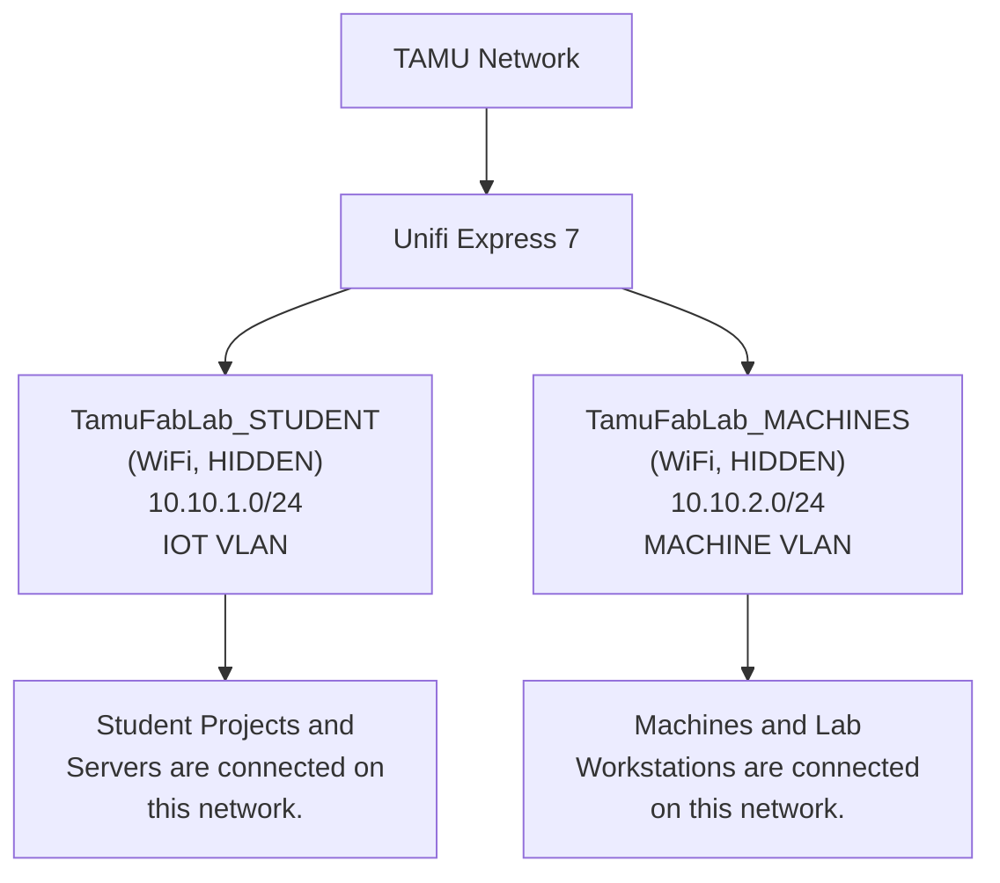

# Fab Lab Network Diagram Simplified

```mermaid
graph TD
    A["TAMU Network"] --> B["Unifi Express 7"]
    
    B --> C["TamuFabLab_STUDENT<br>(WiFi, HIDDEN)<br>10.10.1.0/24<br>IOT VLAN"]
    B --> D["TamuFabLab_MACHINES<br>(WiFi, HIDDEN)<br>10.10.2.0/24<br>MACHINE VLAN"]
    
    C --> E["Student Projects and<br>Servers are connected on<br>this network."]
    D --> F["Machines and Lab<br>Workstations are connected<br>on this network."]
```
