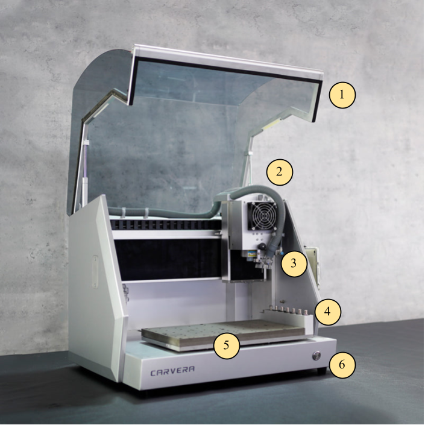
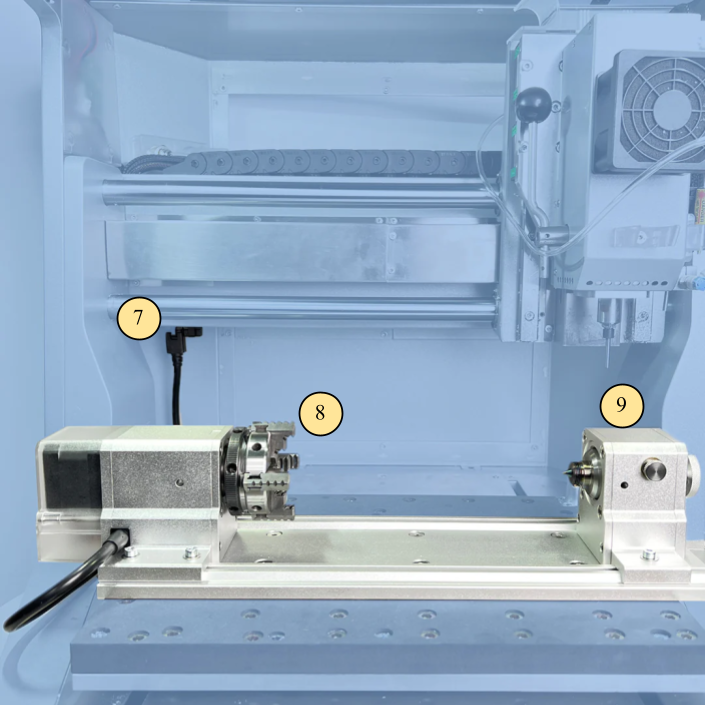
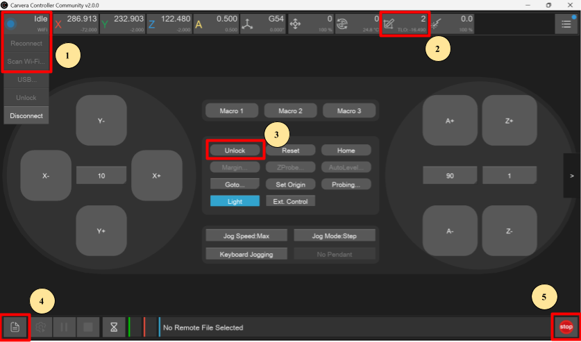

Carvera Desktop CNC Operations Manual

Machine Name: Carvera Desktop CNC

Location: The Fab Lab

Version: v1.0

Last Updated: 4/12/2026

Responsible Student Worker: Marcus Gou, Aidan Stewart

Linked Safety Manual: [Carvera Safety Manual](<Carvera CNC Safety Manual.md>)

## 1\. What This Machine Is For

Use this machine to:

  * Manufacture detailed parts from materials like wood, hard plastic, and soft metals (aluminum, brass).
  * Laser-engrave wood and metal.
  * Create complex geometric shapes using an optional 4th working axis.

## 2\. What This Machine Is Not For

Do not use this machine for:

  * Milling non-[approved materials](<Carvera CNC Safety Manual.md>), such as brittle or fibrous materials. (See safety manual)
  * Manufacturing weapons or weapon-related parts.

* * *

## 

## 3\. What You Need Before You Start

Before operating this machine, ensure:

  * A staff member is present to oversee the operation.
  * The official [Carvera Controller](<https://www.google.com/url?q=https://www.makera.com/pages/software?srsltid%3DAfmBOopYrxCJkp2wXwCbCo3Hq-QcPHN4HuxP3J_t0dqukzCa-3SaOKns&sa=D&source=editors&ust=1776804214528675&usg=AOvVaw1IVk_2U5bTjO0TW0OA3NB->) software or the [Carvera Community Controller](<https://www.google.com/url?q=https://github.com/Carvera-Community/Carvera_Controller/releases/tag/v2.0.0&sa=D&source=editors&ust=1776804214528924&usg=AOvVaw1iFUhhEtMNDM-Gq8jji9cZ>) is installed.
  * The G-code file for the job has been saved using the post processing function in Fusion360

  * See the CAM Guide document [[a]](<#cmnt1>)for necessary Fusion360 plugins and settings to run the machine correctly.

  * Proper PPE is worn:

  * (Required) Laser goggles during laser use.
  * (Optional) Gloves for handling sharp metal edges.
  * (Optional) Safety glasses during filing, sanding, cutting, and snapping.

## 4\. Machine Overview

1| Protective Cover| | 6| Indicator Light  
---|---|---|---|---  
2| Vacuum Hose| | 7| 4th Axis Connector  
3| Spindle & Laser| | 8| Chuck  
4| Tool Holder| | 9| Tail Stock  
5| MDF Bed| | |   
  

Key interaction points:

1| Use the “Scan Wifi” or “Reconnect” to connect to the Carvera.  
---|---  
2| The Tool Status dropdown can be used to drop or change tools.  
3| Unlock is used to release the Carvera from Emergency Stop mode.  
4| The File Upload button is used to import G-code and start a job.  
5| Emergency Stop UI button.  
  
* * *

## 

## 5\. Basic Operating Workflow

### 5.1 Start-Up

  1. Locate the power switch at the back-right of the machine, and turn it on.
  2. (Optional) If the 4th-axis is needed, attach the 4th-axis module to the bed of the Carvera and plug it in.
  3. Secure material to the bed (as planned in CAM beforehand). If a hole or a cut needs to be made through the part, please use an MDF waste board underneath to avoid damaging the bed. For the 4th axis, ensure that the stock material is properly aligned in the jaws.
  4. Connect to the TamuFabLab_MACHINES wifi, and connect to the Carvera using the Carvera Controller app.
  5. Use the Carvera Controller app to drop the current tool, if it has one. Ensure the correct tools are in the correct numbered slots, as defined in the CAM file. 
  6. Locate the emergency stop button and have it ready. 
  7. Run through the steps of the [Carvera Pre-Flight Checklist](<https://www.google.com/url?q=https://docs.google.com/spreadsheets/u/0/d/1ViTiqQyEoflTdvnngzUehGwnDOnr0iL4d97xEuyk8TQ/edit&sa=D&source=editors&ust=1776804214539616&usg=AOvVaw07tZsQTqF-x-tnSiqQpb49>).

### 5.2 Running a Job

  1. Using the Carvera Control software, upload the G-code for the job. Select the page icon in the bottom right corner, then upload and select the G-code file from your computer using the “upload and select” button.
  2. Inspect the path on the screen to ensure that the correct file was selected.
  3. Turn on the vacuum.[[b]](<#cmnt2>)
  4. Begin the job by clicking “run”.
  5. During operation, confirm that:

  * The machine is following the intended path and is not obstructed by the fixtures.
  * There is no excessive vibration in the tool or machine.
  * The cutting process is producing evenly sized chips.
  * The vacuum is cleaning the working area as material is removed.
  * No unusual noises are made during the cutting process.

If there are any abnormalities, hit the emergency stop button immediately.

* * *

### 

### 5.3 End-of-Job / Shutdown

  1. After the job is completed and the Carvera has stopped all movement, leave the machine on in order to use the lights and vacuum.
  2. User cleanup: 

  1. To use the external vacuum, keep it connected to the back of the machine. Simply disconnect the hose from the shield, and use this hose to vacuum all debris.
  2. To use the internal vacuum, disconnect the vacuum hose from the shield, turn on the fan using the command M811 S100, and vacuum all debris. When done, use the command M812 to turn off the fan and vacuum. 

  3. Remove the fixtures from the part and return them to their storage. Retrieve your finished part. Return the optional MDF waste board to its storage area if it can be used again.
  4. Place the tools used in this project into their respective containers. If there is still a tool in the spindle, use the “drop tool” function in the Carvera Control software to have the machine place the tool in its slot.
  5. Ensure the wireless probe is in its charging station.
  6. Power down the machine using the power switch behind the machine.

## 6\. User Responsibilities After Use

After using this machine, you are responsible for:

  * Cleaning: Vacuum all debris inside the machine, and empty the dust collector after all cleaning is complete.
  * Tools and Materials: return all mounting jigs and cutting tools to their respective storage containers, or to the staff. Store any excess material if it can be processed to a workable size.
  * Reporting any concerns to staff.

## 7\. Stop Conditions

Stop immediately and notify Prototyping Studio staff if:

  * Cutting or vibration is causing unusual noises.
  * There is smoke, sparks, or odor.
  * The machine is not following the intended toolpath.
  * A tool breaks during the cutting process.

Do not attempt to troubleshoot major issues yourself.

* * *

## 

## 8\. Common Issues & What To Do

  * Issue: The machine does not follow the intended path, such as being above or to the side of the working material.  
Action: Check the “work origin” of the CAM file and ensure this matches the Carvera’s work origin. The X and Y axes are defined by the Carvera’s axes. The Z axis is found at the beginning of each job by probing the height of the material, so Z=0 is the top of the stock.
  * Issue: The machine is on but unresponsive. It does not move with the control app.  
Action: Check that the control app is connected to the machine and reconnect if needed. Check the run light. If it is red, the machine has been emergency-stopped, and must be “released” via the control app. 

## 9\. External Resources

For more detailed information, refer to:

  * Tool specifications can be found on the manufacturer website or store page.

  * Look for RPM, feed, depth of cut guidelines for the part’s material.

  * [Carvera Wiki](<https://www.google.com/url?q=https://wiki.makera.com/en/home&sa=D&source=editors&ust=1776804214547151&usg=AOvVaw1eFiI615IHRMiwlZJAWvZ5>)
  * [Carvera How To’s](<https://www.google.com/url?q=https://youtube.com/playlist?list%3DPL7zu0ucQCuYRTigCJ4nqRrI0TIhcHHbZl%26si%3DFbT3WNqS-km4SQr_&sa=D&source=editors&ust=1776804214547342&usg=AOvVaw30T5qNKnB50iXNMDwRsfqd>) YouTube Playlist
  * Carvera discord

## 10\. Questions or Help

If you have questions or need assistance at any point, ask a Fab Lab staff member. Staff are always present during operating hours.

* * *

End of Operations Manual

[[a]](<#cmnt_ref1>)make this

[[b]](<#cmnt_ref2>)Once we have the vacuum, show how to do this in Machine Overview.