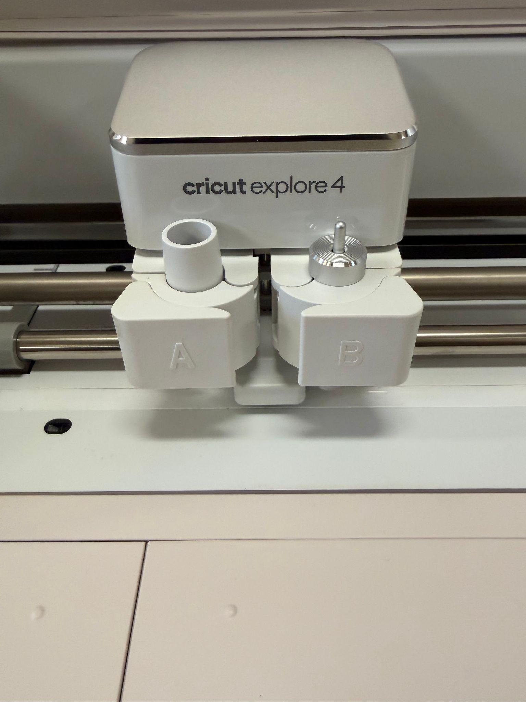
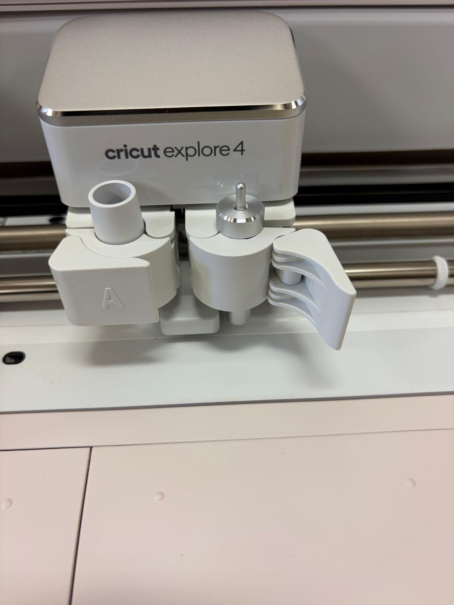

Cricut Explore 4 Assignment 

Machine Name: Cricut Smart Cutting Machine | Explore 4 

Location: The Fab Lab

Version: v1.0

Last Updated: 3/3/26

Responsible Student Worker: Priyanka Naphade

Linked Operations Manual: [[a]](<#cmnt1>)[Operations Manuel](<../Operations & Safety Manuals/The Fab Lab Cricut Operations Manual.md>)

Objective: Cut a sticker

  1. Set up design space 

        Go to [Cricut Design Space](<https://www.google.com/url?q=https://design.cricut.com/?referrer%3Dhttps%253A%252F%252Fwww.google.com%252F%26visitorId%3D4fb264f8-804f-4cde-a08a-6768973df652%26deepLinkGuid%3Dd9460574-036f-4575-b553-6d04e986ecf6&sa=D&source=editors&ust=1776804298665948&usg=AOvVaw2rwtHwJJA08qXOrsUSfFOr>) and follow the prompts from the website and the [operation manual ](<../Operations & Safety Manuals/The Fab Lab Cricut Operations Manual.md>)to Design Space. 

  2. Create a design 

Open Design Space and select new project

Next select vinyl decal from the drop down menu 

Then select the size for a mug and click create 

Go to shapes, on the side bar and select a star 

Press make 

Click save when it prompts you 

Select on mat when prompted (if using smart materials you do not have to use the mat, you’d do all the steps listed except put it on a mat, but for this exercise even if you are using smart materials just so you know how to use the mat.) 

Select 12 x 12 when asked for size 

Take the mat and peel the plastic backing off and put it in a safe place you will need to put the backing back onto the mat later. Put the vinyl onto the mat and make sure that where the star is placed on the design space has enough vinyl on the mat. If not move the star on the mat to a corresponding place on design space where there is enough space. 

Click continue 

  3. Set up the cricut 

Power on the cricut and place the mat up to the first row of rollers. Hold the load button while keeping the mat secure, when the rollers grip the mat let go of the mat. 

Follow the prompts on the design space to make sure the cricut is ready to cut. 

When you are asked to load the blade open the B chamber and place the blade, if the blade is already inserted open and close the chamber without moving anything 

|   
---|---  
  
                         

Select the appropriate material in the drop down menu. 

[[b]](<#cmnt2>)[[c]](<#cmnt3>)

  4. Start the Cut 

When the play button starts flashing press on it, the machine should start cutting. 

After the cut press the unload button and remove the decal from the mat and peel off the vinyl material. Put the plastic backing back onto the mat. 

[[d]](<#cmnt4>)[[e]](<#cmnt5>)

  5. Clean Up

Turn the cricut off and follow the instructions in the [operation manual ](<../Operations & Safety Manuals/The Fab Lab Cricut Operations Manual.md>)to clean up and turn off the machine. [[f]](<#cmnt6>)[[g]](<#cmnt7>)

[[a]](<#cmnt_ref1>)fix links

[[b]](<#cmnt_ref2>)formatting

[[c]](<#cmnt_ref3>)and add link if operation manual is mentioned

[[d]](<#cmnt_ref4>)formatting

[[e]](<#cmnt_ref5>)and add link if operation manual is mentioned

[[f]](<#cmnt_ref6>)formatting

[[g]](<#cmnt_ref7>)and add link if operation manual is mentioned