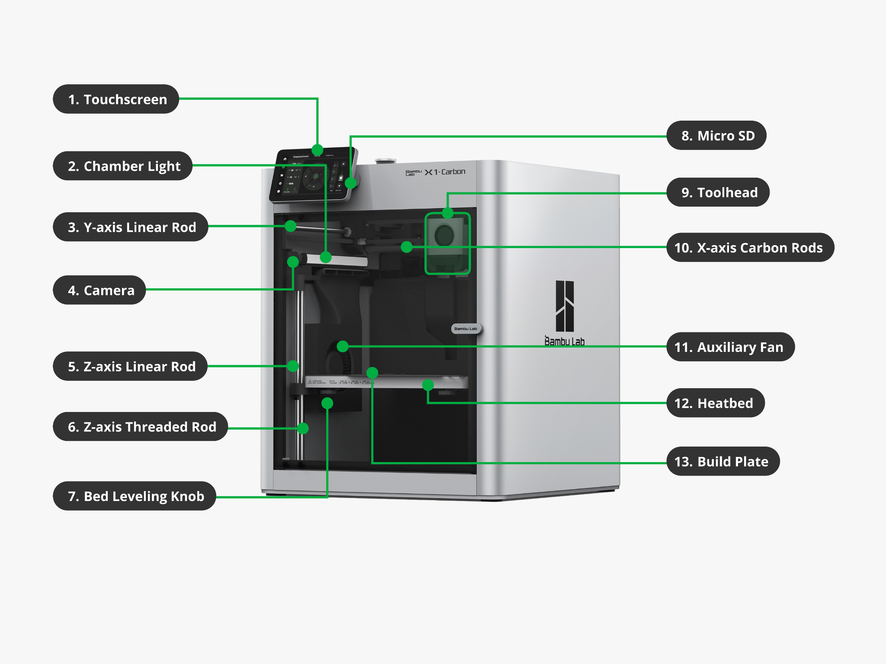
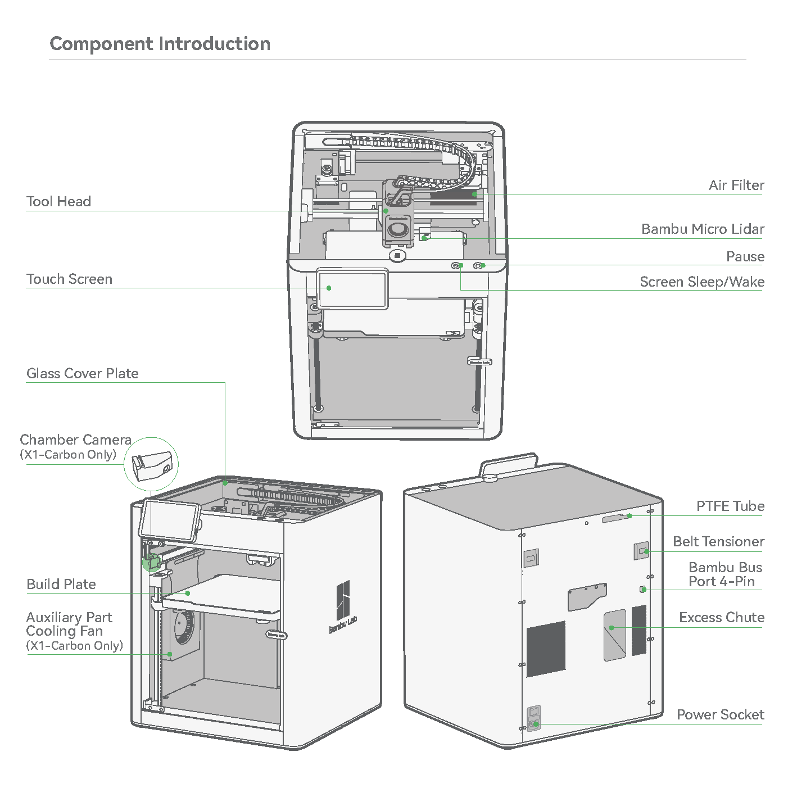
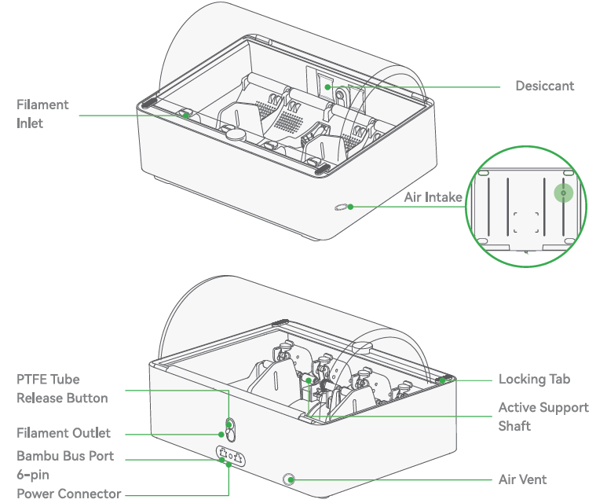

Bambu Lab X1C 3D Printer Operations Manual

Machine Name: Bambu Lab X1 Carbon (X1C) 3D Printer

Location: The Fab Lab

Version: v1.0

Last Updated: 3/12/26

Responsible Student Worker: Aidan Spira

Linked Safety Manual: [Link Here](<Bambu Lab X1C 3D Printer Safety Manual.md>)

## 1\. What This Machine Is For

Use this machine to:

  * 3D print plastic parts using plastic filament
  * Produce prototypes and functional parts
  * Fabricate mechanical components, models, small scale production
  * Practicing lean prototyping methods

## 2\. What This Machine Is Not For

Do not use this machine for:

  * Printing metal or ceramic materials
  * Printing unapproved filament/materials
  * Modifying the printer
  * Printing inappropriate objects
  * Printing objects which may damage the machine
  * Producing food-grade & medical-grade components
  * Cooking using the various heated components

* * *

## 3\. What You Need Before You Start

Before operating this machine, ensure:

  * You have reviewed this manual & the safety manual
  * You have a 3D model file (STL, OBJ, 3MF, etc…)
  * Your desired material is approved for the printer
  * There are no active prints
  * The printer build plate is empty Refer to 5.4 section to remove material if previous print is complete
  * The printer build plate is clean (no oils from skin, etc…)

  * Glue should only be used on the smooth build plate, with staff approval

* * *

## 

## 4\. Machine Overview

DNT = Do Not Touch

### 4.1 First Diagram

  1. Touchscreen – User interface, used to control the printer, displays print status & AMS interface
  2. Chamber Light \- Illuminates build chamber, so that prints remain visible
  3. Y-Axis Linear Rod \- Provides smooth linear motion in Y-axis – DNT
  4. Camera – Internal Camera for monitoring prints remotely – DNT
  5. Z-Axis Linear Rod – Provides smooth linear motion in Z-axis – DNT
  6. Z-Axis Threaded Rod – Drives smooth linear motion in Z-axis – DNT
  7. Bed Leveling Knob – Mechanical adjustment for calibration – DNT
  8. Micro SD Slot – Used to load print files directly to printer – DNT
  9. Toolhead – Contains the hotend, extruder, sensors, etc… that place filament during printing – DNT
  10. X-Axis Carbon Rods \- Provides smooth linear motion in X-axis – DNT
  11. Auxiliary Fan – cooling to improve the print quality for various materials – DNT
  12. Heatbed – Heated platform, helps prints adhere to the buildplate during printing – DNT
  13. Build Plate – Removable printing surface where the printed parts are formed upon

  * The Fab Lab has Dual-Sided Textured PEI Plates, used for typical printing (PETG, PLA)
  * The Fab Lab also has an Engineering/Cool side plate, only use for certain materials (TPU, PC, etc…)

### 4.2 Second Diagram

  * Toolhead – Contains the hotend, extruder, sensors, etc… that place filament during printing – DNT
  * Touchscreen – User interface, used to control the printer, displays print status
  * Glass Cover Plate – Transparent top enclosure panel that allows visibility to inside the printer while helping maintain internal temperatures and block objects from entering
  * Chamber Camera – Internal Camera for monitoring prints remotely – DNT
  * Build Plate – Removable printing surface where the printed parts are formed upon
  * Auxiliary Part Cooling Fan – cooling to improve the print quality for various materials – DNT
  * Air Filter (Activated Carbon) – Helps reduce odor and particles from entering the external area’s air – DNT
  * Bambu Micro Lidar – Sensor system used for automatic calibration and first layer inspections – DNT
  * Pause Button – Allows the user to pause the print during operation
  * Screen Sleep/Wake Button – Wakes or puts the touchscreen into sleep mode
  * PTFE Tube – Guides filament from the spool or AMS into the toolhead – DNT
  * Belt Tensioner – Used to adjust belt tension to maintain accurate movement of the printer axes – DNT
  * Bambu Bus Port (4-Pin) – Expansion port used for connecting compatible accessories – DNT
  * Excess Chute – Channel that directs purged filament “poops” from the print area – DNT
  * Power Socket – Connection point for the printer’s main power cable – DNT

* * *

### 4.3 AMS Diagram

  * Desiccant – Moisture absorbing packets, reduce humidity protecting filament – DNT old ones, feel free to add additional packets from new rolls if not in the way of the machine
  * Filament Inlet – Where filament from each slot enters the system, push slightly and insert filament and it will be automatically spooled in
  * Air Inlet – Air inlet port – DNT
  * Locking Tab(s) – Hold the cover down, ensuring moisture and outside things do not enter, please ensure they are locked during operation of the device. Open to change filaments
  * Active Support Shaft – Supports filament rolls and loading operations – DNT
  * Air Vent – Air outlet port – DNT
  * PTFE Tube Release Button – Allows for releasing of the main filament tube to the printer – DNT
  * Filament Outlet – The main filament tube to the printer, is the ‘loaded’ filament – DNT
  * Bambu Bus Port (6-Pin) – Allows data betwixt AMS & Printer to be shared – DNT
  * Power Connector – Allows Printer to power the AMS, no extra wall outlets used – DNT

* * *

## 

## 5\. Basic Operating Workflow

### 5.1 Start-Up

  1. Ensure the device is not in use, or about to be in use by someone else
  2. Ensure the printer is on, if not turn it to own using the rear power switch
  3. Wait for the touchscreen to initialize
  4. Confirm the printer is connected to the network
  5. Verify the desired filament is loaded

  1. To load filament, see the [Learning Assignment here](<../Learning Assignments/Bambu X1C 3D Printer Learning Assignment.md>)

### 5.2 Preparing a Print in Bambu Studio

  1. Open Bambu Studio on the Fab Lab computer
  2. Import your 3D Model desired to print
  3. Select the correct printer (Bambu X1 Carbon)
  4. Select the desired printer you will print on
  5. Select the desired filament loaded into the printer
  6. Adjust basic settings

  * Layer height for vertical quality
  * Infill percentage for strength
  * Supports for overhangs or small angles (< 45 deg)

  7. Click Slice – Review the sliced part

### 5.3 Running a Job

  1. Send the file by hitting “Print plate”
  2. Ensure the print transfers to the device
  3. Confirm the printer starts extruding filament after all the pre-print checks complete
  4. Watch the first few layers to ensure they start correctly
  5. Normal operation should show:

  1. Smooth filament lines
  2. No clumps
  3. No abnormal noises

  6. Check with a fab lab staff member prior to leaving and letting the print run

### 5.4 End-of-Job / Shutdown

  1. Ensure the print has fully finished
  2. Allow the build plate to cool completely (prevents warping)
  3. Remove part carefully, flex the build plate gently if needed
  4. Remove any leftover filament strands, place in trash
  5. Clean the build plate if needed
  6. Leave the area clean for the next user
  7. If you missed your print end and it is missing, check the finished print area

## 6\. User Responsibilities After Use

After using this machine, you are responsible for:

  * Removing all printed parts
  * Disposing of scrap filament
  * Cleaning the build plate if required
  * Reporting any issued to Fab Lab staff

## 7\. Stop Conditions

Stop immediately and notify The Fab Lab staff if:

  * The printer produces smoke
  * Parts detach from the build plate fully
  * The printer jams or grinds filament
  * Unsure how to proceed

Do not attempt to troubleshoot major issues yourself.

## 8\. Common Issues & What To Do

  * Issue: Print not sticking to the build plate  
Action: Cancel the print – clean the build plate, Raise build plate temperature, add brim
  * Issue: Filament not extruding  
Action: Pause print – Notify staff
  * Issue: Filament not extruding  
Action: Stop the print and review slicing settings
  * Issue: Filament breaks/snaps between print head and AMS   
Action: Pause print – Notify staff
  * Issue: Filament does not extrude correctly, nozzle clogged   
Action: Pause print – Notify staff to analyze & potentially do a cold pull. How to cold pull [here](<https://www.google.com/url?q=https://wiki.bambulab.com/en/p1/manual/p1s-cold-pull&sa=D&source=editors&ust=1776804145880273&usg=AOvVaw2VLtl_yYMu0AMRu5mpNIcX>)

## 9\. Approved Materials

  * PLA                         \-         Approved
  * PETG                         \-         Approved
  * TPU                        \-         Approved with staff assistance
  * ABS/ASA                 -        Staff confirmation required
  * Nylon, CF, filled        -        Not Approved

## 10. External Resources

For more detailed information, refer to:

  * [Bambu Lab X1 Carbon Manual](<https://www.google.com/url?q=https://wiki.bambulab.com/en/x1&sa=D&source=editors&ust=1776804145880882&usg=AOvVaw2NkYCECJkQSicFfGLP_QG7>)
  * [Bambu Studio Software](<https://www.google.com/url?q=https://bambulab.com/en/download&sa=D&source=editors&ust=1776804145880978&usg=AOvVaw0pTJwcTGL0jE79lrUl71dn>)
  * [Bambu Labs X1-Carbon 3D Printer for Dummies](<https://www.google.com/url?q=https://www.youtube.com/watch?v%3DYSRekzvNRFw&sa=D&source=editors&ust=1776804145881088&usg=AOvVaw1Hsb5Nn6N3eow_emNzpAiq>)

## 11\. Questions or Help

If you have questions or need assistance at any point, ask a Fab Lab staff member. Staff are always present during operating hours.

* * *

End of Operations Manual