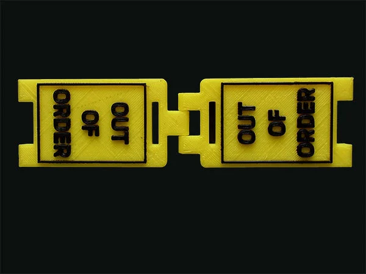
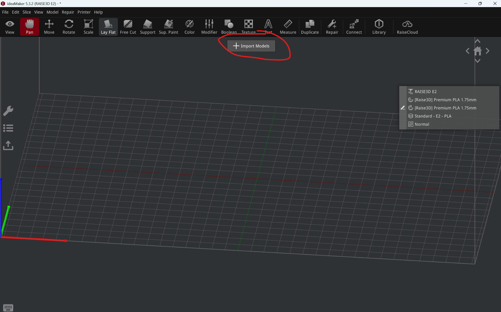
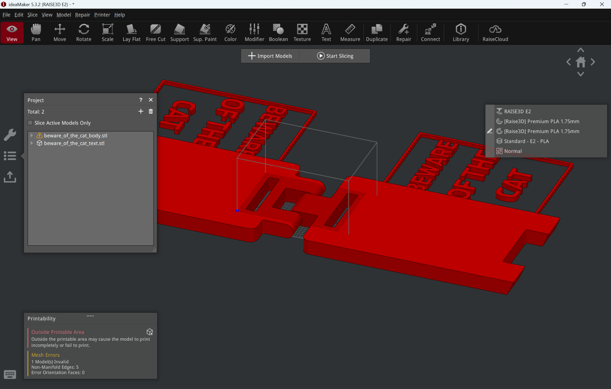
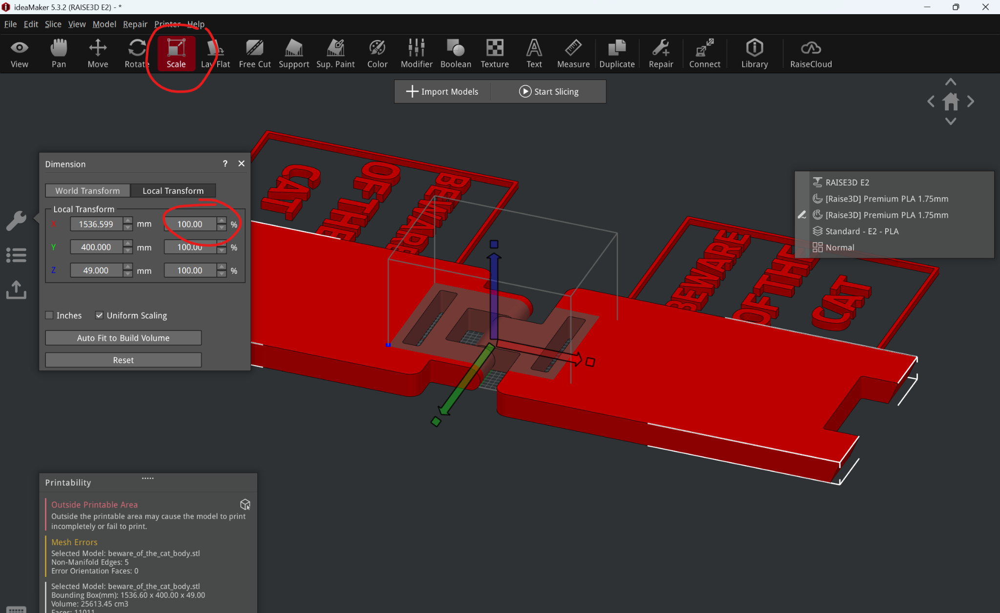
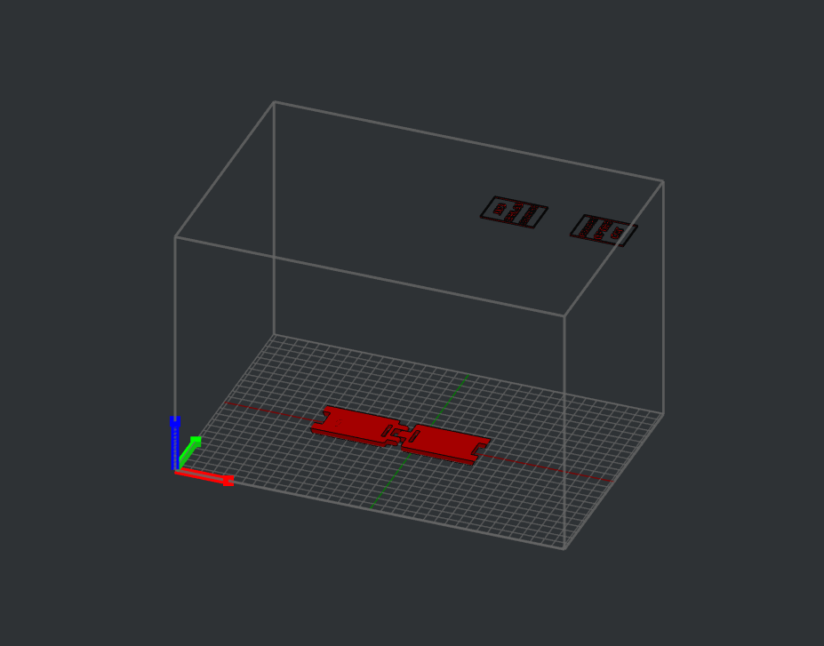
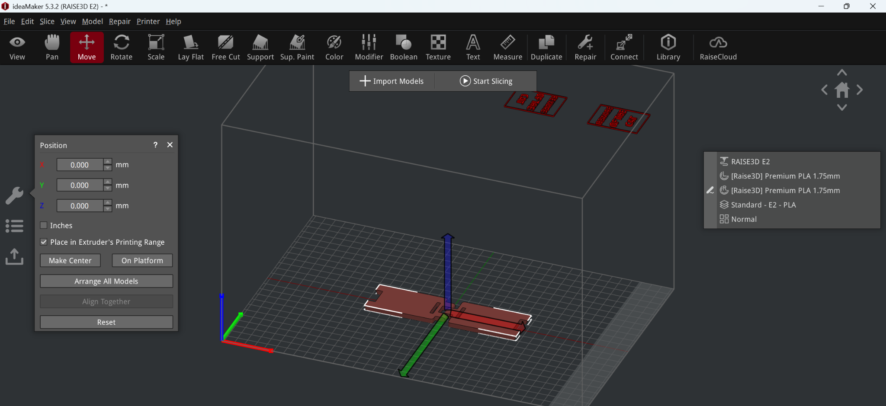
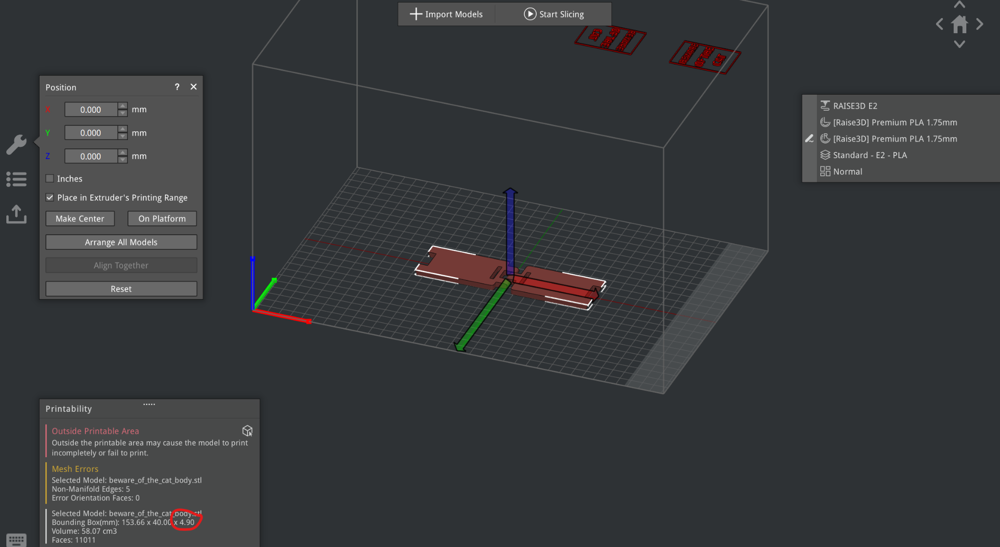
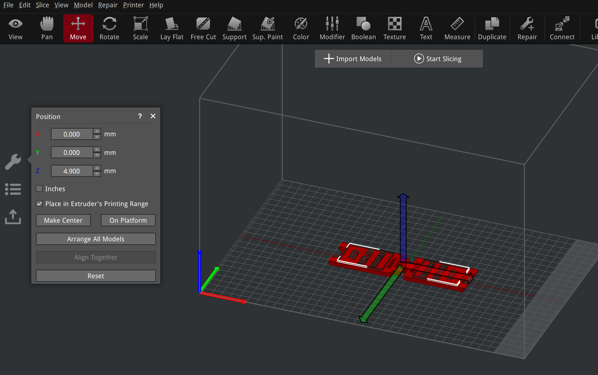
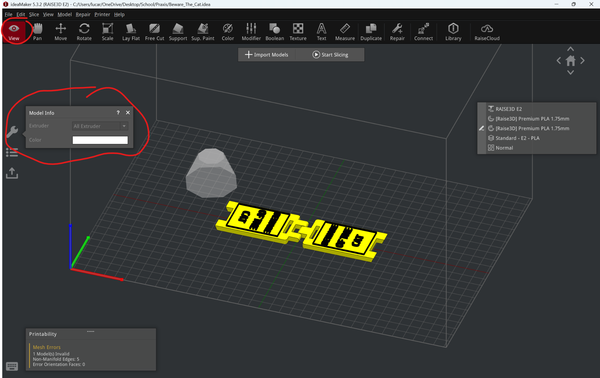

Raise3D E2 Dual Head 3D Printer Assignment

Machine Name: Raise3D E2

Location: The Fab Lab

Version: v1.0

Last Updated: 2/17/2026

Responsible Student Worker: Luca Nealon

Linked Safety Manual: [Raise3D E2 Printer Machine Safety Manual](<../Operations & Safety Manual/Raise3D E2 Printer Machine Safety Manual.md>)

Goal: 3D Print a Part with Two Colors

## 1\. Slicing with colors in IdeaMaker

To make a part with two colors, you need to have two separate files, one for each color. For example:

To make this desktop sign, we need an stl of the base, and an stl of the text independent of each other. When designing parts from scratch, you should keep this in mind, and design for this by ensuring both of the files you make have the same reference origin. You can verify this by placing both parts in an assembly and setting their position to (0,0,0). If the parts line up, then you’ve designed for multicolor printing correctly. 

However, you can also place the models in the correct position inside of IdeaMaker.

  1. Open the provided “beware_of_the_cat_body.stl” and “beware_of_the_cat_text.stl” files in Ideamaker

  2. Scale down the models. To ensure they remain proportional, use the % scaling rather than a specific dimension value.

With uniform scaling checked, scale the models down to 10% scale. You should arrive at the following.

  3. To line our models up, let us first place “beware_of_the_cat_body.stl” at the origin.

  4. Align the “beware_of_the_cat_text.stl” file.

If we select the “beware_of_the_cat_body.stl”, we can see the box dimensions.

Notice the “printability in the bottom left”, referencing the bounding box dimensions, we see the sign body is 4.9mm tall. Thus we will move our text to (0,0,4.9).

  
As shown above, the sign aligns perfectly now.

  5. To choose which extruder prints each part, select the view tool, then click the wrench on the left. When you click a part, you can choose if the left or right extruder will print it, and you can also select the color loaded in the extruder to ensure you’ve chosen correctly.

You will also see a ghost tow[[a]](<#cmnt1>)er appear. This is called a wipe tower, and it automatically appears for multicolor prints. The purpose of the tower is to have excessive filament ooze get wiped on a trash part instead of the actual filament. Wipe towers can be disabled in advanced slicer settings.

  6. Using the [Slicing in Ideamaker](<../Slicing in Ideamaker.md>) instructions, slice the model for PLA and print.

-Optional: You may print your own two color part instead of the sign, but do not use a design that takes over 4 hours to slice, and you must print in PLA.

  7. Analyze your print. Respond to each of the questions with 2-3 sentences.

-Did the print turn out how you expected?

-Are there any flaws in the print?

-What settings could you change to speed up the print time?

-What settings could you change to improve the print quality?

-What is a wipe tower? Do you think it is necessary for this print?

[[a]](<#cmnt_ref1>)check if ooze can get wiped on infill