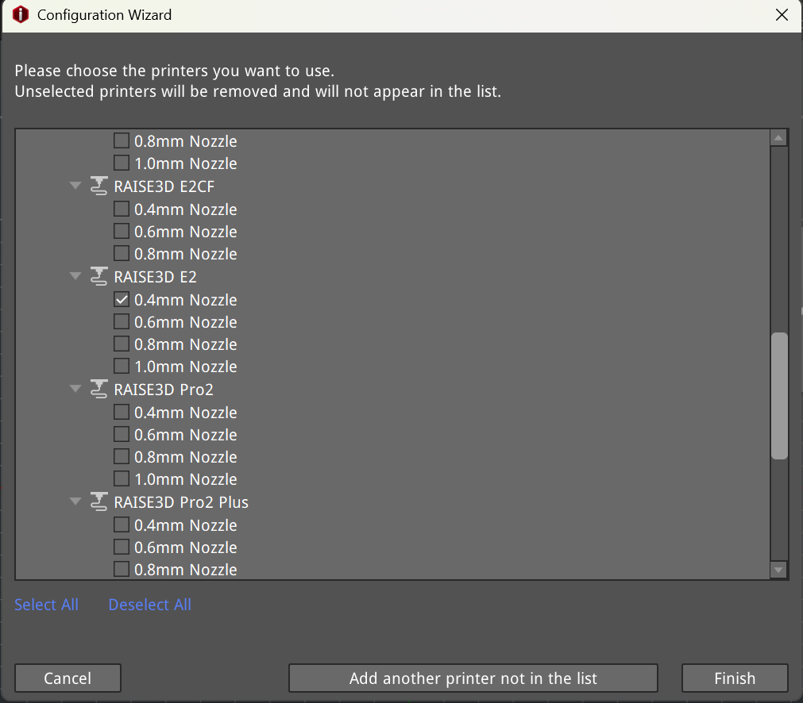
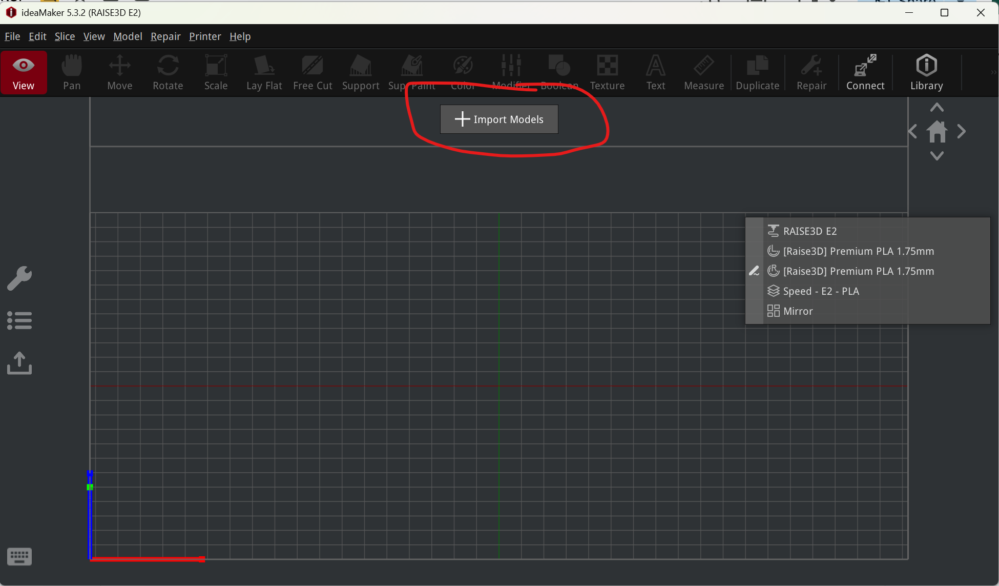
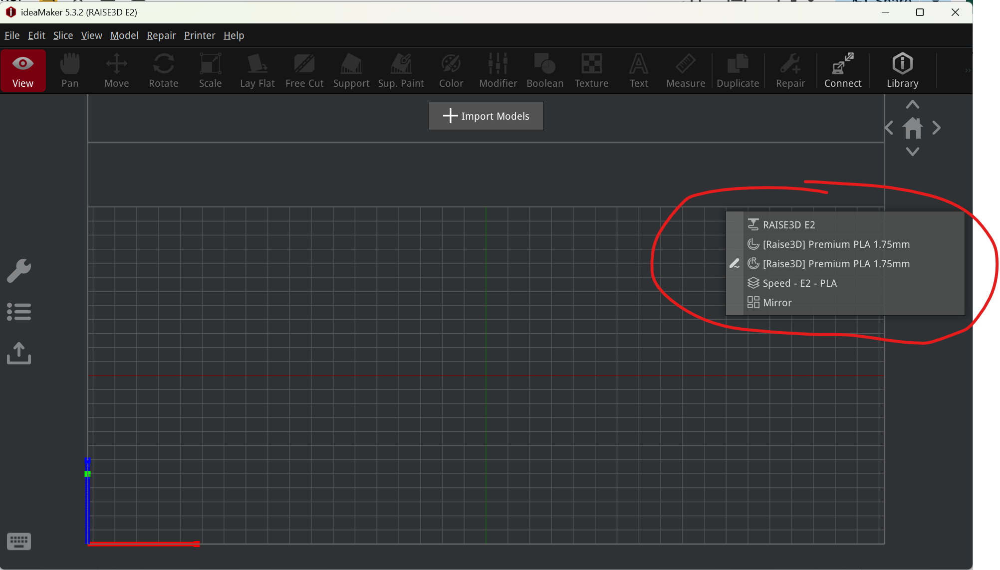
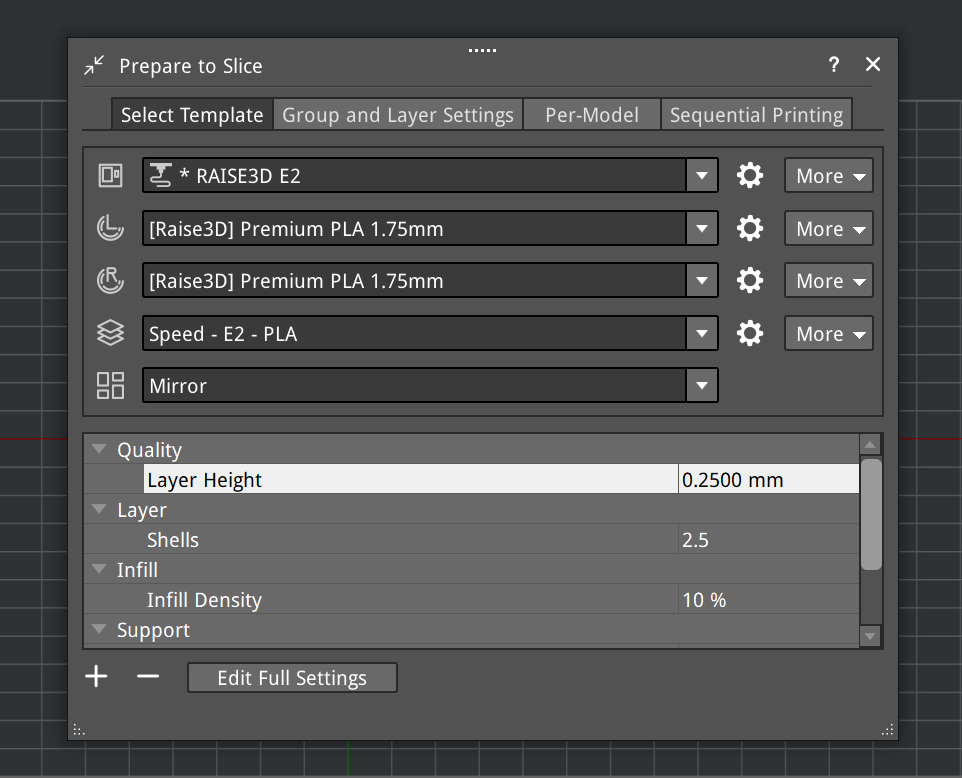
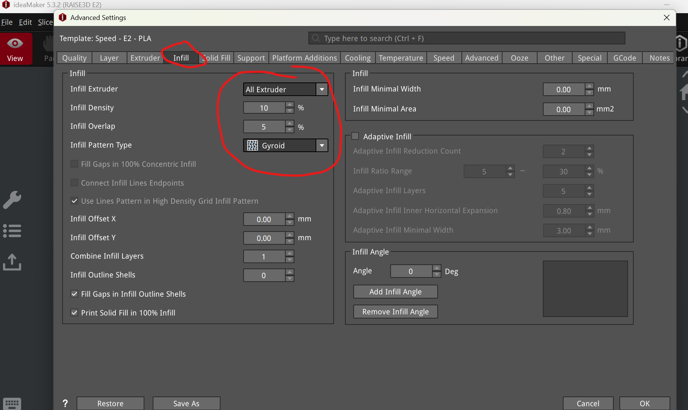
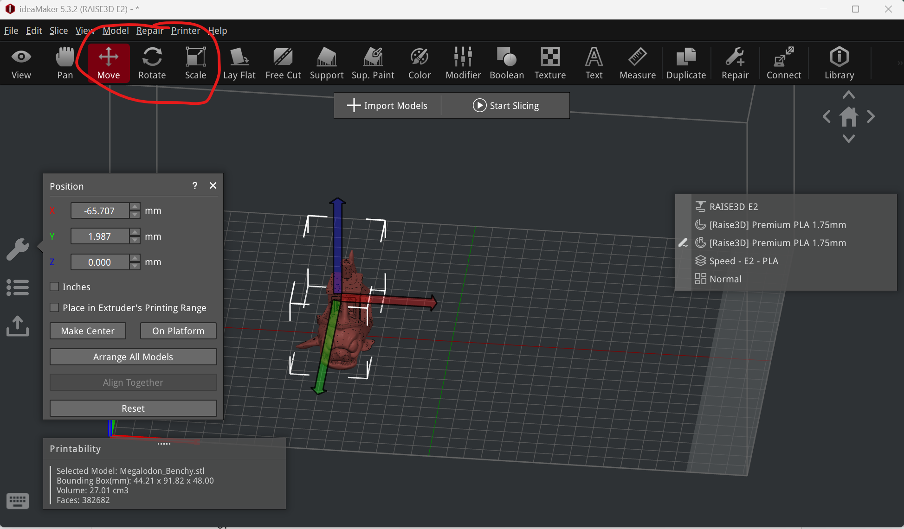
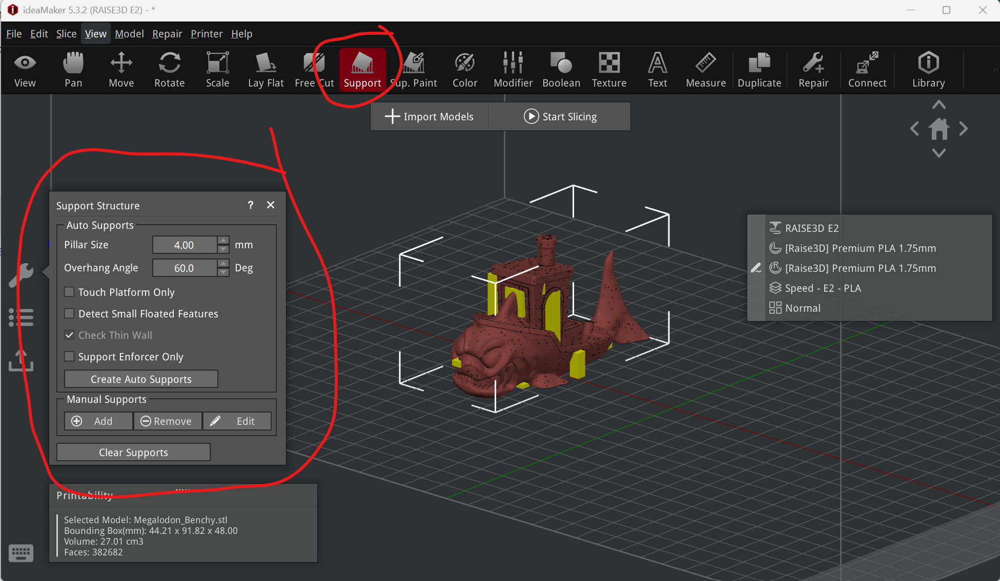
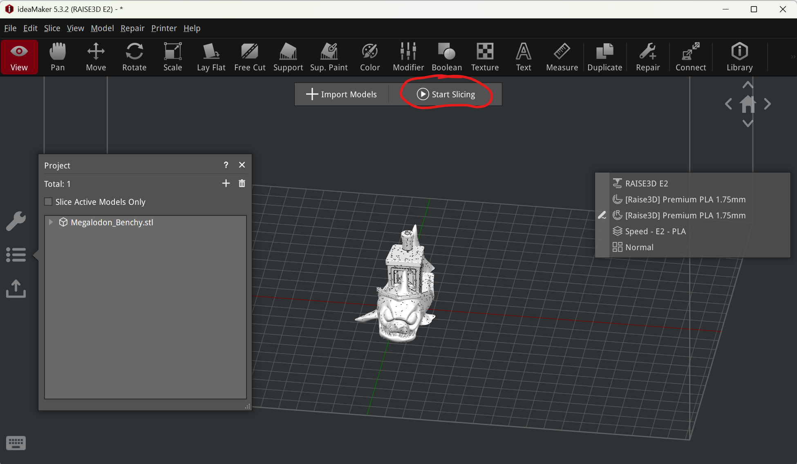
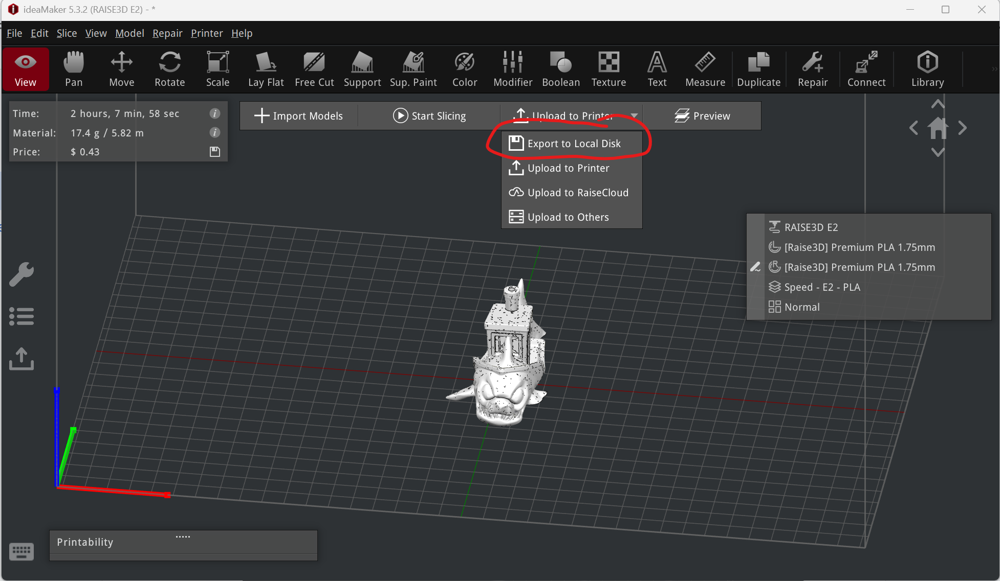

How to Slice in IdeaMaker

  1. Download [IdeaMaker](<https://www.google.com/url?q=https://www.raise3d.com/download/&sa=D&source=editors&ust=1776804160571067&usg=AOvVaw10cSaZDvgKQISuMaMmQfIv>) installer
  2. Finish installing and launch IdeaMaker
  3. You will be prompted to select which printers you are using

        

        

        -choose RAISE3D E2 0.4mm Nozzle (unless you happen to be working with another nozzle size)

* * *

  4. Select Import Models and upload your .stl file

  5. Edit your slicer preset settings

  

* * *

-By pressing the edit button, you can customize the recommended preset.

-confirm your filament type has been entered correctly

-select the level of quality for the print (High Quality/Standard/Speed)

-select none/dual/mirror mode (for a typical 3D print select none)

-The preset settings are sufficient, but if you have sufficient knowledge of slicing settings, you can edit the full settings

-you can customize the infill style in the full settings menu

-For more information on slicer settings, visit [this reference](<https://www.google.com/url?q=https://www.raise3d.com/blog/3d-printing-settings-and-parameters/&sa=D&source=editors&ust=1776804160573982&usg=AOvVaw0P_OuCD2mgH0G5pUxEnCc2>)

* * *

  6.  Move, rotate, or scale your print

-note that for duplication or mirroring, you must keep your model in IdeaMaker’s designated area

  7. Add Supports if necessary

-You can start with auto supports or manually add supports

-Keep in mind auto support tends to generate more supports than necessary (the example model above can actually be printed without any supports at all)

  8. Before slicing, complete the following checklist:  
        -File reviewed in Preview mode  
        -Correct extruder assignment verified  
        -Correct material profile selected  
        -Print fits within build volume  
        -Supports and brims reviewed

  9. Once you are done positioning your model and adjusting settings, you can start slicing

  10. Once slicing is complete, Export to Local Disk and select your USB drive

  11. You are now ready to plug your USB into the Raise3D E2 Printer and start the print. Reference the [Raise 3D E2 Dual Head Printer Operations Manual](<Operations & Safety Manual/Raise3D E2 Printer Machine Operation Manual.md>) to get started.