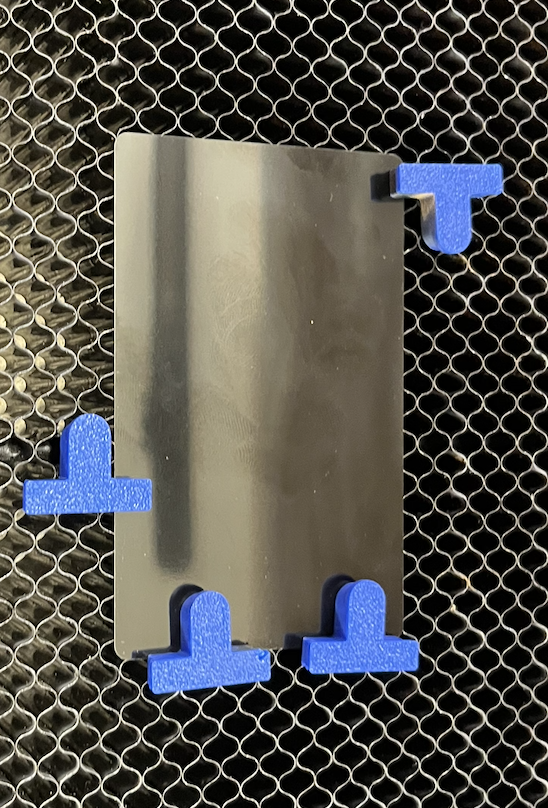
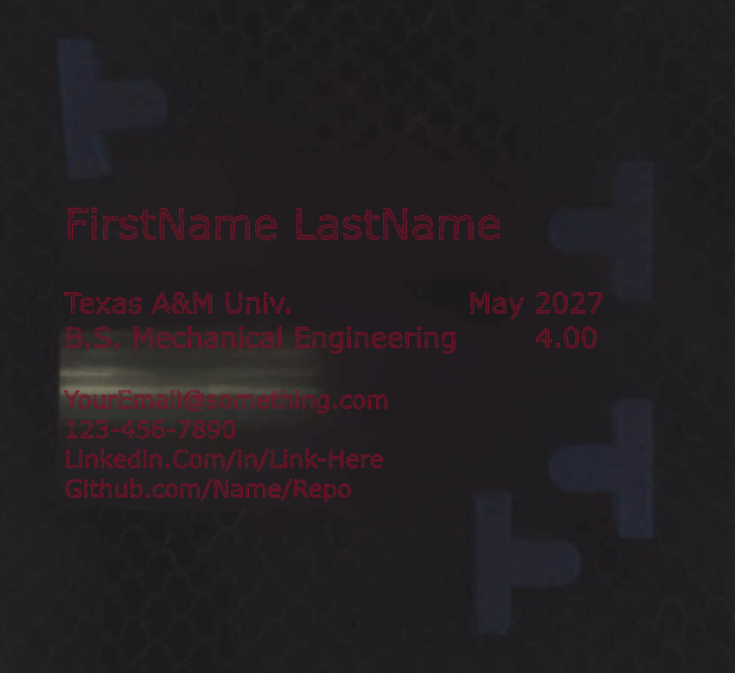
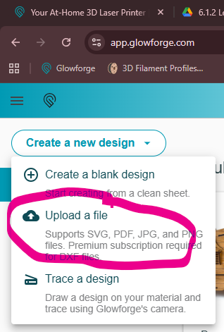
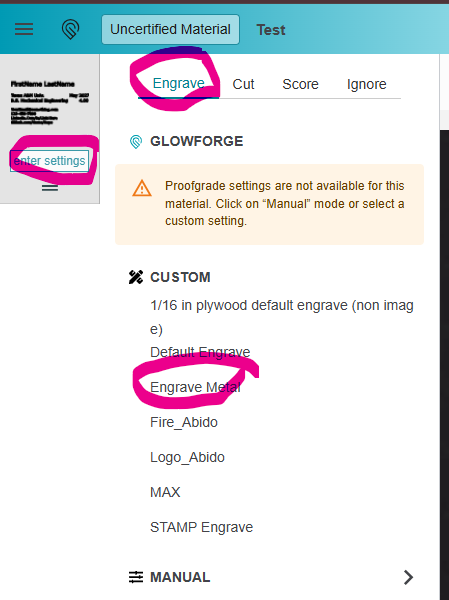
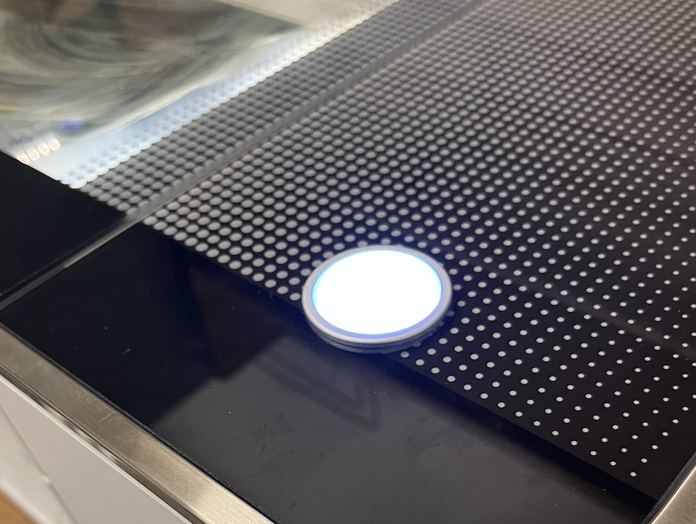

Glowforge CO2 Laser Learning Assignment[[a]](<#cmnt1>)

Machine Name: Glowforge Pro

Location: The Fab Lab

Version: v1.0

Last Updated: 3/12/2026

Responsible Student Worker: Aidan Spira

Linked Operations Manual: [Link Here](<../Operations & Safety Manuals/Glowforge Operation Manual.md>)

Linked Safety Manual: [Link Here](<../Operations & Safety Manuals/Glowforge Safety Manual.md>)

## 1\. Purpose of This Learning Assignment

This document outlines the fundamental information required to operate the Glowforge Laser in The Fab Lab. It focuses on:

  * Preparing a design file
  * Aligning material on the bed
  * Running and monitoring a laser job

Completion of this assignment DOES NOT qualify the user to operate this laser without staff supervision. Only those who have done the TAMU training may operate the laser.

TAMU Training [Link](<https://www.google.com/url?q=https://ehsa.tamu.edu/ehsa/&sa=D&source=editors&ust=1776804264093807&usg=AOvVaw2IQr9tzGOofPFJw-iLpDDG>):

  1. Click on: EHSA Online Training Courses
  2. Fill in your information
  3. Complete the LASER training course and keep the certificate on hand
  4. Show staff completion

We will be engraving aluminum business card blanks to make our business cards! As an engineering student, business cards help you stand out, and these will showcase your engineering skills.

*Note – we aren't really engraving the aluminum. Instead we are removing the top layer which is a colored coating from the aluminum card.*

## 2\. Design Preparation

We have created a template file for you to edit. Download the template file [here](<https://www.google.com/url?q=https://drive.google.com/file/d/1oqVoxlXpzHqtsd8s3paPAKwE7P8uhTPX/view?usp%3Dsharing&sa=D&source=editors&ust=1776804264095677&usg=AOvVaw2cQ748ERW55WA2-umcgaKa>)[ ](<https://www.google.com/url?q=https://drive.google.com/file/d/1oqVoxlXpzHqtsd8s3paPAKwE7P8uhTPX/view?usp%3Dsharing&sa=D&source=editors&ust=1776804264095879&usg=AOvVaw213ZxQVRdxW_efI92VEoSi>)as well as the program inkscape to edit it. We are not here to teach you inkscape… but we will go over some basics.

First double click on the text box and modify the text to describe yourself/as you see fit. You may even consider adding a QR code or logo if you're on a design team (SAE, DBF, etc…).

However, the glowforge software really hates text, so select the text then hit “Path” -> “Object to path”. This will convert the text to a bunch of shapes instead. Then export the file as an SVG.

## 3\. Glowforge Preparation

Ensure the machine is not in use/about to be in use by someone else. Grab a business card blank in your desired color. Go to the glowforge and turn it on if it is not already on. Insert the business card blank and place “hold down” pins to hold the business card down. They are used for several reasons, here they not only will help align the blank but also the laser provides enough force to move the card! So they prevent that motion. See below for an example.

Ensure the lid is closed. This will let the Glowforge camera rescan the work space.

## 

* * *

## 

## 4\. Uploading & Final Preparation

Ensure your file is on the Fab Lab PC. Open glowforge on the Fab Lab computer by going to Google and hitting the “Glowforge” starred link. Then hit “Create a new design” -> “Upload a file” and then select your own file. Now drag and align the file so it lines up.

Black was a poor example color for this, but still see how it is aligned to be on the car, and avoids the plastic hold-down pins.

##   
  
  
  
  
  
  
  
  

Now we will set a material. Click “Unknown Material” -> “Use uncertified material” -> “Set focus”, then click anywhere on the blank. This automatically sets the thickness – if you had wood or acrylic, you would use a known material instead.

Now hit “enter settings” for this file. Then “Engrave” -> “Engrave Metal”. This is pre-set and tuned for metal engraving. For different operations in the same job, you can set different presets! For instance, I could engrave a photo, then cut it in the same job! How cool!

Next hit “Print” in the top right to calculate.

## 5\. Engraving

Read over the other pre-flight and post-flight checklists in the operation & Safety manual. Ensure the fan is on to extract the fumes, and then grab a staff member. Only a TRAINED staff member is able to start a laser job. If they are not trained DO NOT start a job.

The TRAINED PERSON may then hit the glowing button to start the job.

Monitor the job as it works, ensuring everything is going okay. Use the digital UI to inform you when it is safe to open the lid.

When the website informs you it is done (full done -NOT cooling down), remove the card & clean up. Note, many items, like the metal, need to be washed to remove the burned off area. Please take it to the sink and wash by hand, be careful to not rub/stain your fingers.

[[a]](<#cmnt_ref1>)few more pictures, like for the "slicer"