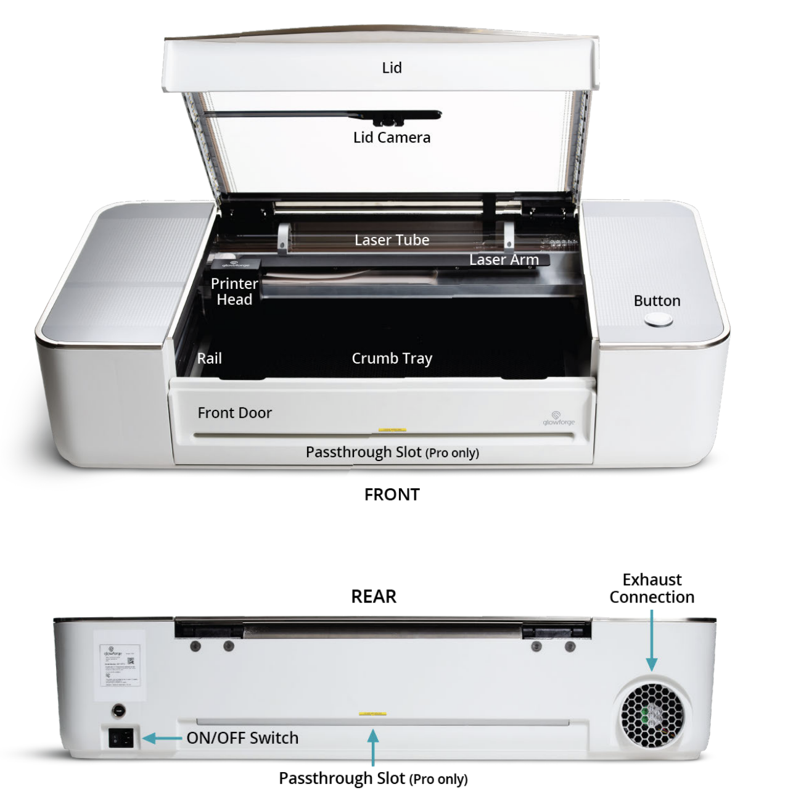

Glowforge CO2 Laser Operations Manual[[a]](<#cmnt1>)

Machine Name: Glowforge Pro

Location: The Fab Lab

Version: v1.3

Last Updated: 4/8/2026

Responsible Student Worker: Aidan Spira

Linked Safety Manual: [Link Here](<Glowforge Safety Manual.md>)

* * *

## 

## 1\. What This Machine Is For

Use this machine to:

  * Laser cut & engrave various materials (wood, acrylic (TO BE EXPANDED WHEN APPROVED & TESTED))[[b]](<#cmnt2>)
  * Produce flat parts, including signage, enclosures, decorative items, and prototypes
  * Perform engraving for labels, artwork, text, and surfaces

## 2\. What This Machine Is Not For

Do not use this machine for:

  * Laser cutting or engraving of unapproved or hazardous materials
  * Metal cutting or deep engraving
  * Operation without the vent system enabled

## 3\. What You Need Before You Start[[c]](<#cmnt3>)

Before operating this machine, ensure:

  * A Fab Lab staff member present (FIRST TIME ONLY)
  * You have reviewed and acknowledged x laser safety material
  * Your material is Glowforge & Staff approved
  * All design files prepared in acceptable formats (SVG, PDF, PNG, or JPG)

  * DXF is NOT currently supported

* * *

## 

## 4\. Machine Overview[[d]](<#cmnt4>)[[e]](<#cmnt5>)

|   
---|---  
  
DNT = Do Not Touch

### 4.1 Physical Machine Front/Top

  * Lid – Clear protective cover – Must remain CLOSED during operation
  * Lid Camera – Internal camera used by the online interface to preview placement
  * Laser Tube – The CO2 laser source the generates the beam – DNT[[f]](<#cmnt6>)
  * Laser Arm – Guides the laser beam from the tube to printer head – DNT
  * Printer Head – The moving component the determines where the laser is beamed on – DNT
  * Rails – The guides which allow for movement of printer head – DNT
  * Crumb/Peg Tray – Below the hexagonal is where the crumbs from jobs end up, above in the hexagon is where hold-down pegs go

| 

  * Front Door – Allows for access to the crumb tray and work area – DNT 
  * Button – Main physical user interface to start and pause the cutting
  * Passthrough Slot – Allows for larger materials to be used – DNT without staff

4.2 Physical Machine Rear

  * ON/OFF Switch – Used to turn the machine on or off – DNT unless in an emergency, than flip off
  * Exhaust Connection – Port used to connect the machine to the external exhaust system, removes smoke & fumes – DNT
  * Passthrough Slot – Allows for larger materials to be used – DNT without staff

  
---|---  
  
## 5\. Basic Operating Workflow

### 5.1 Start-Up

  1. Ensure you are approved to use the Glowforge – if it is your first time you must be accompanied by a PRAXIS staff member
  2. Inspect the Machine:

  1. Make sure no current job is running – DO NOT open the lid for this, you should be able to see/hear the machine operating, along with the UI button being lit up
  2. If not running, than open the lid and make sure there is no left over scrap or debris remains on the tray
  3. Ensure by visual inspection that the exhaust hose is connected (DO NOT TUG ON THE HOSE)

  3. The machine should be left on by default, if it is not on flip the ON/OFF Switch at the back of the machine to “ON”
  4. Using the provided PRAXIS computer system, axis the Glowforge web interface (starred tab called “LASER CUT HERE”
  5. Ensure your files will work with the Glowforge (SVG, PDF, JPG, & PNG)

  1. DXF is NOT currently supported

  6. Ensure your material is on the approved list

  1. Material may be brought in or acquired from PRAXIS stock
  2. If a non-approved material is desired for use, please contact PRAXIS staff

### 5.2 Running a Job

  1. Open the lid and position material as desired, close the lid

  1. Use pegs to hold down the material, this is helpful in wood to mediate warping

  2. In the Glowforge web interface, upload your file(s)

  1. Rearrange as needed, note that the camera is slightly off so allow for tolerance if using a semi-used stock piece and are working around previous cuts.

  3. Select the material
  4. Select the cutting/engraving setting(s)

  1. If doing several operations (eg. cutting & engraving) select the various settings for each operation

  1. Operations will run in order from top to bottom, rearrange as such (do cuts first to minimize warping)

  2. Select the settings based on material type, if working with an external material, it is suggested to run tests before the main operation
  3. Example “sample cards” for various materials should be around the machine.

  5. Confirm that prior steps in 5.1, that the machine is ready to be used

  1. The Lid must be closed

  6. The ventilation system must be turned on – do not mess with the settings on the device
  7. Hit the button in the top right of the web interface to send the job
  8. Flip the “In Use” sign to indicate as such
  9. When the Glowforge is ready, the physical button will light up, press it to start the job

  1. Press it to pause the job

  10. Waiting for job completion

  1. It is asked for small jobs and if inexperienced, you remain nearby the machine during operation

  1. Normal operation includes:

  1. Smooth operation
  2. Smoke drawn towards exhaust
  3. Small flames that extinguish quickly

  2. Abnormal operation includes

  1. Long-lasting flames
  2. Excessive smoke, or smoke from front of machine
  3. Loud mechanical noise
  4. Burning smell not representative of material

  2. If experienced and the job is long, check with staff before letting run while gone or overnight

### 5.3 End-of-Job

  1. Wait for the motion of the system to fully stop before opening the lid

  1. Reference the glowing button (to stop glowing) or online interface
  2. Wait a few seconds for smoke to fully clear

  2. Turn off the ventilation system
  3. Remove all material

  1. Check for smoldering on material first

  4. Remove finished parts carefully

## 6\. User Responsibilities After Use

After using this machine, you are responsible for:

  * If the stock has any meaningful space left, return it to the correct place

  * Excess personal material may be donated to the studio if desired :)

  * Dispose of scrap generated by the machine
  * Wipe down the inside of the lid & internal camera with provided cloth
  * Flip the “In Use” sign to indicate the machine is free
  * Report any abnormal machine behavior before leaving the studio
  * The machine must be left in equal or better condition than it was found

* * *

## 

## 7\. Stop Conditions

Stop immediately and notify Prototyping Studio staff if:

  * Sustained fire for more than a couple of seconds
  * Fire that does not self-extinguish
  * Excess smoke inside the machine OR smoke leaving the front/side of the machine
  * Loud mechanical noise like grinding, knocking, or other abnormal noises
  * Strong burning or odor that is not typical for the material
  * If the machine behaves in any way that feels unsafe or abnormal

  * The Glowforge is one of the more dangerous machines in the lab, safety of our members is held to the highest standards

Do not attempt to troubleshoot major issues yourself.

## 8\. Common Issues & What To Do

[[g]](<#cmnt7>)[[h]](<#cmnt8>)[[i]](<#cmnt9>)

  * Issue: Small flame flare-up during cutting that lasts longer than a couple of sections  
Action: Pause job & notify staff
  * Issue: Material does not fully cut through  
Action: Do not re-run the job – recheck settings & notify staff
  * Issue: Excess charring or burn marks  
Action: Recheck settings & notify staff
  * Issue: Ventilation appears weak  
Action: Notify staff

## 9\. External Resources

For more detailed information, refer to:

  * [Glowforge User Manual Link](<https://www.google.com/url?q=https://assets.ctfassets.net/ljtyf78xujn2/7axLVEf4kpTdrKskWKEmIp/0d389fbe73c2c1de01e4160d73f793e3/Glowforge_Performance_Series_User_Manual_v3.5.pdf&sa=D&source=editors&ust=1776804258725632&usg=AOvVaw3yneeZIpTsR5crIXAi-Hpm>)
  * [Glowforge Official Video Tutorials](<https://www.google.com/url?q=https://www.youtube.com/@Glowforge/videos&sa=D&source=editors&ust=1776804258725760&usg=AOvVaw23XywC1EvHv5Sg6Ldd68tu>)

## 10\. Questions or Help

If you have questions or need assistance at any point, ask a Fab Lab staff member. Staff are always present during operating hours.

* * *

End of Operations Manual

[[a]](<#cmnt_ref1>)More pictures

[[b]](<#cmnt_ref2>)link to feeds and speeds provided by manufacturer

[[c]](<#cmnt_ref3>)show staff your tamu laser certification

[[d]](<#cmnt_ref4>)would rather this not be 2 colns of text if you can move around the pictures to make this possilbe

[[e]](<#cmnt_ref5>)Yeah Must not be 2 columns

[[f]](<#cmnt_ref6>)Not consistent underline with bambu doc, and should maybe be italicized

[[g]](<#cmnt_ref7>)Can we please add how to clean the lenses

[[h]](<#cmnt_ref8>)Camera or Laser lens?

I ordered/requested microfiber cloth I thought

[[i]](<#cmnt_ref9>)I think laser lens, yesterday we tried cleaning them with a microfiber cloth to fix a focus issue but if its in the operations manual in the future it may be helpful