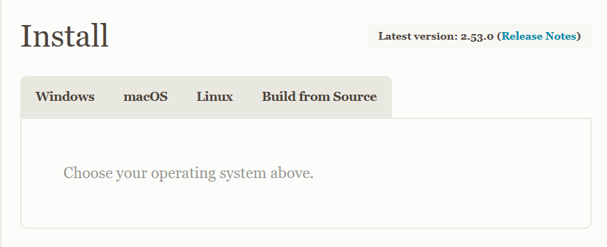
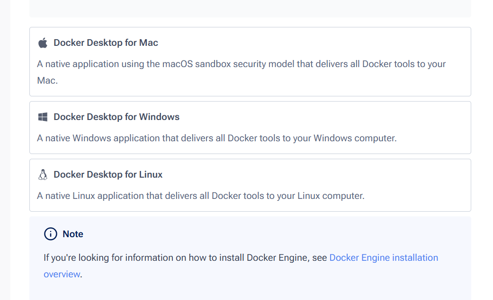

Tab 1

Network and Cloud Assignment

Machine Name: The TAMU Fab Lab WiFi/Wired Network

Location: The Fab Lab (WEB 121)

Version: v1.0

Last Updated: 03/27/2026  

Responsible Student Worker: [Aden Mann](<mailto:adenmann@tamu.edu>), [Mohammad Ibrahim](<mailto:mur731001976@tamu.edu>)

Linked Operations Manual: [TAMU Fab Lab Network Operations Manual](<../Operations & Safety Manual/TAMU Fab Lab Network Operations Manual.md>)

Linked Safety Manual: [TAMU Fab Lab Network Security Overview ](<../Operations & Safety Manual/TAMU Fab Lab Network Security Overview.md>)

Linked Reference Documentation:

[ ](<https://www.google.com/url?q=https://help.ui.com/hc/en-us&sa=D&source=editors&ust=1776804244420508&usg=AOvVaw2Gh1uLzd83wTEDdjq3qc9v>)[https://help.ui.com/hc/en-us](<https://www.google.com/url?q=https://help.ui.com/hc/en-us&sa=D&source=editors&ust=1776804244420650&usg=AOvVaw1GCboSdgCNf-ziAmCjGAmr>)

# Assignment: Learn how to visualize a dataset through a cloud-based platform.

Objective: Understand how to use cloud data pipelines and visualize a dataset 

through a cloud based pipeline.

        

# 

# Part 1: Cloud 

  1. ## What is the cloud?

Answer: The cloud is when your data runs on someone else’s computer instead of your 

own machines.

  2. ## Name a project where using the cloud is better than self-hosting:

        Answer: One should consider using the cloud when a project’s hosting 

        requirements, scale, and cost effectiveness exceed the limits of local hardware.

  3. ## Why do companies use the cloud?

## Answer: Companies use the cloud because it’s cheaper than purchasing servers and is  

## less work than running their own servers.

  4. ## Should you always use the cloud?

Answer: It depends on the project.

# Part 2: VPN

  1. ## What is a VPN?

Answer: A VPN is a Virtual Private Network that tunnels an encrypted connection over 

the internet between your device and a network.

## 

  2. ## How does a VPN impact your system?

Answer: A VPN impacts the user’s system by making their traffic come from the VPN 

server’s IP instead of the user’s real IP address.

## 

  3. ## What devices can connect to a VPN?

Answer: Practically any device that uses IP networking can be configured to connect to a 

VPN.

## 

  4. ## How can VPNs help companies?

Answer: VPNs can protect internal systems from being directly exposed to attacks.

        

# Part 3: Networking

  1. ## What is a server?

Answer: A server is a computer that provides services to other computers.

## 

  2. ## How is a server different from a regular computer?

Answer: A server is designed for the network, meaning that it can handle heavy usage 

and has very stable and durable hardware.

## 

  3. ## What is a router?

Answer: A router provides internet access to other devices.

## 

  4. ## What is the difference between the cloud and a local server?

Answer: The cloud runs on someone else’s computers in a large data center, whereas a  

more local stack runs on hardware you maintain yourself. 

# Part 4: Data Visualization with the Cloud

Prerequisites:

  1. Git (any recent version). 

Install git from [https://git-scm.com/install/](<https://www.google.com/url?q=https://git-scm.com/install/&sa=D&source=editors&ust=1776804244430360&usg=AOvVaw0yq_Cl8RdFwJ6FB7rkdR6k>) 

  2. Docker (Docker Desktop on Mac/Windows. Docker Engine on Linux.) 

Install Docker from [https://docs.docker.com/get-started/get-docker/](<https://www.google.com/url?q=https://docs.docker.com/get-started/get-docker/&sa=D&source=editors&ust=1776804244431167&usg=AOvVaw35Ohmk73OpRF4dyrl4pFhV>) 

Installation instructions for each are on the websites mentioned above. If you need assistance please contact the student workers.

it is a good practice to name your devices on the network. There are a lot of devices connected to our network. It will be hard for you to find yours if you do not follow a naming convention[[a]](<#cmnt1>).

i. We recommend a <your-name-device-name> format, such as jacob-raspberry-pi or luke-arduino.

 

Assignment:

 Setup (part 1)

  1. Windows Users: Press the Win key, type    Git Bash    and Press Enter.

  2. Mac Users: Press Command (⌘) + Space, type    Terminal and press Enter.

  3. Linux Users: On most systems, press Ctrl + Alt + T, or search for Terminal in your applications menu. 

Setup (part 2) 

        With the terminal you opened from part 1, enter the following commands in the order  

presented to you below.

  1. cd ~
  2. mkdir TAMUFabLab
  3. cd TAMUFabLab
  4. git clone [https://github.com/Praxis-Prototyping-Studio/server_base](<https://www.google.com/url?q=https://github.com/Praxis-Prototyping-Studio/server_base&sa=D&source=editors&ust=1776804244437881&usg=AOvVaw2UPyhmKv2SNNSAerXt7Rmd>)
  5. git clone [https://github.com/Praxis-Prototyping-Studio/esp32_base](<https://www.google.com/url?q=https://github.com/Praxis-Prototyping-Studio/esp32_base&sa=D&source=editors&ust=1776804244438493&usg=AOvVaw3kSJbeg37ZE-ssjX5BCmG9>)
  6. git clone [https://github.com/Praxis-Prototyping-Studio/cloud_base](<https://www.google.com/url?q=https://github.com/Praxis-Prototyping-Studio/cloud_base&sa=D&source=editors&ust=1776804244438836&usg=AOvVaw26FQTzK-9TutQVm1gIx7jr>) 

        

Arduino (part 3)

Grab an arduino and a USB-A to Micro USB cable from the Arduino station, and plug the Micro USB into your arduino, and the USB-A slot into your computer.

  1. Open your coding platform (i.e. VS Code).

  2. <docker compose and wsl instructions> [[b]](<#cmnt2>)

  3. <building and flashing to hardware>

i. cpp build instructions for arduino 

Cloud (part 4):

  1. <Serverbase instructions>

  2. <Device naming instructions>

  3. <wireguard, endpoint setup>

i. Wireguard steps

        

  4. <dashboard section >  

        i. Generative ai steps or independent frontend development if they choose to do so

Generative AI guidelines:

Generative AI can be a great prototyping tool, provided that you understand the underlying concepts and possess the basic skills needed for the task. Please avoid entering confidential, sensitive, or personal information. It is your responsibility to follow all relevant academic, professional, or organizational integrity policies.

        ii. Prompt guidelines:

  1. Export an existing dashboard JSON
  2. Prompt your LLM tool. Example prompt: “<Paste dashboard JSON here> Keep all queries and data sources in this dashboard JSON exactly the same, but reorganize the layout in X way and change Y panels to stat panels. Do not change any datasource or expr fields.”
  3. Paste the modified JSON back into the import dashboard dialog.

After step d, you should have a completed real-time cloud-based data dashboard that is connected to your arduino device.

Congratulations on completing the cloud assignment! You are now able to use your devices for your prototyping needs.

If you have questions or need assistance at any point, ask a Fab Lab staff member. Staff are always present during operating hours.

* * *

End of Assignment

[[a]](<#cmnt_ref1>)when servers are setup, include a network tutorial for naming devices.

[[b]](<#cmnt_ref2>)Aden will talk to Dr. Nowka, waiting for new room to set up servers. It is not possible for people completing the assignment to communicate to the cloud without the servers.