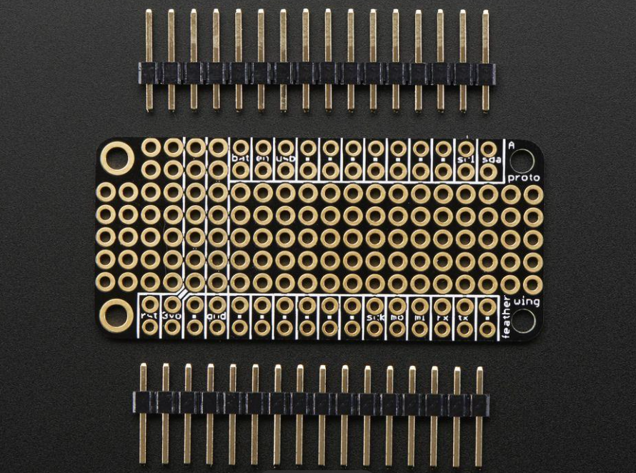
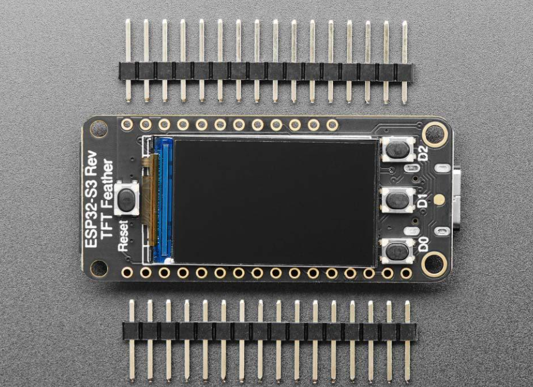
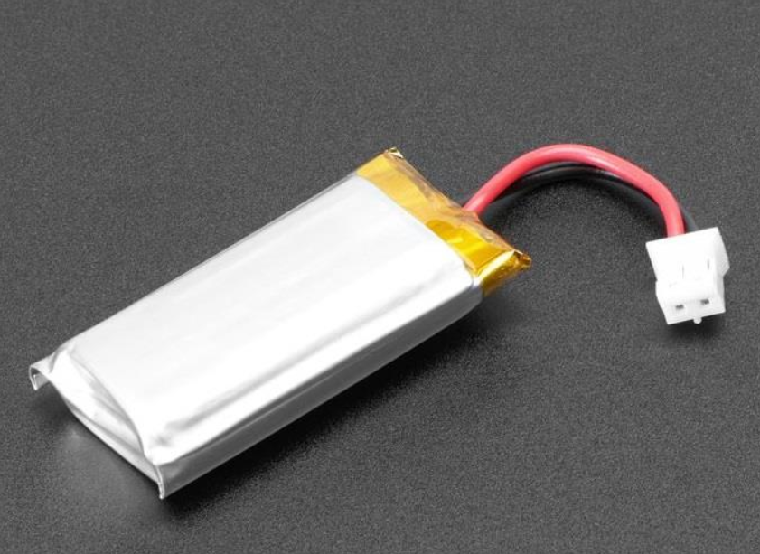
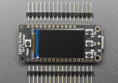
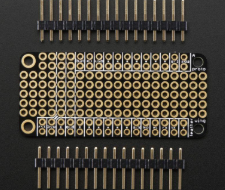
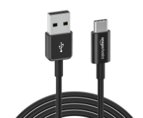
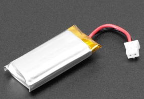
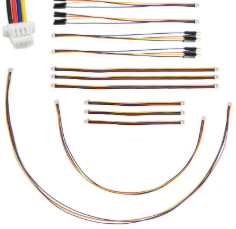

Assignment Name: TAMU Prototyping Course IOT Integration Assignment

Location: TAMU Fab Lab

Version: v1.0

Goal:

The goal of the TAMU Prototyping Course IOT Integration Assignment is to provide industry standard/transferrable rapid prototyping experience with Microcontroller platforms. While numerous Microcontroller platforms are available, the ESP32 (specifically Adafruit ESP32-S3s) provide the best platform for students given that they minimize development friction. Our selections in the BOM provide the baseline equipment necessary to fully implement IOT functionality into any student project. Our selections ensure student familiarity with Commercial Off The Shelf (COTS) Microcontroller platforms as well as basic embedded C++.

The Platform:

  
We’ve selected the Adafruit ESP32-S3 Reverse TFT as the Microcontroller platform for this assignment, it occupies a price segment at the high-end of completed ESP32 boards ($25), but provides considerable advantages for this course:

Feature| Pedagogical Value| Transferable Industry Skill  
---|---|---  
Integrated 240x135 TFT| Immediate visual feedback for debugging.| UI/UX design for embedded systems.  
STEMMA QT (I2C)| Eliminates beginner breadboarding problems.| Understanding I2C Bus Topology.  
LiPo Battery Management| Enables mobile/wearable prototype testing.| Low-power design and battery management.  
ESP32-S3 Dual-Core| Allows separating I/O tasks from Wi-Fi stacks.| Multithreaded RTOS (Real-Time Operating System) concepts.  
  
In summary, the student is provided with a fully capable development platform to develop their prototype concept without needing to struggle with breadboarding and firmware flashing - both of which are significant blockers for beginners within a 2-week assignment period.

Assignment Plan:

  * A. Development Environment Setup: 

  * Supplies: Students are supplied with the Microcontroller and materials as specified in the BOM (PUT LINK HERE).
  * Objective: Student installs VS Code and PlatformIO, and successfully clones and flashes the base image onto the board.
  * Submission Requirements: Student demonstrates in class or over Canvas that they’ve successfully flashed the firmware onto the Microcontroller.

  * B. CAD Design Component:

  * Supplies: Fusion 360 or Solidworks (depends on overall course design/objectives) 
  * Objective: Student integrates the screwhole patterns for each component into their design such that the Microcontroller and accessory components can be mounted using M2/M2.5 threaded inserts.
  * Submission Requirements: Student demonstrates the integration of the component into the design, the screwhole inclusion is required, but component integration is a  plus

  * C. Software Engineering Component:

  * Supplies: Students have the Microcontroller and materials from part A.
  * Objective: Students implement the Microcontroller into their design, likely implementing COTS Stemma QT sensors (discuss). The Students develop the application to provide functionality for their design (could be as simple as collecting sensor data, or as complex as integrating IC components and LEDs into the design - but the goal is to avoid scope creep in a 2 week window). It is expected that these components are planned for in the CAD design before or during step B.
  * Submission Requirements: Students will demonstrate the implementation of their software per the project requirements / project plan.

  * D. Final Design Component:

  * Supplies: Student manufactured prototype, Microcontroller and Materials from part A, CAD Design from overall project and from part B, and Software Engineering Component from part C.
  * Objective: Students will integrate the Microcontroller functionality into their final design.
  * Submission Requirements: The Microcontroller/Software component is graded with the final projects rubric.

Timeline Plan (discuss):

  * A.Week 1 - Hardware Validation and Development Environment:

  * Week 1 is intended for students to establish the UART serial link with the micro controller and their computers via USB-C. They will then initialize the display and configure the VSCode/PlatformIO environment to ensure that firmware can successfully be flashed to the board.

  * B.Week 2 - Design Planning,  CAD, and Software:

  * Week 2 is intended for students to implement the microcontroller into their CAD designs (discuss if this aligns with course objectives). Students are to be introduced to the engineering design process, and to plan how they will implement the microcontroller.

  * B.Week 3 -Software Engineering and Sensor Placement:

  * Week 3 is intended for students to develop the C++ backend logic to interface with sensors, while also integrating sensors into their microcontrollers for data collection.

  * D.Week 4 - Final System Assembly

  * Week 4 is intended to give students the time to wrap their projects up
  * (we need to discuss the scope of the intended completion timeline, so that it aligns with what the class is intending to progressively achieve on both a time-level and an objective-level view)

Tools & Cost:

  * Total cost per team: $58.83 (BOM Sheet LINK)

Tool | Reference| Use case  
---|---|---  
Adafruit_ESP32-S3_Reverse_TFT_Feather Display Kit| | Microcontroller with an embedded display. Gives students an operating system for their prototypes, along with UI/UX design experience.  
Adafruit Accessories FeatherWing Proto| | Prototyping expansion board. Mounts on top of the ESP32. Allows for custom circuits without breadboarding.  
USB-C to USB-A Charging & Data Transfer Cable (Amazon)| | Used for flashing compiled firmware from the PlatformIO environment to the microcontroller’s flash memory.   
Adafruit Accessories Lithium Ion Polymer Battery| | Functions as a battery for the microcontroller, allows it to turn on without a computer connection. For students this means that they can experiment with wearable designs.  
I2C Qwiic Cable Kit| | I2C connectors provide connectivity between sensors that collect data and microcontrollers.  
  
   

  * Arduino feathersense
  * Teach students how to use the network 
  * I have a device i need to talk to the server

  * Heres some sample code you can load
  * This code reads these and it loads into the server
  * And now that its in the server how do you get it from the server to the cloud
  * Once its on the cloud how do you get that into a dashboard
  * Its just about the network 
  * Give me an example of how to use the network
  * I know how to set up a server how to make my device talk to the server how to get my server to send to the cloud
  * Can use ai to generate the dashboard
  * Just an exercise on how to use the network
  * This is for anybody who wants to use the space (an assignment)
  * We might want to use paul’s feathersenses instead

  * The display might not be necessary bc someone who buys an esp32 wont get one with a display
  * The display might get in the way from learning how

  * Friday 27th + manual formatted

  *