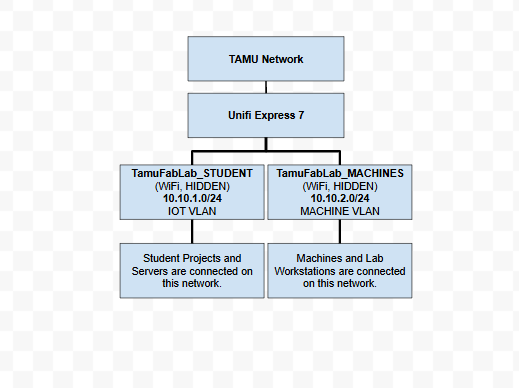
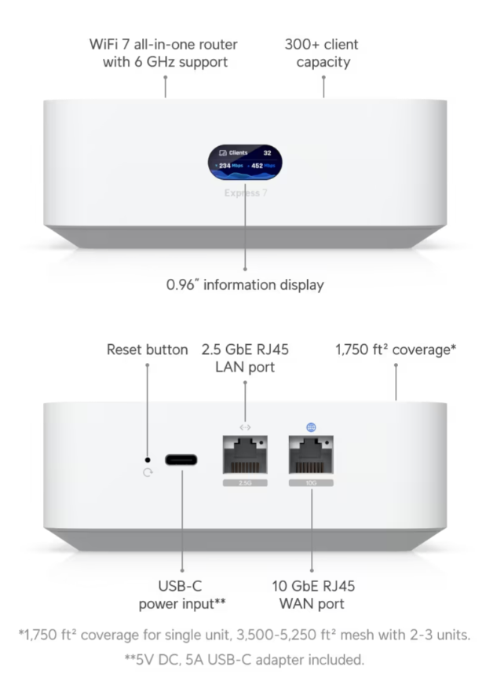
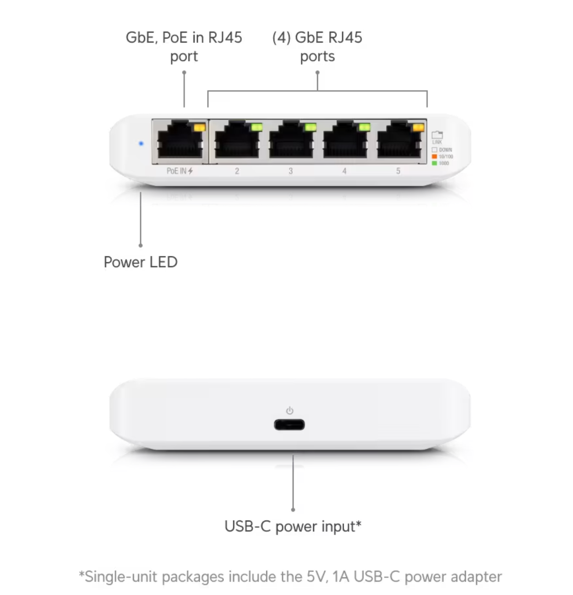

Tab 1

Network Operations Manual

Machine Name: TamuFabLab WiFi/Wired Network

Location: The Fab Lab (WEB 121)

Version: v1.6

Last Updated: 04/02/2026

Responsible Student Worker: [Aden Mann](<mailto:adenmann@tamu.edu>), [Mohammad Ibrahim](<mailto:mur731001976@tamu.edu>) 

Linked Safety Manual: [TAMU Fab Lab Network Security Overview ](<TAMU Fab Lab Network Security Overview.md>)

Linked Reference Documentation:

General Help: [https://help.ui.com/hc/en-us](<https://www.google.com/url?q=https://help.ui.com/hc/en-us&sa=D&source=editors&ust=1776804234445235&usg=AOvVaw1cDd1ePOYQzP3IZmOPeumq>)

## 1\. What This Machine Is For

Use this machine to:

  * Connect Approved (Refer to Section 5.4) Network Devices and Machines for Lab Use
  * Manage VPN connections to Approved Cloud Virtual Private Servers (VPS)
  * Prototype student personal, research, or business related projects
  * Facilitate reliable internet connections for all Fabrication Lab Machines

## 2\. What This Machine Is Not For

Do not allow the use this machine for:

  * Anything illegal
  * Operations that are in violation of [A&M Network Rules](<https://www.google.com/url?q=https://www.it.tamu.edu/security-and-policy/it-policy/it-policy-guides/network-access.html&sa=D&source=editors&ust=1776804234446864&usg=AOvVaw26ARJuOFlxj7xmIqq9ItDl>)

## 3\. What You Need Before You Start

Before operating this machine, ensure:

  * The desired device to connect supports WiFi
  * The correct network is selected (TamuFabLab_MACHINES for Machines, TamuFabLab_STUDENT for student projects and student-related servers)
  * That you have completed the network [assignment](<../Learning Assignment/Learning Assignment.md>) or have staff permission.

## 4\. Machine Overview

  * The TamuFabLab Network is a managed UniFi-based infrastructure utilizing the UniFi Cloud Gateway Ultra (UX7). It provides segregated connectivity (VLANS) for lab machines and student IoT/Server projects. The VLANS provide separated networks for devices that require security/isolation. The system is integrated with university-compliant IDS/IPS (Intrusion Detection/Prevention Systems) to ensure network security. The IDS/IPS system can block normal behavior, this is expected to happen at some point, and can be overridden by staff operators. It can support up to ~300+ users simultaneously according to Ubiquity, distributor datasheets, and independent reviewers and testers. 

## 5\. Basic Operating Workflow

### 5.1 Start-Up

  1. STEP 1 – POWER ON / INITIAL ACTION

  * The Unifi Express 7 should automatically connect to the network uplink and provide WiFi access when plugged in over USB-C.

  2. STEP 2 – SOFTWARE / INTERFACE ACCESS

  * The Unifi Express 7 management interface is provided at [unifi.ui.com](<https://www.google.com/url?q=http://unifi.ui.com&sa=D&source=editors&ust=1776804234450990&usg=AOvVaw0lm73zOYVCArYa-f6_ag9u>) using the Prototyping Studio management account.

  3. STEP 3 – BASIC READINESS CHECK (USER-LEVEL ONLY)

  * The Unifi Express 7 front display should be displaying status information and the activity lights on the back of the router should be indicating connection.

### 5.2 Connecting a Device

  1. Select Network (TamuFabLab_STUDENT) and enter the exact SSID manually into the desired device to connect.
  2. Enter Network Password (Reference Staff Document [TAMU Fab Lab Staff - Machine Passwords](<TAMU Fab Lab Staff - Machine Passwords.md>)).
  3. Connect to the Network.
  4. During operation, confirm that:

  * The Device is connected and reachable over the network, internet access should also be available to/from the device.

### 5.3 Connecting a Wired Device

  1. Bring the device to a Staff Member to approval, (wired devices are permitted on a case-by-case basis).
  2. The staff member will set up the device on the appropriate wired network.

### 5.5 Connecting a Machine

  1. Using the Machines setup or user interface, select the (TamuFabLab_MACHINES) network.
  2. Enter network Password (Reference Staff Document:[TAMU Fab Lab Staff - Machine Passwords](<TAMU Fab Lab Staff - Machine Passwords.md>)).
  3. Connect to the Network.
  4. During operation, confirm that:

  1. The Device is connected and reachable over the network, internet access should be available to/from the machine.

### 5.6 Connecting a Wired Machine

  1. Reach out to Lab IT Staff for Wired Machine setup to ensure the correct wired network and VLAN are enabled for the connected machine.

### 5.7 Disconnecting a Device

  1. Disconnect the Device from the Network.
  2. Forget the Network Password (if saved).

### 5.8 Disconnecting a Wired Device

  1. Unplug the wired device.
  2. Return the cable used to the proper location.

### 5.9 Approved Devices

  1. Devices approved for use on TamuFabLab_MACHINES:

  1. Any Lab Machine that requires internet connection or WiFi access.
  2. Any Lab Workstation that is secured and used to deliver designs to Machines or otherwise perform work on student designs.
  3. Connect all Machines to this network!

  2. Devices approved for use on TamuFabLab_STUDENT:

  1. Devices required to develop assignments for any course which requires the use of the Prototyping Studio.
  2. Servers used for any course which requires the use of the Prototyping Studio.
  3. Any device that contributes to a project or a prototype. We promote a bring your own device policy, as long as it is for your project and is legal. 

### 5.10 Device Removal Policy

  1. If at any time, you reasonably believe that a device is causing network connectivity problems, network access should be terminated. Additionally, if the user who connected the device is known, they should be monitored.
  2. If a connected device is known to be used to circumvent network security policies or any violation of Section 2, access must be immediately terminated, and the user must be notified. If continued circumvention and safety violations are recorded, the user may need to be banned from the Fab Lab.
  3. Refer to security manual for Device Removal workflow.
  4. For further information/suspect violations, contact the Fab Lab IT Lead.

## 6\. User Responsibilities After Use

After using this machine, you are responsible for:

  * Disconnecting your personal device (when work is completed).
  * Following  [A&M Network Rules](<https://www.google.com/url?q=https://www.it.tamu.edu/security-and-policy/it-policy/it-policy-guides/network-access.html&sa=D&source=editors&ust=1776804234459132&usg=AOvVaw0cwB-OfhrBXuBvKDf_Wb_0>).
  * Not disrupting network service by using excessive bandwidth.
  * Properly securing the Connected Device (for Raspberry Pi, or other computer)
  * Recording Issues or Abnormal Behavior and reporting to the IT Lead

## 7\. Stop Conditions

Stop immediately and notify Fab Lab staff if:

  * Internet connection stops working on connected devices.
  * The connected device stops responding over the Network.
  * Operations expected to succeed are blocked or not working (e.g. connecting to a server over VS-Code Remote Explorer).
  * Repeated connection attempts result in failure.

Do not attempt to troubleshoot major issues yourself, make a ticket with the IT lead.

## 8\. Common Issues & What To Do 

  * Issue: Access is blocked or restricted after performing remote connection tasks (e.g. VS Code Remote Explorer).  
Action: Notify staff to override the IDS/IPS feature on the Router. 
  * Issue: Network connection fails after the device has been connected for a while.  
Action: Attempt to reconnect, if reconnection efforts fail, notify staff.

## 9\. External Resources

For more detailed information, refer to:

  * Product Page: [https://store.ui.com/us/en/products/ux7](<https://www.google.com/url?q=https://store.ui.com/us/en/products/ux7&sa=D&source=editors&ust=1776804234462352&usg=AOvVaw1hslXoab1Z-3KLO7znZiZx>)
  * General Help: [https://help.ui.com/hc/en-us](<https://www.google.com/url?q=https://help.ui.com/hc/en-us&sa=D&source=editors&ust=1776804234462632&usg=AOvVaw0PZ4XTkRdVegZqx6tb8hS->)
  * Texas A&M Network Rules: [https://www.it.tamu.edu/security-and-policy/it-policy/it-policy-guides/network-access.html](<https://www.google.com/url?q=https://www.it.tamu.edu/security-and-policy/it-policy/it-policy-guides/network-access.html&sa=D&source=editors&ust=1776804234463010&usg=AOvVaw3o7tpWADZUZqGnsNehHMS5>)
  * Management Panel (Staff): [unifi.ui.com](<https://www.google.com/url?q=http://unifi.ui.com&sa=D&source=editors&ust=1776804234463215&usg=AOvVaw3L7C0yMRtfX7DAGSQbtiDS>)

## 10\. Questions or Help

If you have questions or need assistance at any point, ask the Fab Lab IT Lead. Staff are always present during operating hours.

* * *

End of Operations Manual