Network Dashboard Tutorial

Machine Name: The Fab Lab WiFi/Wired Network

Location: The Fab Lab (WEB 121)

Version: v1.1

Last Updated: 03/27/2026  

Responsible Student Worker: [Aden Mann](<mailto:adenmann@tamu.edu>), [Mohammad Ibrahim](<mailto:mur731001976@tamu.edu>)

# 1\. Login

2. [http://unifi.ui.com](<https://www.google.com/url?q=http://unifi.ui.com&sa=D&source=editors&ust=1776804240326113&usg=AOvVaw1vQyIkqR3uZ_seM2wYLwij>) 

3. [Credentials](<TAMU Fab Lab Staff - Machine Passwords.md>)

4\. Use the computer by the router to log in.

5\. You might get sent to the site manager page. Click on the Express 7 square to 

access the network.

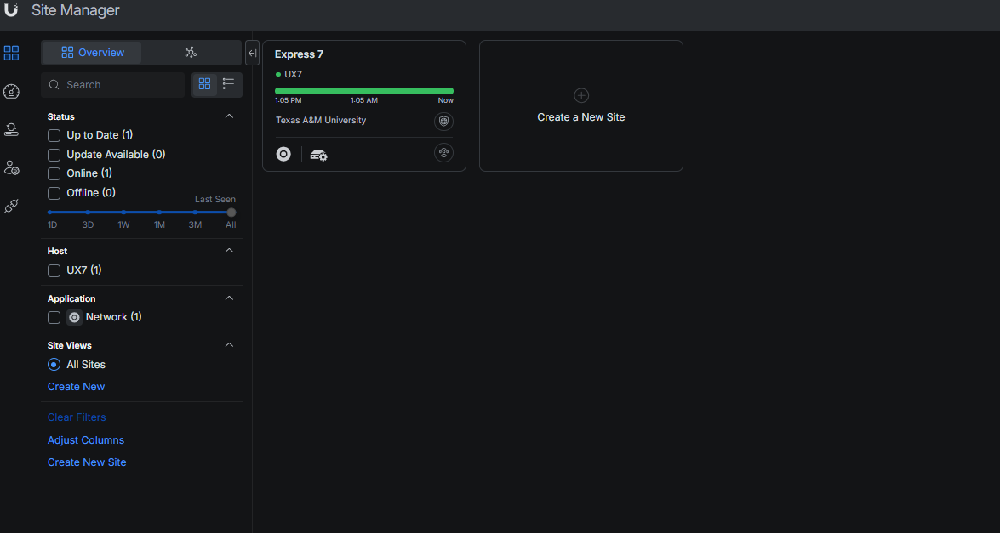

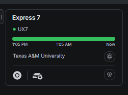

  1. Reference for the Express 7 square: 

6\. This is the home page for the network:

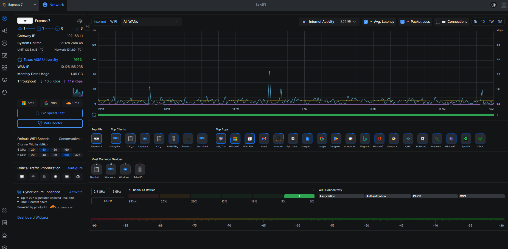

*Note: dark mode can be toggled on from the top right

# 2\. Navigation (icons in dark mode for visibility):

Performance 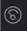

Shows you our router traffic and statistics. This is usually the home page.

Topology 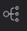

Shows you everything that’s connected to the network. You can kick devices from here, see per-device network info, and manage them. 

UniFi Devices 

Shows you your UniFi devices (your router).

Client devices 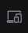

Shows you what devices are connected to your network. You can also kick devices from here, see per-device network info, and manage them. We recommend using the topology icon for managing devices.

Ports 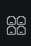

Shows us each port’s status.

Airview 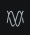

Radio-Frequency (RF) level view; shows us channel usage in the air around our network.

Insights 

Gives extra data about the network.

Settings, Logs, Alarm Manager, and Admins & Users (Bottom four, in that order)

  * Settings: View WiFi, Networks (VLANS), Internet (cloud), and Ethernet Port Profiles information here
  * Logs: Traffic Logs for the Network. Risk levels (security risk) for traffic included.
  * Alarm Manager: Router/Device specific logs.
  * Admins & Users: Lets you view which accounts are logged into the network.

# 3\. Sections

## 

## 3.1 How to kick devices off the network

1\. Open topology page:  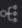   

        

2\. Click on a device that’s connected to the network (tab should show up on 

    the right side of the screen)

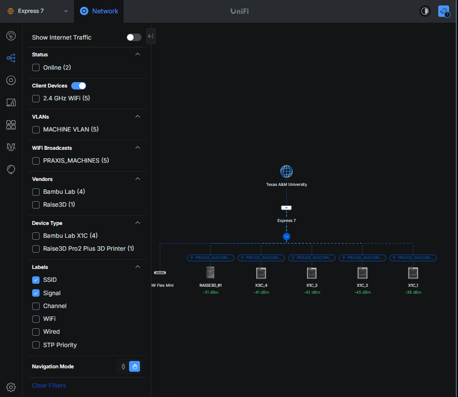

3\. Click on settings (gear icon) 

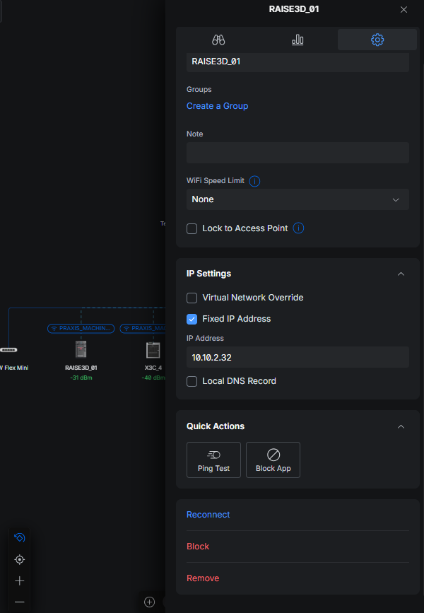

4\. Click on Remove

5\. Done

## 

## 3.2 How to check traffic logs (security)

1\. Click on logs (clipboard icon) 

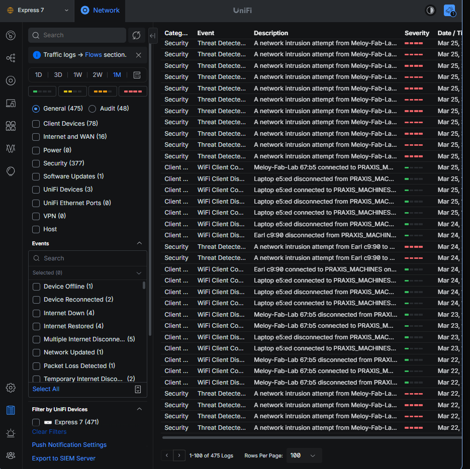

2\. The table of traffic shows up here. It’s organized as    

    Category-Event-Description-Severity-Date/Time

## 3.3 How to restart the network

1\. Click on UniFi Devices 

 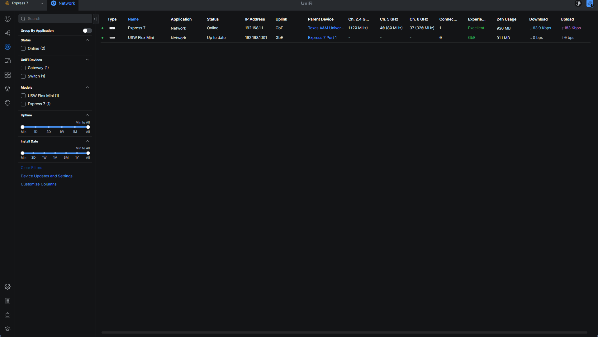

2\. Hover your mouse over Express 7 (Do not touch USW Flex Mini)

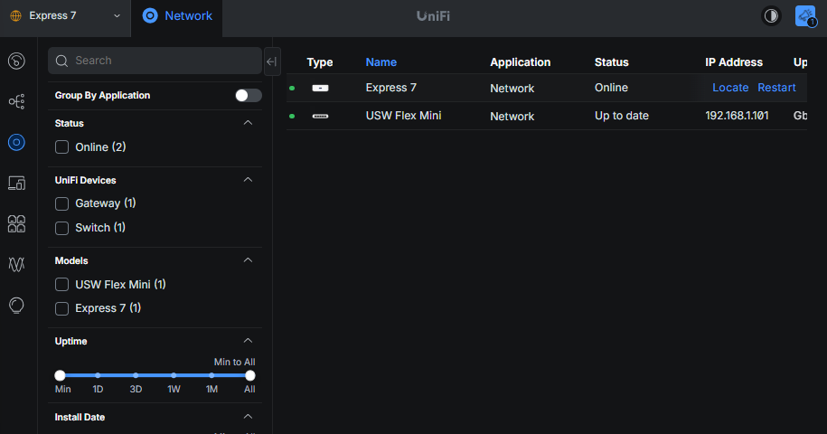

   

3\. Click on Restart 

4\. Done