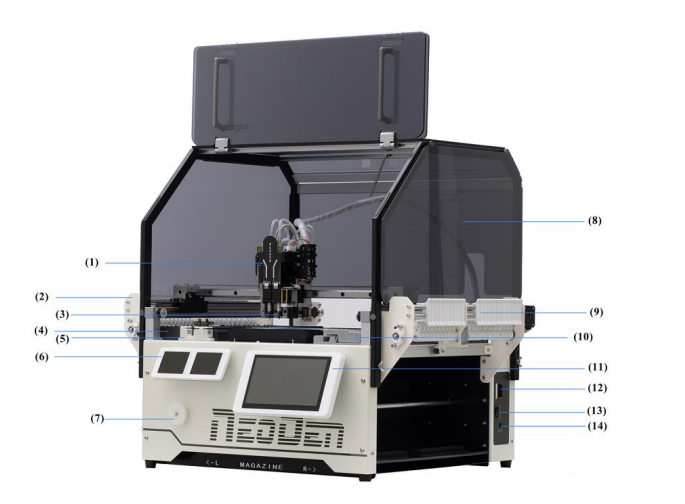
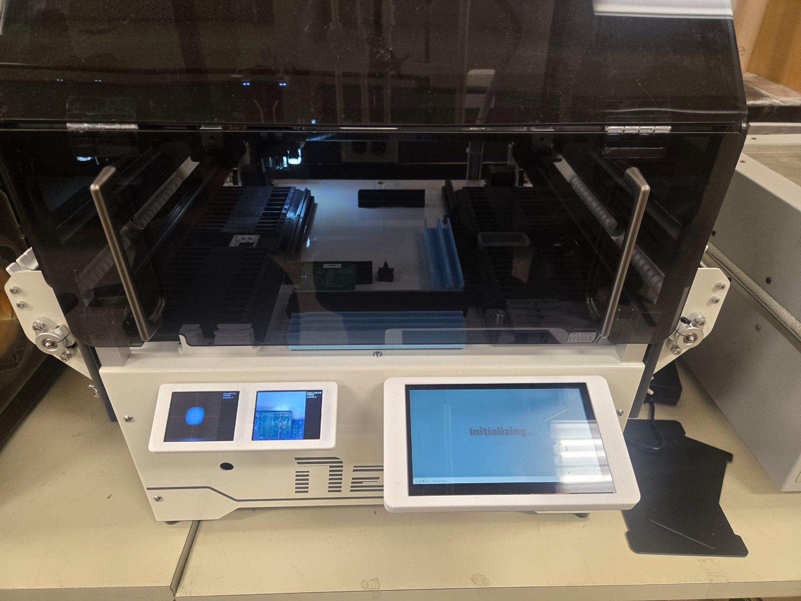

NeoDen YY1 Pick & Place Machine Operations Manual

Machine Name: NeoDen YY1 Pick & Place Machine

Location: The Fab Lab

Version: v1.3

Last Updated: 04/07/2026

Responsible Student Worker: Juan Aldapa

Linked Safety Manual: [Link](<NeoDen YY1 Pick & Place Machine Safety Manual.md>)

## 1\. What This Machine Is For

Use this machine to:

  * Educational PCB assembly and training: Teaching students the full workflow of PCB design, component preparation, machine setup, and automated placement.
  * Low Volume Prototyping and Research Builds:  Assembling small batches of prototype boards for design verification, testing, and iteration
  * Rapid Proof of Concept Assembly: Quickly validating electronic designs before committing to full-scale manufacturing.

## 2\. What This Machine Is Not For

Do not use this machine for:

  * High Volume or Production Manufacturing: The YY1 is not intended for mass production, continuous operation, or industrial-scale assembly.
  * Very large PCB Assemblies: Boards exceeding 315 mm x 350 mm or requiring panelized production workflows.
  * Ultra Fine Pitch or Advanced Packaging Technologies: This includes BGA, CSP, flip-chip, or wafer-level packaging beyond the machine’s vision and placement accuracy capabilities, and beyond fiducial markings.

## 3\. What You Need Before You Start

Before operating this machine, ensure:

  * Trained Fab Lab staff present
  * Safety Acknowledgment: Safety manual acknowledgment and completion of the "Machine Basics" orientation.
  * PCB Preparation: Applied lead free soldering paste through stencil to the printed circuit board. 
  * File Preparation: A compatible CSV containing X, Y, Rotation coordinates, and component location exported from an EDA software, such as Fusion 360, Altium, KiCad, etc. 
  * Component Check: Ensure all required surface mount devices (SMD) are loaded into the tape feeders in the same feeder as defined in the CSV file, if external components are added, be sure that they are placed on a free slot, consider the following [document](<https://www.google.com/url?q=https://docs.google.com/spreadsheets/d/18dMiUAIPoFiYq0AChLLP8tyWiuEx4bR4EatctU6wq48/edit?usp%3Dsharing&sa=D&source=editors&ust=1776804266925355&usg=AOvVaw0FawXzmESQrf-sBa0ZgBPU>) with the preloaded slots and available slots.  

## 4\. Machine Overview

  1. Placement Head: The motorized assembly that moves across the X and Y axes to pick up components and precisely place them onto the PCB.
  2. Peeler Left: An automated mechanism on the left side that strips the plastic cover tape off the component carrier tape to expose the parts for picking.
  3. Nozzle: A specialized vacuum tip attached to the placement head that physically holds and releases the electronic components during transport.
  4. Tape Feeder Left: The mounting area on the left side of the machine where reels of components (on paper or plastic tape) are loaded.
  5. Nozzle Station (ANC): The Automatic Nozzle Changer (ANC) rack where the machine stores different nozzle sizes and swaps them out automatically based on the component size.
  6. Camera Display: The visual output from the machine's "upward" and "downward" looking cameras used for component alignment and PCB fiducial recognition.
  7. Peeler Holder: The bracket or frame that secures the peeling mechanism in place, ensuring the waste cover tape is guided away from the picking area.
  8. Safety Cover: An acrylic or metal shield that protects the operator from moving parts and helps maintain a stable internal environment for the vacuum systems.
  9. Peeler Right: A secondary peeling mechanism located on the right side of the machine to handle additional tape reels.
  10. Sticker Feeder: A unique NeoDen YY1 feature that allows the machine to pick components from short, cut strips of tape rather than full reels.
  11. Touch Screen: The primary user interface where you load files, calibrate the machine, and monitor the assembly process in real-time.
  12. SD Card: The storage medium used to transfer PCB "coordinate" files (exported from CAD software) and machine backups to the internal controller.
  13. ON/OFF Switch: The main physical toggle that controls the electrical flow to the machine's internal computer and motors.
  14. Power Cord (DC 24V): The cable that connects the machine to its external power brick, providing the steady 24-volt direct current required for operation.

## 5\. Basic Operating Workflow[[a]](<#cmnt1>)

### 5.1 Start-Up

  1. Ensure that the area is clean, check for components left over. 
  2. To activate the pick and place machine, turn on the power button (13) [[b]](<#cmnt2>)located at the right corner of the machine.  

  3. After turning on the button, the machine should initialize, and the interface on the front screen should activate, along with the camera screens 

 

After the machine finished loading, it should be ready for initializing a job. If any additional SMDs were to be placed in the machine, please enter the reel through a free feeder 

Be sure that the component is properly aligned with the internal rail 

To move the component, use a pair of tweezers to gently move the reel until it reaches the marked line 

### 5.2 Running a Job

  1. The first step for loading a job is to insert the SD Card with a valid CSV file. The SD card slot is located at the right hand side of the machine, on top of the power switch.

  2. Then, make sure the SD card is pressed correctly, and there is a click sound.  Once the SD card is correctly placed, the corresponding uploaded files should appear on the screen

  3. To run the file, select it on the interface, if the CSV file is compatible, it should display “Neoden YY1 Type File” at the bottom center part of the screen.

  4. If the CSV file were to be not compatible with the machine, it would display “File Error.”

  5. Once the correct file has been selected and there are not any errors, the next step is to run the job by selecting “Mount” on the screen interface 

  6. Now, place the printed circuit board starting from the origin, and placing the board at the same orientation as in the fusion 360 design, the origin is defined as the screw to the bottom left. The black magnetic holder can be adjusted by just moving it, to hold the  

  7. After placing the pcb board and pressing mount on the interface, to initialize the job, press the start button, and the job should start automatically.

### 5.3 End-of-Job / Shutdown

  1. Stop or Complete Job: Once the software indicates "Placement Complete," wait for the head to return to the "Home" or "Park" position.
  2. Remove Part Safely: Carefully slide the PCB out of the rails. Handle by the edges to avoid disturbing the solder paste.
  3. Required User Cleanup: Use a brush to remove any "lost" components from the machine bed. Do not blow or use compressed air, as this can blow components into the internal lead screws.
  4. Power Down: Navigate to the "Exit" icon on the touchscreen before flipping the physical power switch at the rear.

## 6\. User Responsibilities After Use

After using this machine, you are responsible for:

  * Final Inspection: Carefully removing the PCB and performing a visual check for misaligned parts before reflow soldering.
  * Material Management: Returning unused component reels to their moisture-barrier bags or designated storage bins.
  * Reporting: Promptly reporting any broken needles (nozzles), feeder jams, or software "freezes" to the Fab Lab staff.

## 7\. Stop Conditions

Stop immediately and notify Fab Lab staff if:

  * Unexpected noise, vibration, or erratic motion occurs
  * Placement head moves outside programmed bounds
  * Smoke, sparks, or burning odors appear
  * Feeder jams or mechanical binding occurs
  * Software crashes or communication is lost
  * Power cable is damaged

Do not attempt to troubleshoot major issues yourself.

## 8\. Common Issues & What To Do

  * Issue: Component not getting picked up properly.

Action: Check if the feeder tape is properly indexed or if the nozzle size is too small for the part. If the issue persists, notify staff.

  * Issue: Vision alignment failure (Warning on screen).

Action: Ensure the upward-looking camera lens is clean and free of dust. Use a microfiber cloth to gently wipe it.

  * Issue: PCB fiducials not found.

Action: Check that the PCB is flat and that there is adequate lighting in the room, notify staff.

## 9\. External Resources

For more detailed information, refer to:

  * [NeoDen YY1 User Manual ](<https://www.google.com/url?q=https://www.neodensmt.com/Content/upload/PDF/2019436761/User-Manual-NeoDen-YY1-PNP-machine.pdf&sa=D&source=editors&ust=1776804266932777&usg=AOvVaw0uG0iIXyjDInirXqnQa6dQ>)
  * [Video Tutorial](<https://www.google.com/url?q=https://www.youtube.com/watch?v%3DDDgkHmDhd_Q&sa=D&source=editors&ust=1776804266932897&usg=AOvVaw3YvbuouzAmazRticxa2Ivm>)

## 10\. Questions or Help

If you have questions or need assistance at any point, ask a Fab Lab staff member. Staff are always present during operating hours.

* * *

End of Operations Manual

[[a]](<#cmnt_ref1>)reformat some pictures maybe if possible, if not thats fine

[[b]](<#cmnt_ref2>)numbered what and bold.