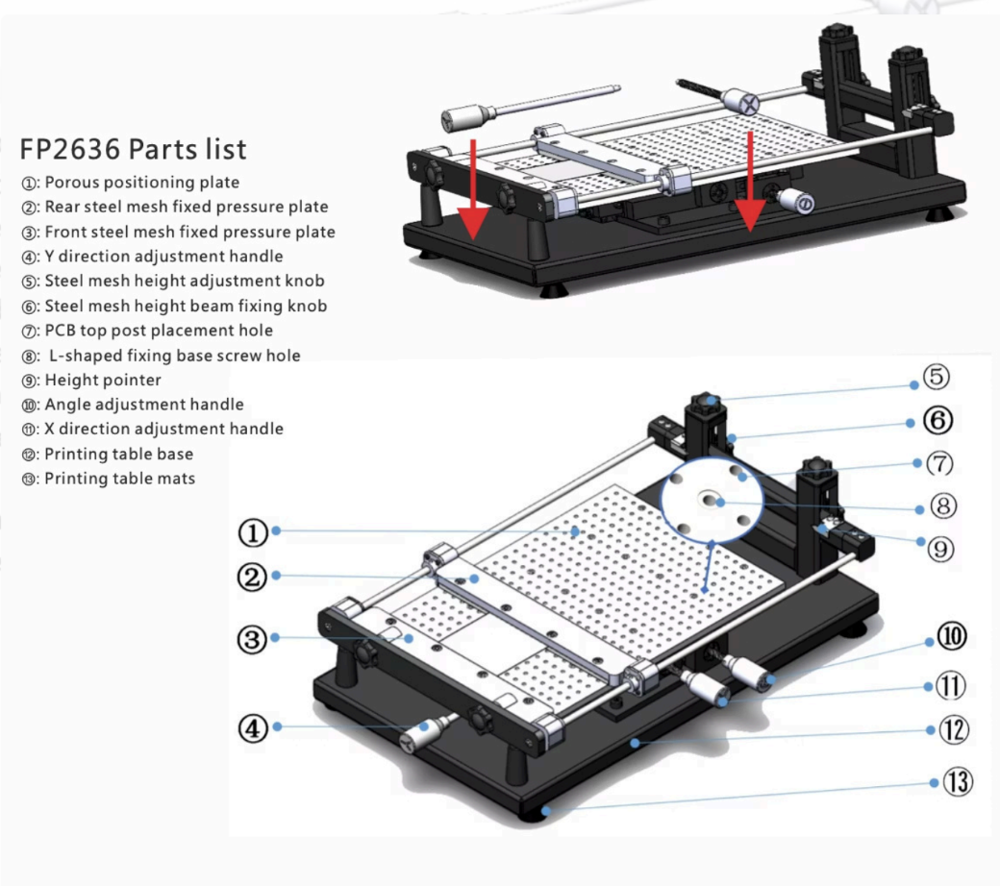
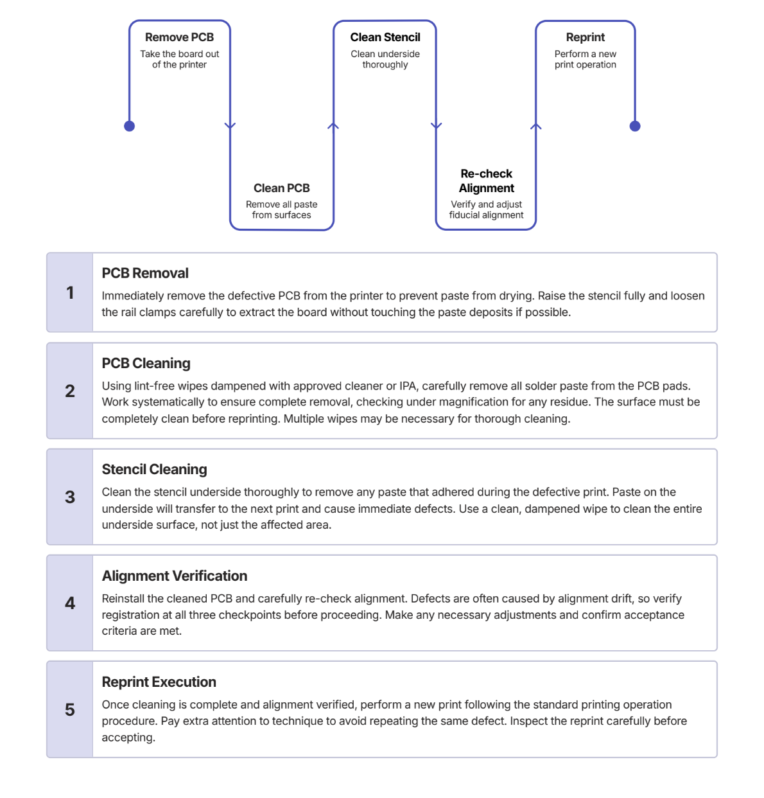

NeoDen FP2636 Solder Stencil Fab Lab Operations Manual

Machine Name: NeoDen FP2636 Solder Stencil

Location: The Fab Lab

Version: v1.0

Last Updated: 2/24/2026

Responsible Student Worker: Luca Nealon

Linked Safety Manual: [Safety Manual](<NeoDen FP2636 Machine Safety Manual.md>)

## 1\. What This Machine Is For

Use this machine to:

  * Apply solder paste to PCBs

## 2\. What This Machine Is Not For

Do not use this machine for:

  * Non-PCB solder application
  * Non-solder related stenciling

## 3\. What You Need Before You Start

Before operating this machine, ensure:

  * Staff Presence
  * Safety Manual acknowledgement
  * Nitrile Gloves
  * PCB
  * Solder Stencil Sheet
  * Cleaning Materials

## 4\. Machine Overview

  1. Porous Positioning Plate - used to attach the ‘L-shaped’ seats and pins
  2. Rear Steel Mesh Fixed Pressure Plate - holds one end of the stencil
  3. Front Steel Mesh Fixed Pressure Plate - holds the other end of the stencil
  4. Y Direction Adjustment Handle - makes fine tuning Y axis adjustments to align the PCB and the Stencil
  5. Steel Mesh Height Adjustment Knob \- ensures the stencil is level and at appropriate height
  6. Steel Mesh Height Beam Fixing Knob - locks the stencil at the desired height for application
  7. PCB Top Post Placement Hole - Used for alignment of the PCB top post
  8. L-Shaped Fixing Base Screw Hole - Holes for the L-shaped seat mounting
  9. Height Pointer - Indicates the height of the stencil
  10. Angle Adjustment Handle - Fine tunes the angle of PCB for proper alignment with the stencil
  11. X Direction Adjustment Handle - makes fine tuning X axis adjustments to align the PCB and the Stencil
  12. Printing Table Base - Base fixture that supports the assembly
  13. Printing Table Mats - Feet of the assembly to assure good friction with table and reduce vibration/damage to table surface

## 5\. Basic Operating Workflow

### 5.1 Start-Up

Pre-Operation Checklist

  1. Stencil stable and level on workbench
  2. Bed surface clean and completely dry
  3. Rails freely moving (no binding)
  4. Clamps tighten evenly on both sides
  5. Adjustment knobs turn smoothly
  6. No visible damage
  7. Correct stencil and PCB versions
  8. No clogged apertures
  9. No warping, bending, or damage on stencil
  10. Stencil frame is straight
  11. Stencil surface is clean
  12. Tension mesh has no tears
  13. PCB surface clean and oxide free
  14. Minimal warpage across PCB board
  15. Fiducials clearly visible if present
  16. Paste within expiration date
  17. Paste conditioned to room temperature
  18. Paste properly mixed per guidelines

### 5.2 Running a Job

  1. Preparation

  *  Proper bed preparation is the foundation of successful stencil printing. Begin by thoroughly cleaning the perforated bed surface using a lint-free wipe dampened with approved cleaner. Remove any debris, dust, or residual solder paste that could create an uneven printing surface. Pay special attention to the perforations, ensuring they are clear and unobstructed. Any contamination on the bed surface will transfer through to the PCB bottom side and can cause the board to sit unevenly, resulting in inconsistent paste deposits. 
  * After cleaning, visually inspect the bed to confirm it is level and free from any obstructions. The bed should be completely dry before placing the PCB. A clean, level bed ensures optimal contact between the PCB and stencil, which is critical for achieving uniform paste thickness across all pads. This step takes only one to two minutes but significantly impacts print quality and should never be rushed or skipped.

  2. PCB Placing

  * Prepare PCB Positioning; Install "L-shaped seats" and "positioning pins" on the printer's bed, aligning them with PCB holes. Position the PCB as close as possible to the frameless stencil's hole location, accounting for limited XY adjustment. For deformable PCBs, consider installing a "PCB top post" for additional support and flatness.
  * Initial PCB Placement; Carefully place the PCB on the clean bed surface, ensuring the side to be printed faces upward. Handle the board by its edges to avoid contaminating the pad surfaces with oils or residue from your gloves. Position the board approximately in the center of the bed to allow for adjustment in all directions during alignment.
  * Rail Adjustment; Adjust the side rails inward to secure the PCB firmly in position. The rails should make solid contact with the board edges without applying excessive pressure that could cause board flexing or damage. Tighten the rail locking mechanisms to prevent any movement during printing. Ensure both rails provide equal pressure to keep the board centered.
  * Gently press on the PCB center to check for flexing. If the board shows any significant flex or warpage, add support underneath using approved materials. Carefully insert the stencil frame into the clamp assembly, handling only the frame edges to avoid touching the mesh surface. Ensure the correct orientation with the paste side facing upward.

  3. Stencil Placement

  * Center the stencil over the PCB area by visual approximation. The aperture pattern should be roughly positioned over the corresponding PCB pad layout before tightening any clamps.
  * Tighten the clamps gradually and evenly on both sides, alternating between left and right to maintain balanced tension. Avoid over-tightening which can warp the frame or damage the mesh.
  * Visually inspect the stencil to confirm it is flat and properly tensioned across the entire printing area. There should be no sagging, ripples, or distortion in the mesh.

  4. Alignment and Registration

  * Lower the stencil gently until it nearly contacts the PCB surface. Look through the stencil apertures and visually align major pad patterns such as IC footprints or connector pads. Use the X and Y adjustment knobs to move the stencil position until the overall pattern appears centered.
  * Identify fiducial marks on the PCB or select fine-pitch component pads for precise alignment. Fiducials are typically circular pads designed specifically for alignment. If fiducials are not present, use the smallest pitch components as alignment references.
  * Check alignment at minimum three points across the PCB, ideally at opposite corners and center. All verification points should show symmetric aperture-to-pad overlap. If alignment is good at one location but poor at another, check for PCB warpage or stencil flatness issues.
  * Once alignment is optimal at all verification points, carefully lock all adjustment controls to prevent drift during printing. Perform one final visual check before proceeding to paste the application

  5. Paste Application

  * Raise the stencil to its upper position using the lift mechanism. Apply a continuous bead of solder paste along one edge of the stencil, positioned just before the first apertures. The bead should be approximately 10-15mm in diameter and extend across the full width of the print area. Ensure the paste bead is uniform with no gaps.
  * Lower the stencil slowly and carefully until it makes full contact with the PCB surface. Ensure the stencil contacts the board evenly across the entire area. Any gaps between stencil and PCB will result in uneven paste deposits or incomplete filling of apertures
  * Hold the squeegee at 30-60 degrees to the stencil surface, with 45 degrees being typical and most effective for most applications. Apply even, moderate downward pressure—just enough to shear the paste and force it into the apertures without excessive force that could damage the stencil or cause over-filling. Perform one smooth, continuous pass across the entire stencil at a steady speed of approximately 25-50mm per second. Do not stop mid-stroke or vary your speed.
  * After completing the squeegee pass, immediately lift the stencil vertically upward in one smooth motion. This is called the snap-off or separation. Avoid any lateral movement that could smear the paste deposits. The separation should be quick but controlled—not jerky or hesitant. A clean separation is critical for maintaining sharp, well-defined paste deposits.

### 5.3 End-of-Job / Shutdown

  1. All pads should have paste deposits with no missing pads. Check every pad systematically, especially fine-pitch areas and small passive components. Missing paste on even one pad can cause assembly failure.
  2. Paste deposits should have sharp, well-defined edges that match the aperture shape. Rounded or fuzzy edges indicate poor stencil separation or excessive paste. Crisp edges are essential for accurate component placement.
  3. Adjacent pads should show no paste bridges connecting them. Bridging is most common on fine-pitch components and indicates alignment issues, excessive paste, or too much squeegee pressure. Any bridging is cause for rejection.
  4. Paste deposits should have consistent thickness across all pads, typically 50-75% of the stencil thickness. Variations in thickness indicate uneven stencil contact, PCB warpage, or inconsistent squeegee pressure during the print stroke.
  5. All above conditions should be satisfied for a successful operation
  6. Remove stencil from the frame and discard appropriately (If lead concentration in the paste was higher than 5 PPM/0.0005% it must be thrown away as hazardous waste)
  7. Remove PCB from frame
  8. Ensure assembly is clean and free of debris
  9. Return all tools to their original location
  10. If the stencil application failed, use the following diagram

## 6\. Common Issues & What To Do

  * Issue: Solder application failed  
Action: Follow above diagram to restart process
  * Issue: Knobs not adjusting properly  
Action: consult staff

## 7\. External Resources

For more detailed information, refer to:

  * [Manufacturer user manual](<https://www.google.com/url?q=https://drive.google.com/file/d/1vA-kGAvt8dEtVxf1765T83xTjlG_aOhA/view?usp%3Dsharing&sa=D&source=editors&ust=1776804279887919&usg=AOvVaw1vLeNGuB-Qs6xBMnFBp4z1>) (inside the drive folder)
  * [Stencil Video Example](<https://www.google.com/url?q=https://www.youtube.com/watch?v%3D1tkFluE98RU&sa=D&source=editors&ust=1776804279888303&usg=AOvVaw3zvJoGRxXMpGr_PZ8l6XIy>)

  * Though not exact;y the same machine, the video demonstrates what the process should look like. Note that setting up the stencil requires more checking that the stencil and PCB line up than the video shows

## 8\. Questions or Help

If you have questions or need assistance at any point, ask a Fab Lab staff member. Staff are always present during operating hours.

* * *

End of Operations Manual