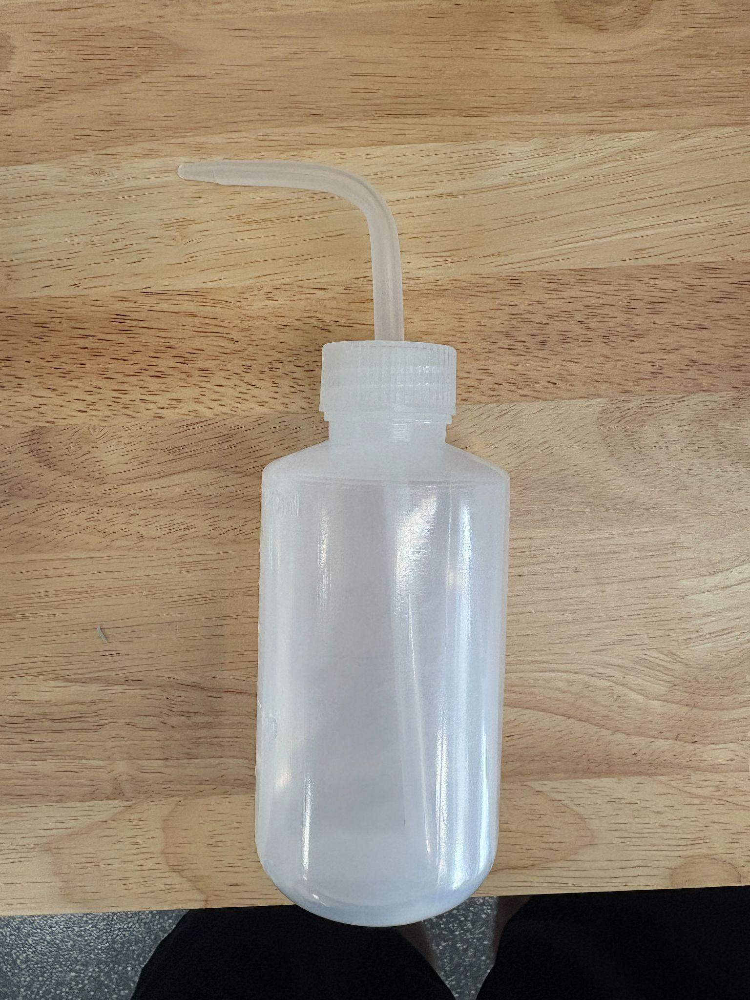
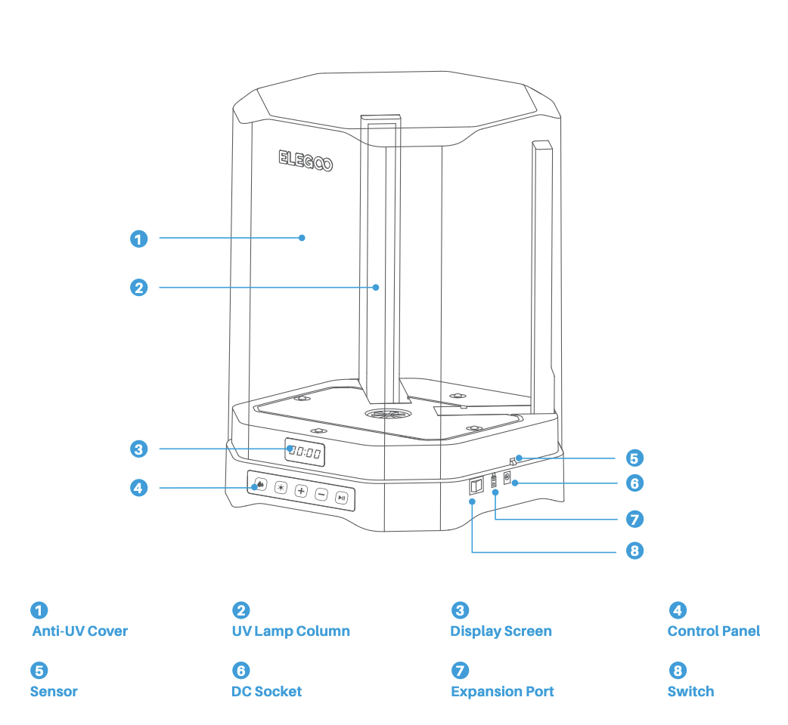
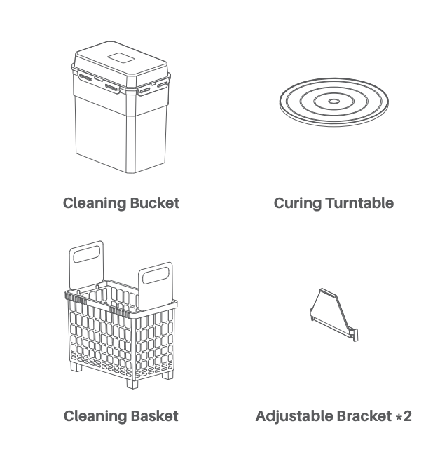
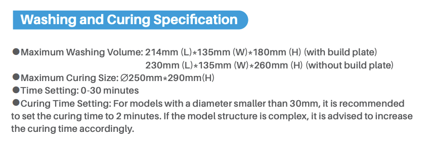
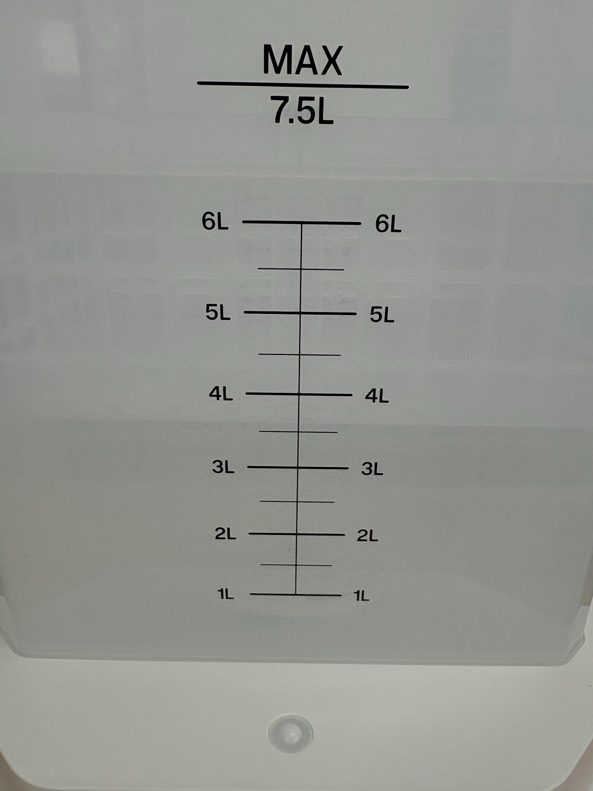
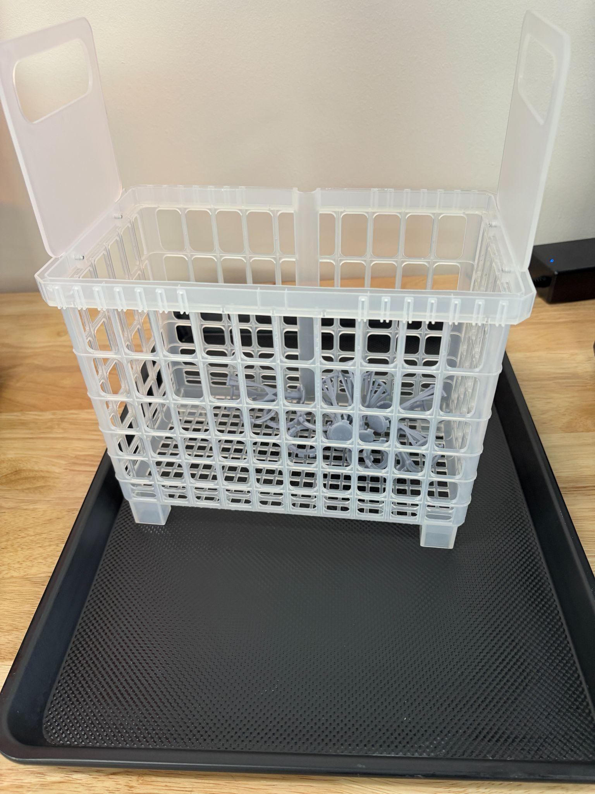
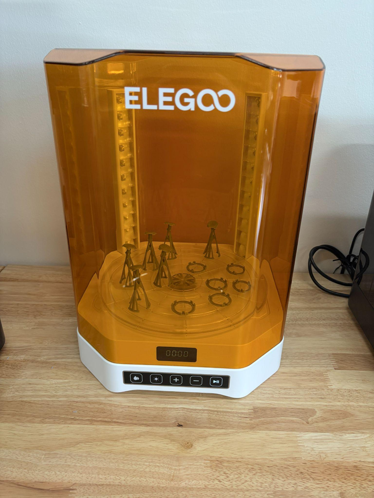
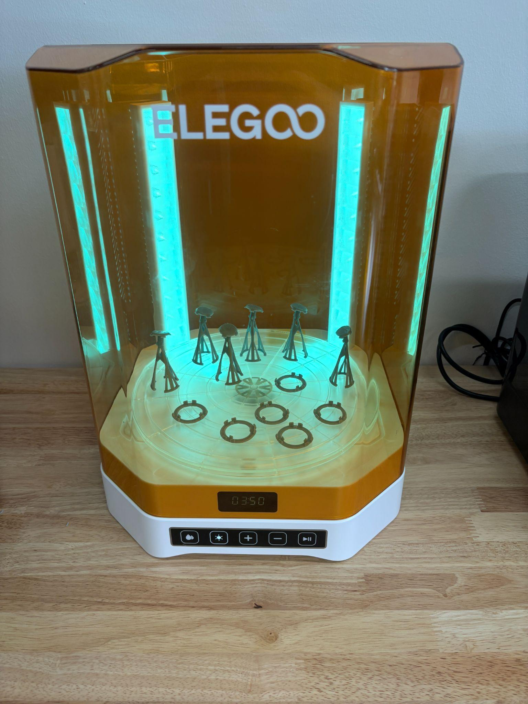

**Disclaimer: YOU WILL NOT LEAVE UNCURED RESIN IN THE WORK AREA**

# SAFETY MANUAL

## 1\. Purpose of This Safety Manual

This document outlines the safety requirements for operating the Mercury 3.0 Plus wash and cure station in The Fab Lab. It focuses on:

  * Hazards that can cause injury or damage
  * Required PPE
  * Emergency response procedures

## 2\. Who May Use This Machine

This machine may be used by:

  * Fab Lab users who have read through the entirety of this document

Usage conditions:

  * Staff must be present during the operation
  * Users must follow all resin handling procedures

## 3\. Primary Hazards

Be aware of the following hazards:

  * IPA is flammable and produces harmful vapors
  * Uncured resin is toxic and can irritate skin/eyes

  * UV LEDs used for curing can damage eyes/skin

  * Risk of shock if liquid contacts electrical components

  * Spinning wash impeller and rotating cure platform

## 4\. Required Personal Protective Equipment (PPE)

The following PPE is required:

  * Nitrile gloves (required)
  * Safety glasses (recommended)
  * Mask (optional)

## 5\. General Safety Rules

Always follow these rules:

  * Never touch uncured resin with bare hands
  * Never operate with the lid open during curing
  * Keep liquids away from electrical components
  * Do NOT reach into the machine while it is running
  * Do not operate if unsure how to proceed

If resin or IPA contacts skin or eyes, follow [manufacturer guidance](<https://www.google.com/url?q=https://elegoo-downloads.oss-us-west-1.aliyuncs.com/download.elegoo.com/04%2520LCD%2520Printer/12%2520Photopolymer%2520Resin/SGS%252020240206/Standard%2520Photopolymer%2520Resin/MSDS-US%2520Standard/CANEC24000105203%2528SZP24-000166%2529-Final.pdf&sa=D&source=editors&ust=1776804210097215&usg=AOvVaw02x0gJaQTGh2lt2PIKGeo9>):

  * Rinse with water for at least 15 minutes
  * Seek medical attention if irritation persists

## 6\. Emergency Stop & Safety Features

  * Emergency Stop: No dedicated emergency stop button
  * Power Disconnect: Use rear power switch or unplug
  * Safety Cover: Must remain closed during curing

If an emergency occurs:

  1. Stop the process using controls
  2. Turn off power
  3. Notify Fab Lab staff immediately

## 7\. Unsafe Conditions – Stop Immediately If:

  * Strong chemical odors or excessive fumes
  * IPA spills near electronics
  * Abnormal noise or vibration
  * UV lights malfunction
  * Cracks or leaks in wash container

## 8\. Incident & Injury Response

  1. Stop the machine
  2. Move to a safe distance
  3. Notify staff immediately
  4. Follow Fab Lab emergency procedures

## 9\. Chemical & Material Safety

This machine uses:

  * Isopropyl Alcohol (IPA)
  * Uncured resin residue

Handling requirements:

  * Never pour IPA or resin down the drain
  * Dispose of solid resin waste in the trash
  * Store IPA in sealed containers

Ventilation:

  * Use in the designated resin area
  * Keep the lid closed during operation

## 10\. Acknowledgement

By using this machine, you acknowledge that:

  * You understand the hazards and risks
  * You will follow all safety procedures
  * You will ask for help when needed

* * *

End of Safety Manual

* * *

# 

# OPERATIONS MANUAL

## 11\. What This Machine Is For

Use this machine to:

  * Wash uncured resin from printed parts
  * Cure prints using controlled UV exposure

## 12\. What This Machine Is Not For

Do NOT use this machine for:

  * Cleaning non-resin parts
  * Heating, drying, or curing incompatible materials

## 13\. What You Need Before You Start

Before operating:

  1. Staff present
  2. PPE (gloves required)
  3. Printed part ready for post-processing
  4. Wash bucket filled with IPA
  5. Curing platform
  6. Part removed safely from build plate
  7. Alcohol dispenser

* * *

## 

## 14\. Machine Overview

General Machine locations:

|   
---|---  
Figure 1| Figure 2  
  
Key User Interaction Points

  * Control Panel (Figure 1:4): Set wash and cure time
  * Cleaning Bucket (Figure 2): Holds IPA and basket
  * Cleaning Basket (Figure 2): Holds parts during wash
  * Curing Turntable (Figure 2): Rotates for UV exposure
  * Anti UV Cover (Figure 1:1): Must be closed during operation

Emergency Operation

  * Stop using the controls or the power switch
  * No dedicated emergency stop (consistent with printer)

* * *

## 

## 15\. Basic Operating Workflow

## 15.1 Pre-Processing (From Printer)

  1. Remove print from build plate
  2. Allow excess resin to drip into vat
  3. Transfer part to wash station

** This is a 2-in-1 washing and curing machine. The following subheadings will be broken into two sections, one for washing and one for curing. **

  
---  
Figure 3  
  
## 

## 15.2 Washing Process

  1. Fill container with IPA (within marked limits)

  2. Place part in the basket

  3. Close lid
  4. Set wash time (typically 2–5 minutes. View washing times in Figure 3 above)
  5. Start wash cycle
  6. Allow parts to fully clean

## 15.3 Drying

  1. Place baking sheet on the table
  2. Take out the basket and place it on the sheet so that excess alcohol will drip on it

  3. Let IPA evaporate fully (air dry or fan)
  4. Remove parts when dry
  5. Wipe the sheet clean with a shop towel 

## 15.4 Curing Process

  1. Put the lid on the wash container and remove the container from the platform
  2. Place the curing platform on the machine

  3. Close lid completely

  4. Set curing time (typically 2–10 minutes, depending on part size. View Figure 3 above for cure times)
  5. Start curing cycle

  6. Wait for curing cycle to finish

## 15.5 End-of-Job / Shutdown

  1. Remove finished part
  2. Inspect for completeness
  3. Replace the curing platform with the wash container
  4. Ensure lid is closed
  5. Turn off machine 

## 16\. User Responsibilities After Use

After using the machine, you are responsible for:

  * Cleaning spills and work area with IPA
  * Ensuring IPA container is sealed
  * Disposing of IPA or Resin solid waste in the trash
  * Reporting issues or damage

## 17\. Stop Conditions

Stop immediately and notify staff if:

  * Machine makes unusual noise
  * IPA leaks or spills internally
  * UV lights fail or flicker
  * Parts are not rotating or washing properly

## 18\. Common Issues & What To Do

Issue: Parts still sticky after wash

Action: Increase wash time or replace IPA

Issue: White residue on parts

Action: Let part dry fully before curing

Issue: Uneven curing

Action: Reposition part or increase cure time

Issue: IPA becomes cloudy

Action: Replace IPA

## 19\. External Resources

  * Manufacturer Manual (Mercury 3.0 Plus): [https://f00.psgsm.net/product/921685/mercury-3.0-plus.pdf](<https://www.google.com/url?q=https://f00.psgsm.net/product/921685/mercury-3.0-plus.pdf&sa=D&source=editors&ust=1776804210123315&usg=AOvVaw3vOVpj0wMomjMBXPl8YXfH>)
  * Elegoo Printer Manuals: ([Safety Manual](<../Elegoo Saturn 4 Ultra 16K Resin 3D Printer/Operations & Safety Manuals/Elegoo Resin 3D Printer Safety Manual.md>), [Operations Manual](<../Elegoo Saturn 4 Ultra 16K Resin 3D Printer/Operations & Safety Manuals/Elegoo Resin 3D Printer Operations Manual.md>))

## 20\. Questions or Help

If you have questions or need assistance at any point, ask a Fab Lab staff member. Staff are always present during operating hours.