Tab 1

Elegoo Resin 3D Printer Cleaning Manual

Machine Name:  Elegoo Saturn 4 Ultra 16K

Location: The Fab Lab

Version: v1.5

Last Updated: 04/11/2026

Responsible Student Worker: Tyler Roussett

Linked Operations Manual: [Elegoo Saturn 4 Ultra 16K Operations Manual](<../Operations & Safety Manuals/Elegoo Resin 3D Printer Operations Manual.md>)

Linked Safety Manual: [Elegoo Saturn 4 Ultra 16K Safety Manual](<../Operations & Safety Manuals/Elegoo Resin 3D Printer Safety Manual.md>)

Linked Assignment: [Elegoo Saturn 4 Ultra 16K Safety Manual](<../Learning Assignments/Elegoo Resin 3D Printer Activity.md>)

Linked Washing and Curing Manual: [Elegoo Mercury Plus V3.0](<../../Elegoo Mercury 3.0 Plus Washing And Curing Machine/Elegoo Washing And Curing Machine Manual.md>)

DISCLAIMER:

  * YOU WILL NOT LEAVE UNCURED RESIN IN THE WORK AREA
  * IF YOU ARE NOT USING THE STANDARD 2.0 RESIN, YOU ARE RESPONSIBLE FOR CHANGING RESINS

This is the cleaning manual for the Elegoo resin printer.

The manual contains procedures for cleaning the resin vat in the printer, as well as the cleaning procedures for the parts made by the printer.

The vat cleaning is to take place BEFORE the use of the resin printer, the washing and curing is for AFTER the piece is made.

# 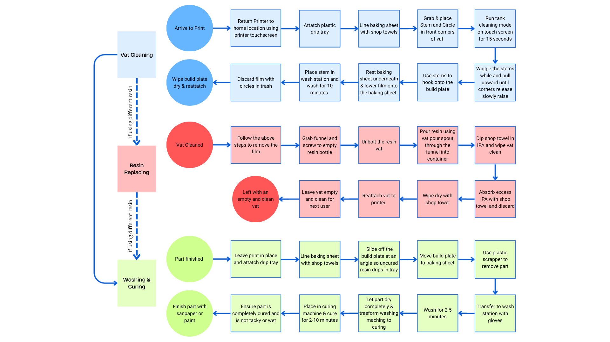

Resin VAT Cleaning

Required Materials:

  * Nitrile gloves (required)
  * Safety glasses (recommended)
  * N95 mask (optional)
  * Isopropyl Alcohol (IPA) 99%
  * Blue shop paper towels
  * Plastic or silicone scraper (NOT metal)
  * Baking sheet
  * Plastic Elegoo drip pan
  * Cleaning pieces: Stem and Circle
  * Plastic scraper

##   
1\. Safety Precautions

  * Always wear gloves when handling anything with resin 
  * Avoid skin contact with liquid resin
  * Keep IPA away from flames
  * Never pour resin or IPA down the drain

Refer to the [safety manual](<../Operations & Safety Manuals/Elegoo Resin 3D Printer Safety Manual.md>) for more details

## 2\. When to Clean

Clean the printer:

  * Before every print (basic cleaning procedure)
  * After print failure

## 3\. Basic Cleaning Procedure

### 3.1 Preparation

  1. On the printer touchscreen, click “Return Home” through the menus: “Tool” -> “Manual” -> “Return Home” to raise the build plate 
  2. Attach the plastic drip pan around the VAT

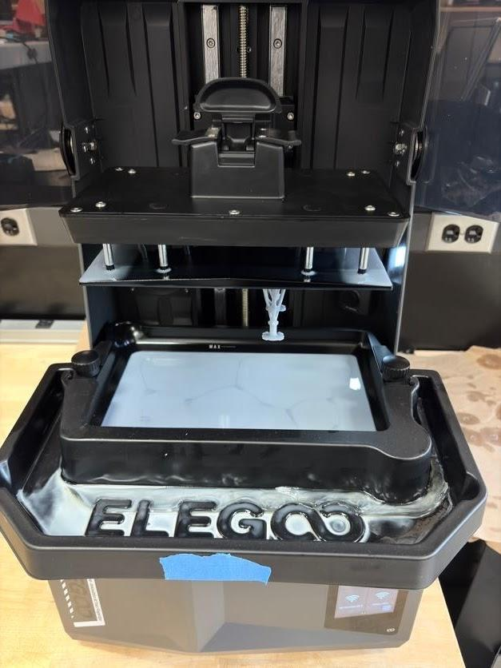

  3. Grab the baking sheet and line it with shop towels to absorb any liquid resin

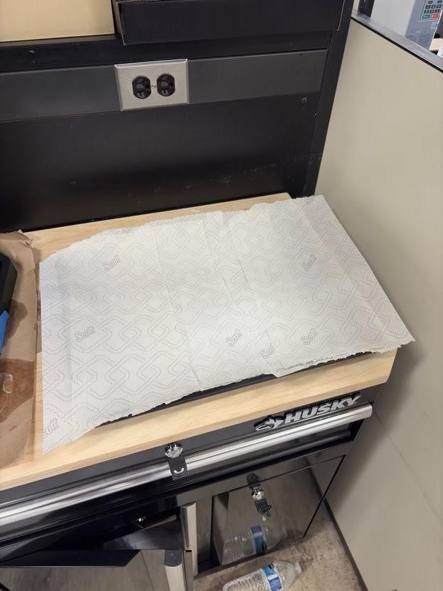[[a]](<#cmnt1>)

  4. Grab the two cleaning pieces: Stem and Circle, and snap the circle onto the base of the stem

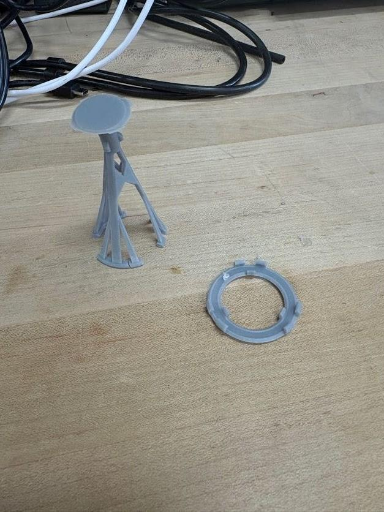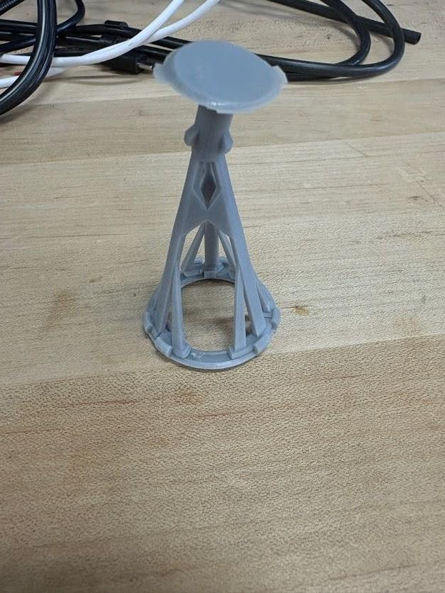

  5. Place the stems into the resin tank at the front corners of the screen

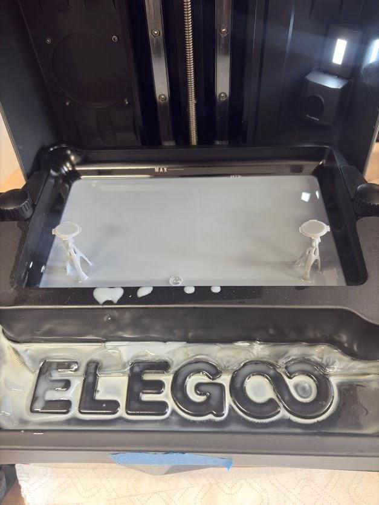

  6. Run the cleaning mode for 15 seconds on the touchscreen under “Tools” ->” Tank Cleaning.”

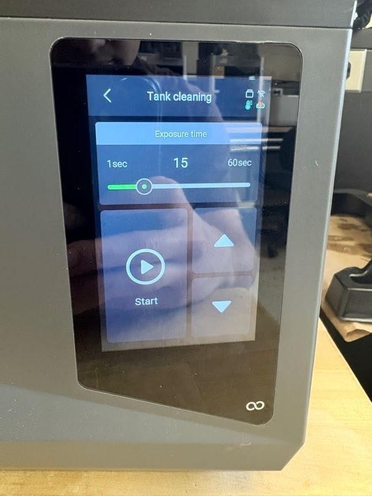

  7. After the tank cleaning completed, gently wiggle the two stems while slightly pulling upward until you feel the corners release from the bottom film, and slowly raise

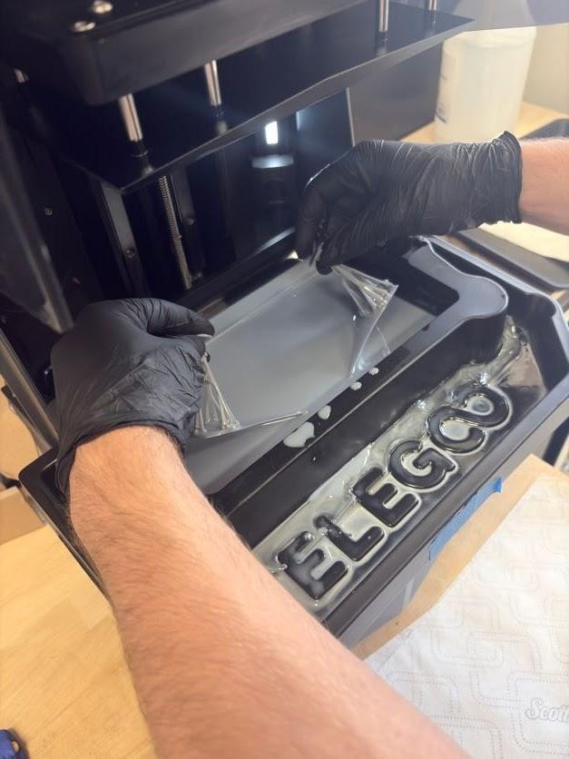 

  8. After raising, use the knobs at the end of the stems to hook onto the build plate above.

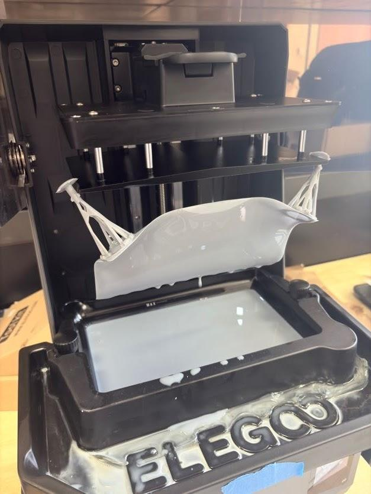 

  9. Take the baking sheet lined with towels and hold underneath the film, resting on top of the two screws knobs on the VAT, and gently remove one side of the stem from the build plate, lowering the cleaned film onto the baking sheet.

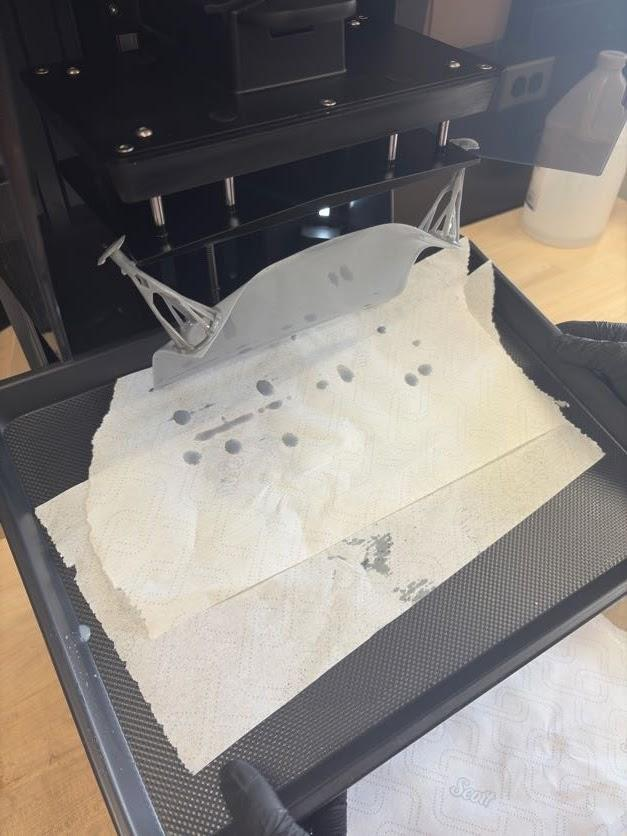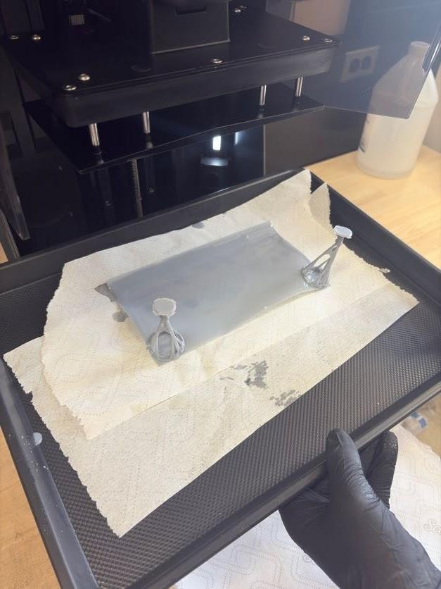 

  10. Using the plastic scraper, hold down on the circle that is attached to the cleaned film and pull the stem with the other hand to separate the two pieces. Place the two stems on towels to dry for 10 minutes, then place them in the IPA washing station for 2 minutes. Discard the film as well as the circles attached to it.

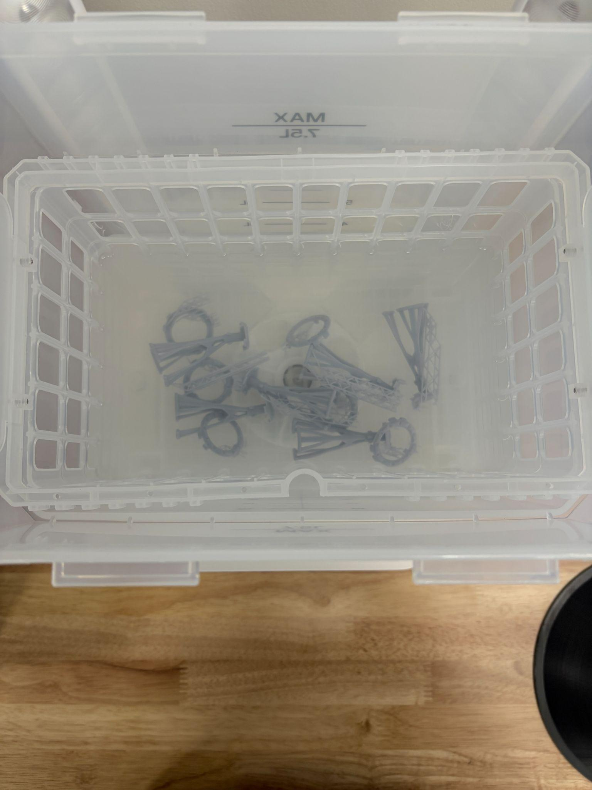 

### 3.2 Clean the Build Plate

  1. Ensure the build plate is clear of cured resin
  2. Wipe excess resin with paper towels.

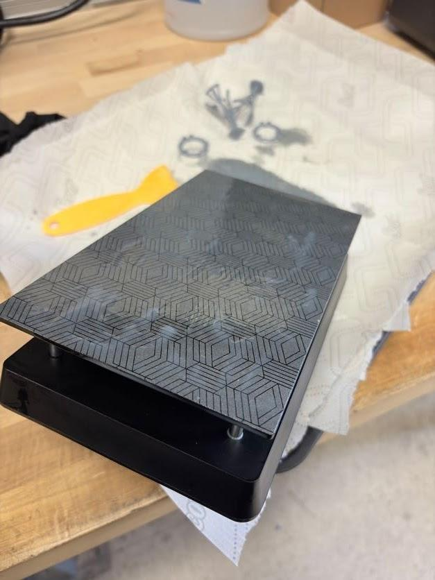

  3. IMPORTANT: Do NOT use alcohol on the main face of the build plate, as it interferes with the adherence of the resin when printed.
  4. Wipe the build plate with a shop towel
  5. Dry the build plate completely with a shop towel.
  6. Important: Do NOT scratch or gouge the surface, which also affects adhesion.
  7. Reattach to the printer, freeing up the cleaning tray

## 5\. Filling Resin Vat

5.1 Refill Resin

  1. On the printer touchscreen, click “Return Home” through the menus: “Tool” -> “Manual” -> “Return Home” to raise the build plate 
  2. Put the plastic drip tray around the vat
  3. Get the Grey Standard 2.0 resin from the staff and open
  4. Slowly pour the resin into the vat until it is filled between the Max and Min lines
  5. Close the container and return it to the staff
  6. Use a shop towel dipped in IPA to clean any resin spills
  7. Discard of waste in the trash

## 5.2 Changing Resin / Full Vat Cleaning

  1. Follow the above steps to remove the film
  2. Grab the threaded funnel and screw it to the opening of an empty resin bottle

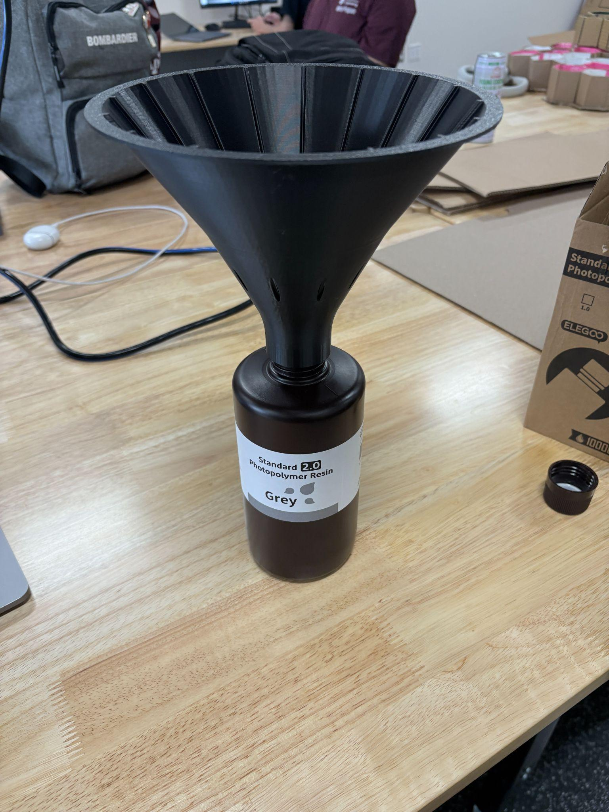

  3. Grab the part to hold the bottle and place the bottom in the holder

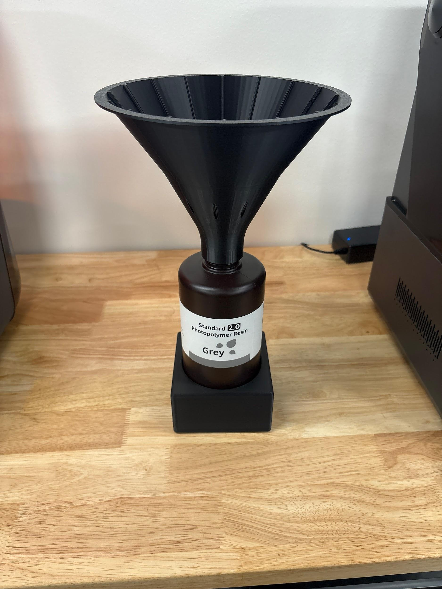

  4. Place a paper funnel inside the large funnel

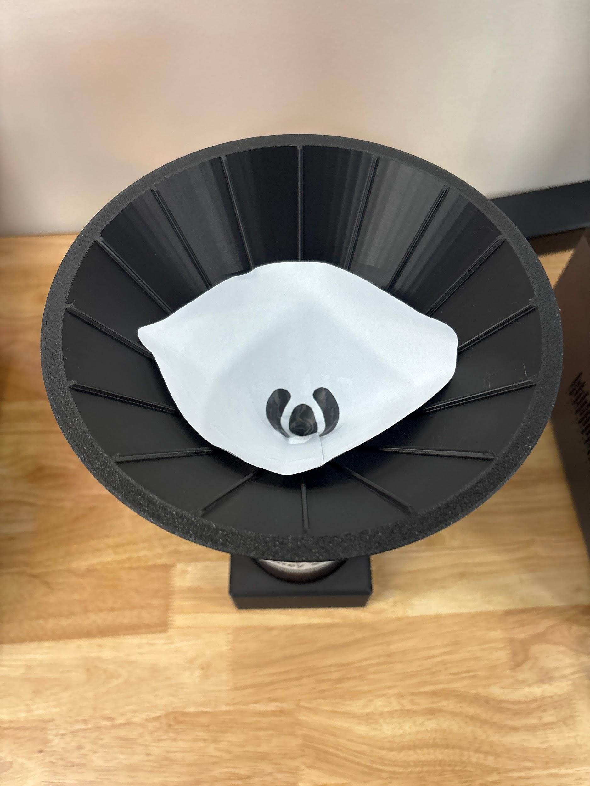

  5. Unbolt the resin VA
  6. Slowly pour resin via the VAT pour spout through the funnel into the container.
  7. Dip a shop towel into IPA and wipe the vat clean (do NOT scrub aggressively)
  8. Absorb excess IPA with a shop towel and discard
  9. Wipe dry with a shop towel
  10. Reattach VAT to the printer 
  11. Leave the printer empty of resin for the next user

## 6\. Post Print Cleaning

### 6.1 Printed Component Removal

  1. Let the print finish
  2. Leave in place for approximately one minute for the excess resin to drip into the VAT
  3. Lift the UV cover and install the plastic drip skirt around the VAT

  4. Grab the baking sheet and line it with shop towels to absorb uncured resin (seen above in basic cleaning)
  5. Lift the build plate handle and carefully remove the build plate. Slide off the build plate and keep the plate angled so uncured resin continues to drain into the drip tray

  6. Carefully move the plate to the cleaning tray. Go slowly so the resin does not run onto the printer body or screen.

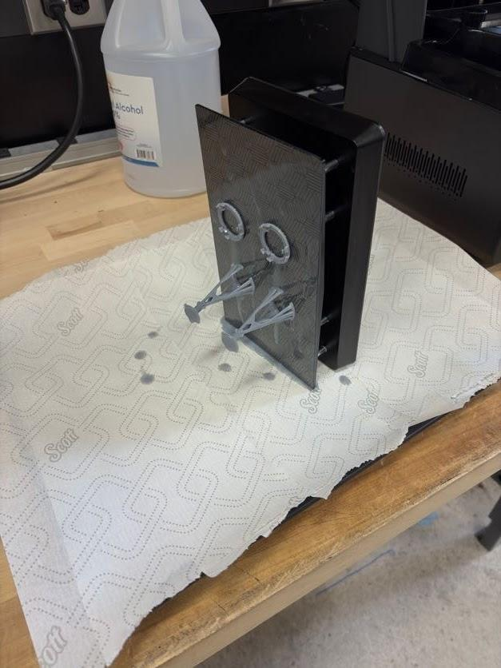

  7. Use the plastic scraper and start at the edge or under a support raft. Apply steady pressure until the print separates from the plate

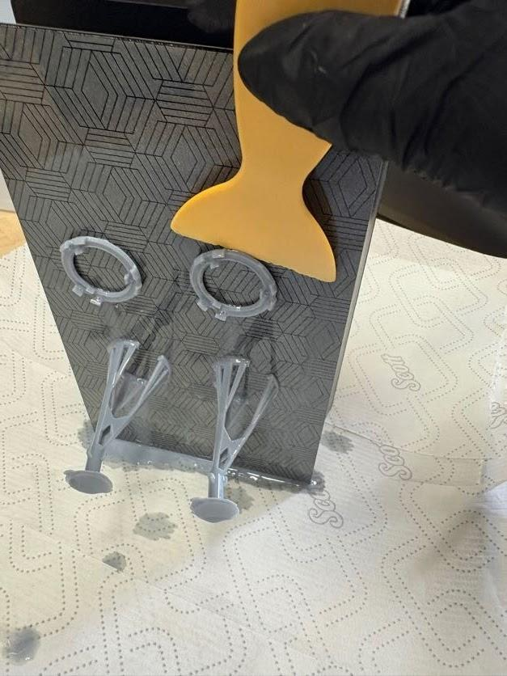

Tip:

  * Do not pry toward your hand
  * Keep the blade low to the plate
  * If the print is hard to remove, lightly tap the scraper handle or let the part sit for a minute before trying again

  8. As soon as the part is removed, transfer it to the wash station basket. USE GLOVES 

  9. Wash for about 2 to 5 minutes. 

** For more information, view the [Elegoo Washing and Curing Manual](<../../Elegoo Mercury 3.0 Plus Washing And Curing Machine/Elegoo Washing And Curing Machine Manual.md>) **

  10. Let the standing liquid drip off in the washing station
  11. If it still feels slippery or glossy with uncured resin, wash it again briefly
  12. Let the print air dry fully or pat dry with shop towels

Note: If the IPA is not removed completely, it can leave white marks, tackiness, or an uneven cure.

  13. Remove the supports from the washed print:

  * Snip or peel the support away carefully
  * Twist gently instead of forcing them
  * Trim support marks if needed

  14.  Before curing, make sure the print is clean, no wet resin remains, no alcohol remains on the surface, and supports are removed
  15. Place the part in the UV curing machine

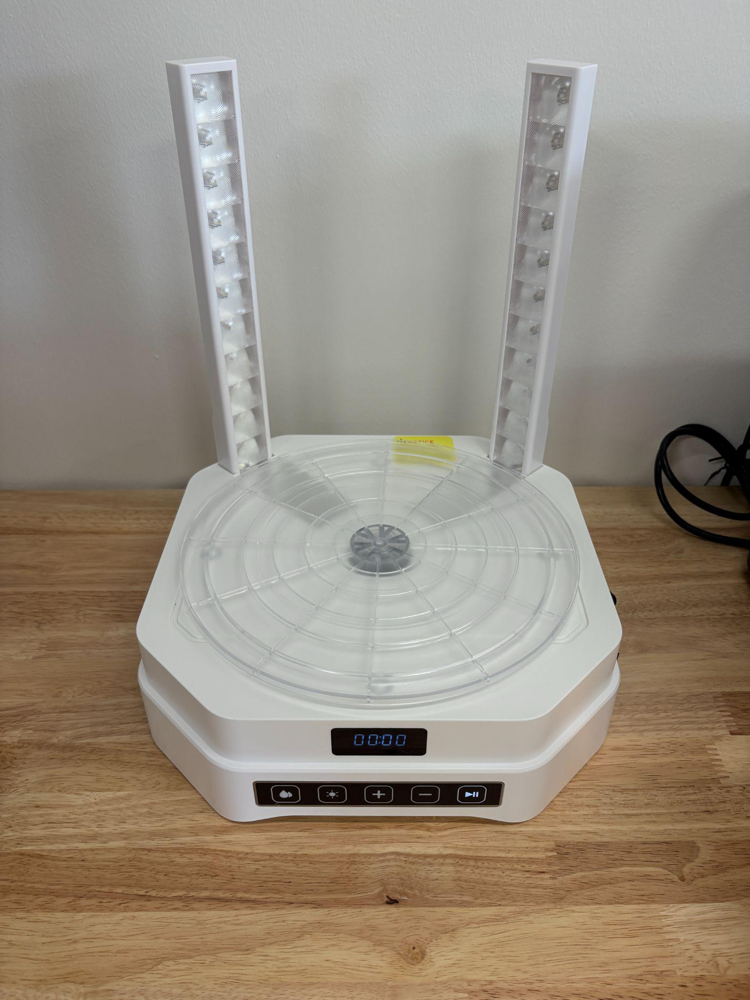

  16. Cure for 2 to 7 minutes, depending on:

  * part size (small ~2-3, medium ~ 3-5, large ~5-7)

** For more information, view the [Elegoo Washing and Curing Manual](<../../Elegoo Mercury 3.0 Plus Washing And Curing Machine/Elegoo Washing And Curing Machine Manual.md>) **

  17. After curing, ensure the part feels dry, no longer feels tacky, and holds its shape firmly
  18. If still slightly tacky, cure a little longer in short intervals, but do not overcure thin or detailed parts, because that can make them brittle.

## 7\. External Resources

For more detailed information, refer to:

  * Elegoo Saturn 4 Ultra 16K User Manual ([Elegoo Saturn 4 Manual](<https://www.google.com/url?q=https://3d.nice-cdn.com/upload/file/Saturn_4_Ultra_16K-_multilang_-20240909.pdf&sa=D&source=editors&ust=1776804189202877&usg=AOvVaw02z_yC_x-phvJWL_fLsvs3>)) 
  * Official Elegoo setup and operation videos ([Non-official setup video](<https://www.google.com/url?q=https://www.youtube.com/watch?v%3D1k0sVDiMGVo&sa=D&source=editors&ust=1776804189203184&usg=AOvVaw01FRYpW4BhMeo1jOK8DTBN>))
  * For more information on typical issues, reference the FAQ at the end of this [manual](<https://www.google.com/url?q=https://3d.nice-cdn.com/upload/file/Saturn_4_Ultra_16K-_multilang_-20240909.pdf&sa=D&source=editors&ust=1776804189203551&usg=AOvVaw36Il_o1XU9EdjC3KQmbSCt>)

## 8\. Questions or Help

If you have questions or need assistance at any point, ask a Fab Lab staff member. Staff are always present during operating hours.

* * *

End of Cleaning Manual

 

[[a]](<#cmnt_ref1>)temporary until we get more shop towels