Elegoo Resin 3D Activity

**Machine Name:** Elegoo Saturn 4 Ultra 16K

**Location:** The Fab Lab

**Version:** v1.5

**Last Updated:** 04/14/2026

**Responsible Student Worker:** Tyler Roussett

**Linked Operations Manual:** [Elegoo Saturn 4 Ultra 16K Operations Manual](../Operations & Safety Manuals/Elegoo Resin 3D Printer Operations Manual.md)

**Linked Safety Manual:** [Elegoo Saturn 4 Ultra 16K Safety Manual](../Operations & Safety Manuals/Elegoo Resin 3D Printer Safety Manual.md)

**Linked Cleaning Manual:**[Elegoo Saturn 4 Ultra 16K Cleaning Manual](../Elegoo Cleaning Procedure/Elegoo Resin 3D Printer Cleaning Manual.md)

**Linked Washing and Curing Manual:**[Elegoo Mercury Plus V3.0](../../Elegoo Mercury 3.0 Plus Washing And Curing Machine/Elegoo Washing And Curing Machine Manual.md)

Activity: Understand the use of an SLA printer and print the test piece.

## Part 1 – Why SLA Printing?

## What is the benefit of using SLA printing as opposed to other options?  
Answer: Higher resolution and surface finish (very fine detail and smoother parts)  

## Name a type of project where SLA printing would be a better choice than FDM  
Answer: Anything requiring immense amounts of detail  

## What is one limitation of SLA printing compared to other methods?  
Possible answers examples: Needs post-processing (washing and curing), uses liquid that requires PPE, parts can be more brittle than FDM prints, resin is more expensive than filament, etc.  

## Why is post-processing required for SLA prints?  
Answer: Printed parts still have uncured resin and need to be washed and UV-cured to fully harden

# Part 2 – Basic Machine Knowledge

## What is the purpose of the resin vat?  
Answer: It holds the liquid resin that is cured in the printing process

## What component holds the printed part while it is being printed?  
Answer: The build plate  

## Why does the UV-blocking cover have to remain closed during printing?  
Answers: Protects from UV exposure, contains fumes and resin odor, prevents dust contamination  

## What should you do if the printer behaves unexpectedly?  
Answer: Stop the print and notify staff  

# Part 3 – Safety

## What PPE is required when handling resin?  
Answers: Nitrile gloves (minimum requirement), safety glasses are recommended, and masks are optional.  

## Why should resin never be touched with bare hands?  
Answer: Uncured resin can irritate skin and is considered hazardous.

## What should you do if resin gets on your skin?  
Answer: According to the [manufacturer](https://elegoo-downloads.oss-us-west-1.aliyuncs.com/download.elegoo.com/04%20LCD%20Printer/12%20Photopolymer%20Resin/SGS%2020240206/Standard%20Photopolymer%20Resin/MSDS-US%20Standard/CANEC24000105203\(SZP24-000166\)-Final.pdf), “Take off contaminated clothing and shoes immediately. Wash off with plenty of water for at least 15 minutes and consult a physician if feeling uncomfortable.”

  1. What should you do if resin gets in your eyes?

## Answer: According to the [manufacturer](https://elegoo-downloads.oss-us-west-1.aliyuncs.com/download.elegoo.com/04%20LCD%20Printer/12%20Photopolymer%20Resin/SGS%2020240206/Standard%20Photopolymer%20Resin/MSDS-US%20Standard/CANEC24000105203\(SZP24-000166\)-Final.pdf), “In case of contact may cause irritation, immediately flush eyes with plenty of water for at least 15 minutes. Call a physician immediately if eyes are hurt.”

# 

# Part 4 – Printing!

Objective: In this section, you will go through the process of setting up a print and printing your first part!

  1. Obtain a file: Go into the shared Google Drive under the SLA activity and choose one of the chess set pieces. Download this file.
  2. Open up the Elegoo SatelLite slicing software on The Fab Lab computer (if needed, ask staff for assistance)

  1. Once the application is opened, you will be in the “Prepare” tab of the slicer. Click on the open file tab on the left side of the menu (circled red in photo)

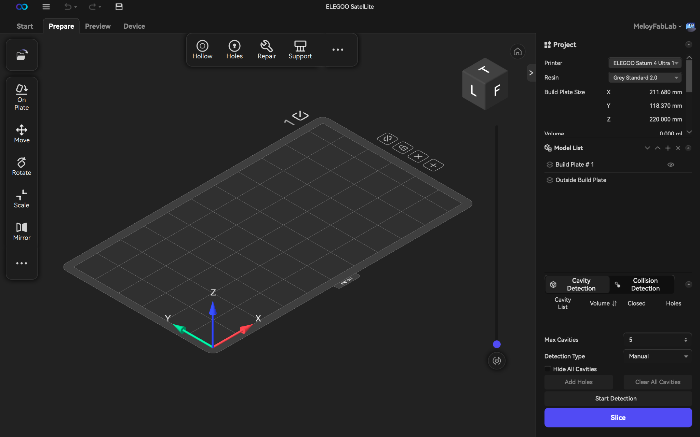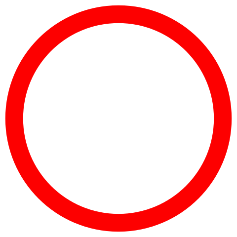  
---  
  
  1. Open up your selected .stl file in the slicer. Once opened, your piece will be at the center of your slicer. 

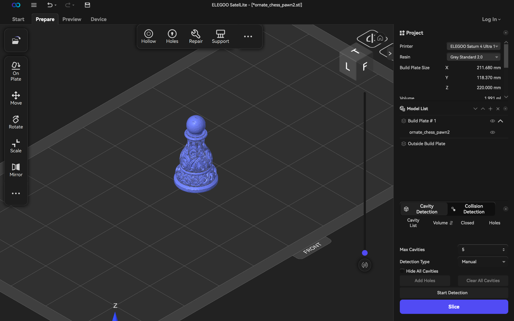  
---  
---  
  
Note: For .stl’s that need to be hollow or require supports, do the following:

  1. Note: if piece printing is a solid piece, use the “Hollow” tool on the top toolbar on the piece and set the wall thickness (~2-3mm, but will vary based on what the user prefers)

** For more information reference the [Operations Manual](../Operations & Safety Manuals/Elegoo Resin 3D Printer Operations Manual.md)

  1. To Auto Orient to build plate according to slicer recommendations (strongly recommended), select your model, right click, and click “On Plate.”

  1. Click “Automatic mode” and apply
  2. Generate supports using the “Support” function at the top of the toolbar next to “Hollow.”
  3. After clicking, it will auto-generate supports. Use these. 
     1. If your piece is hollow, ensure “Generate internal supports” is clicked.

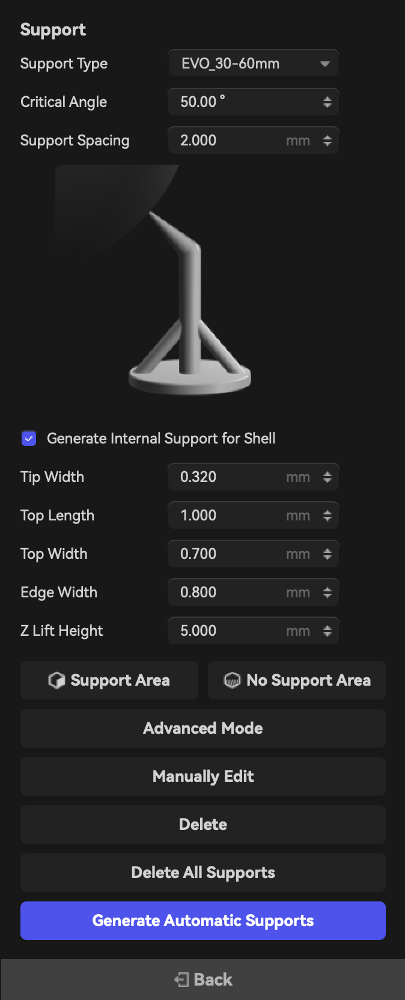| 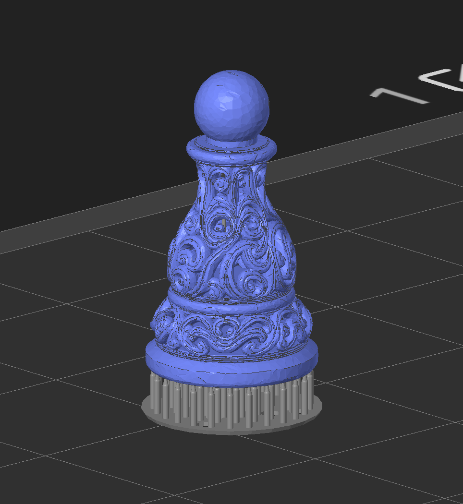  
---|---  
  
  1. When done, click Slice and view the layers to ensure supports are generated correctly, and the piece is hollowed out

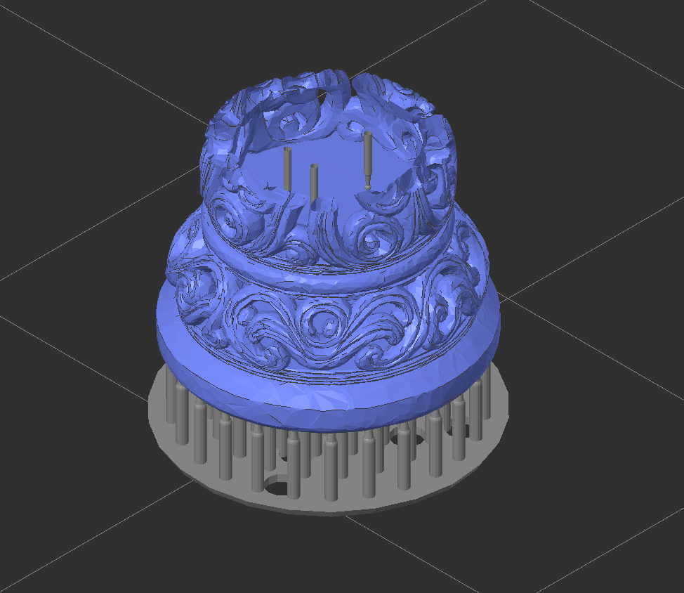

  1. When confirmed, click “Network Transmission” and click the Elegoo Printer and wait for the file to upload to the printer

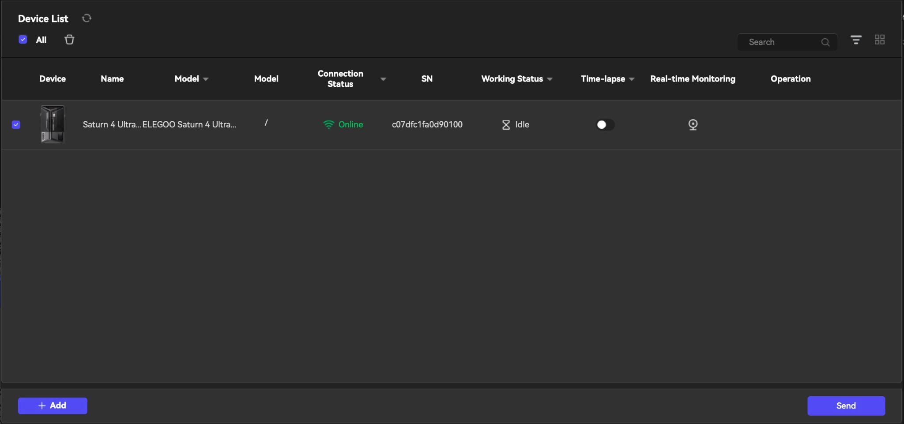

  1. Before you click Print, make sure the printer has a sufficient amount of resin (above Min but below Max) and that the build plate has been cleaned (Reference[ Cleaning Manual ](../Elegoo Cleaning Procedure/Elegoo Resin 3D Printer Cleaning Manual.md)**Section 3.0** for more information)

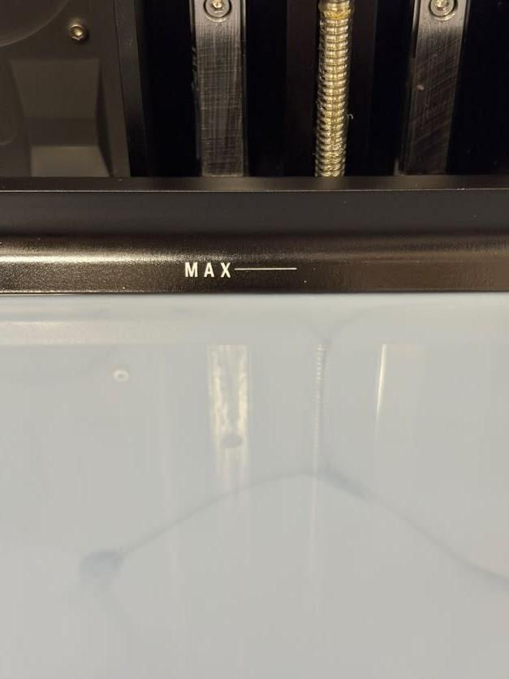

  1. Click Print and watch the first couple of layers to ensure the print adheres to the build plate according to the procedures in the [Operations Document](../Operations & Safety Manuals/Elegoo Resin 3D Printer Operations Manual.md)
  2. Now wait for the print to finish, and you should have a piece that looks like this:

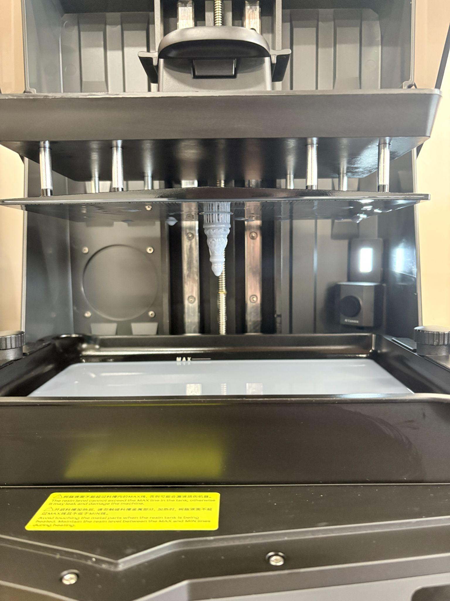

  1. Now that the print is finished, you **have** to cure it. Refer to washing and curing in **Section 6.0** of the [cleaning document](../../Elegoo Mercury 3.0 Plus Washing And Curing Machine/Elegoo Washing And Curing Machine Manual.md). 

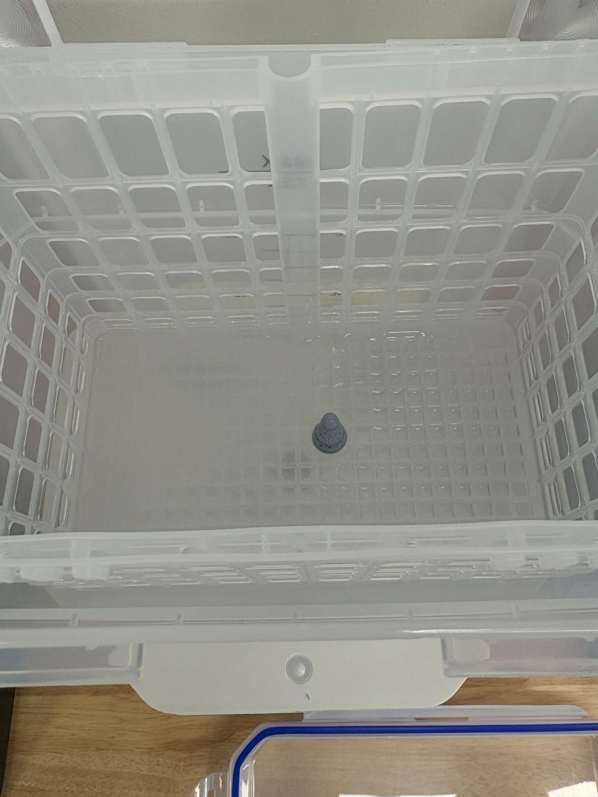| 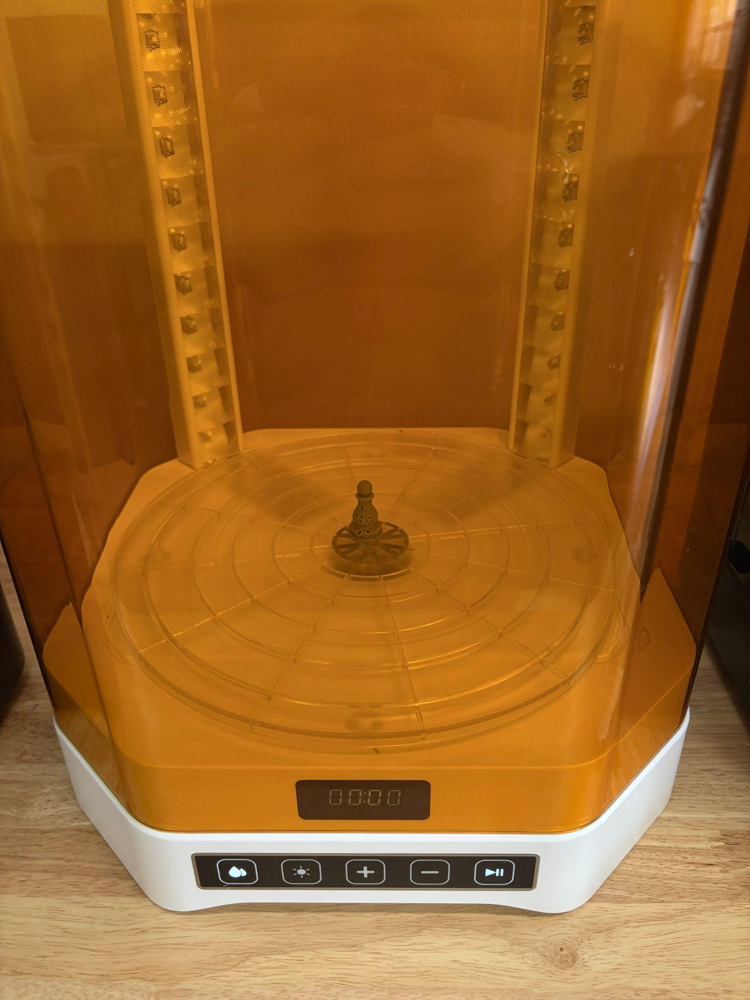  
---|---  
  
  1. You’re done! From here, you can sand and paint your piece however you like! If you are finished with your print in The Fab Lab, please clean the mess from sanding, and sand over a trash can

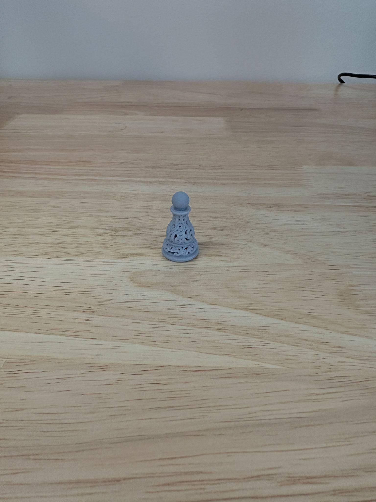

## Questions or Help

If you have questions or need assistance at any point, ask a **Fab Lab staff member**. Staff are always present during operating hours.

**End of Activity**
