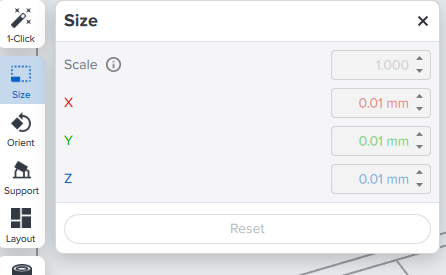
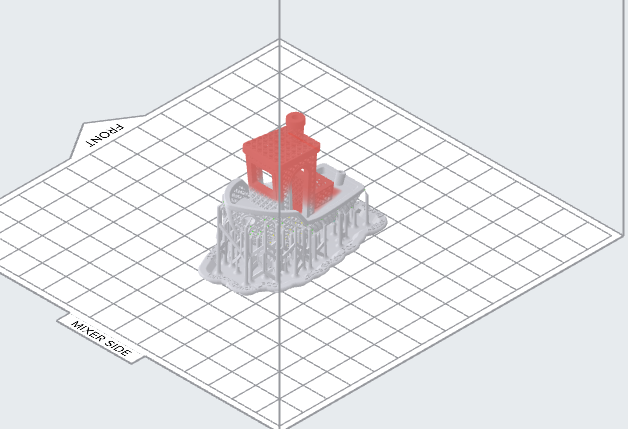
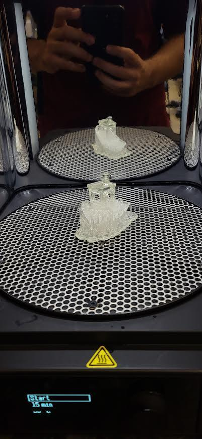
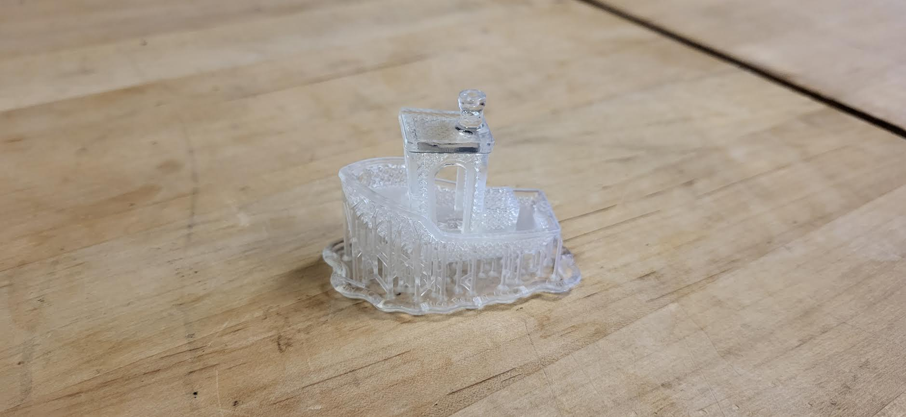

FormLabs 3 Printer Assignment

Machine Name: FormLabs 3

Location: The Fab Lab

Version: v1.0

Last Updated: 2/22/2026

Responsible Student Worker: Gael Ramos

Linked Safety Manual: [Formlabs 3 Safety Manual](<../Operations & Safety Manuals/Formlabs Resin Printer Safety Manual.md>)

Goal: 3D Print a Bot with rafts and supports

## 1\. Prepare Print 

Download the STL file with the name “Lattice_Benchy_FCC.stl” and open it in the [preform program](<https://www.google.com/url?q=https://formlabs.com/software/preform/&sa=D&source=editors&ust=1776804198796094&usg=AOvVaw2mqsDCUHKc67tluxcK8N1V>). First, use the size section on the left, and in the first part, use the scale option and scale it to 0.5.

Then, we are going to delve into the support and orientation of the piece. Go to the side panel and select the support option.

All of these options allow us to modify the supports that can be autogenerated or manually generated to the print. For this assignment, we will use rafts and supports to facilitate the extraction of the piece. 

First, go to the Touchpoint Placement and ensure everything is selected; there is no need to change anything. Then, go to Support Structure and ensure that Raft is set to Full Raft, Pillars are set to classic, and Toucpoints have the modifier “Allow Internal Supports on model” not selected. Finally, click auto-generate all and wait for the supports to be printed 

If an error or warning appears on the slicer, ignore it only this time.

## 2\. Print 

Once the preparation is finished, connect to the printer to begin the print(if unsure how refer to the [operations manual](<../Operations & Safety Manuals/FormLabs 3 Resin Printer Operations Manual.md>)). Before starting, make sure the printer is set up, the resin has a sufficient amount, and everything is clean. Start the print and monitor the first layers to ensure correct adhesion. 

If everything is correct, you should have a good print like this.

(enter print)

## 3\. Clean

For more information about [cleaning ](<../Wasing and Curing Machines/Formlabs Cleaning Manual.md>)and [processing](<../Operations & Safety Manuals/FormLabs 3 Resin Printer Operations Manual.md>), refer to the respective manual:

  1. Shake slowly the build platform to break the leftover resin left on the print and wait  2 to 3 minutes to let some of the resin naturally drip onto the tank.

  2. Take out the build platform and set it on the build platform Jig as on picture on the Finishing Tray

  3. Using ONLY PLASTIC SCRAPERS, use a low angle and start pushing to remove the print from the platform

  1. Go all around of the print, prying the object, trying to create an air gap
  2. Always point to a wall or non-populated area when prying the object to minimize spilling.

  4. After removing the object, send the print to the washer, and after finishing to the curing machine
  5. While the print is washing and curing, clean the build platform and the workspace (refer to [Cleaning Manual](<../Wasing and Curing Machines/Formlabs Cleaning Manual.md>))

  6. Once finished post-processing, ensure the printer, washer, and currer are cleaned. Also, tools should be on their respective stations

.

  7. Finally, Go to settings -> sleep -> and click to sleep mode to set the Formlabs 3 printer to sleep.

## Extra. Questions

Once you finish thinking on these questions:

  1. How can the process be done with minimal mess or cleaning? 
  2. What ways can a print be done without rafts, but with easy disengagement of the platform?
  3. How can other prints benefit from this quality?
  4. What can I do to get the most value of the benefits of a resin printer?

If you have any questions or suggestion contact any staff member and we can relay the comment or give you advice.