## What This Machine Is For
* Printing high‑resolution resin 3D prints for prototyping, design verification, and small functional or aesthetic parts
* Creating fine‑detail components such as housings, enclosures, fixtures, or display models

## What This Machine Is Not For
* Printing large objects surpassing 145 x 145 x 185 mm or 5.7x5.7x7.3 inches
* High-impact or high load--bearing parts

## What You Need Before You Start

* There is trained Fab Lab staff present
* The Fab Lab[ Formlabs Resin Printer Safety Manual ](<Formlabs Resin Printer Safety Manual.md>)was acknowledged
* The required PPE is being used: 

* Nitrile Gloves
* Mask (optional)

* No loose hanging garments or jewelry that is at risk of catching in pinch points
* STL file that has been properly sliced in Pre-Form, given to the staff in time

## Machine Overview

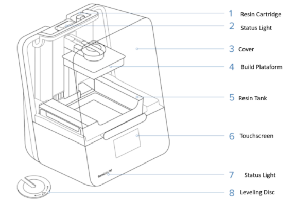

Emergency Cases \- When dealing with any case of emergency, there are two areas:

1. On the (6) touch screen , in the bottom left corner, when a print is in process, an abort button to end the printing process, and in the center, there is a pause button which will end the current layer and go to the max vertical position.
2. On the Back of the printer, if looked from the front, if you extend your left hand and reach, there will be the power cord that will disconnect the energy.

Depending on severity, pause if wanting to make sure functioning, abort if an error starts to be seen, and disconnect if an error starts or will start to cause damage.

Main points: 

1. The touchscreen would be the main source of the print and machine information. 
2. NEVER TOUCH THE RESIN TANK FILM BOTTOM. (5) Is the resin tank, and if anything outside of holding resin (leaking or resin, printed objects on tank, possible puncture, etc.) stops the print, machine, and contact a staff member.

## Basic Operating Workflow

### Start-Up

1. Prepare and slice your model and present it to the pertinent Staff (refer to section 11 to learn how to slice )
2. Ensure that the working area is clean (nothing is obstructing the build platform and resin tank). If in the case, refer to the [Formlabs Cleaning Manual](<../Wasing and Curing Machines/Formlabs Cleaning Manual.md>) and clean the working area

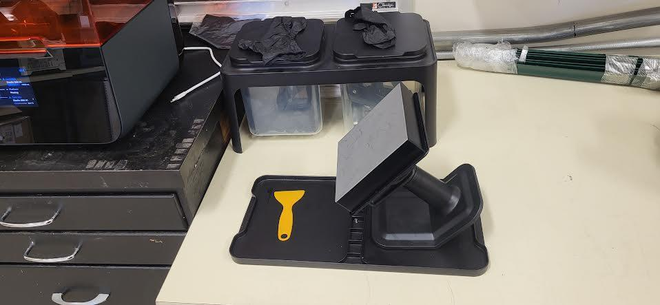

3. If the machine has the screen blacked out (in sleep mode), touch the screen once to turn off the sleep state.

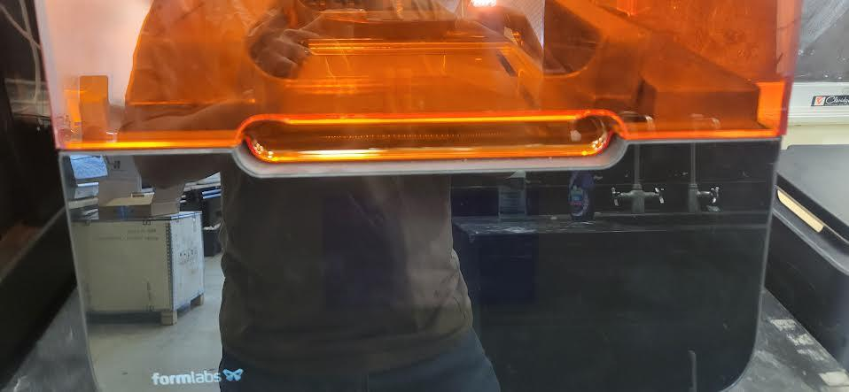

4. Revise the resin in the tank and resin cartridge to ensure a sufficient amount of resin. If not enough resin, notify a staff member to look for more.

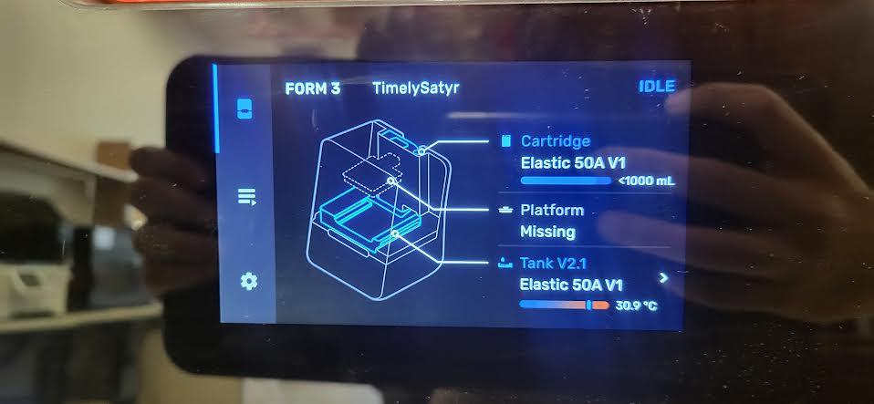

Look at the top section named “1 Cartridge” and see that the bar has sufficient amount of resin

        5.1.1 - Change Resin

### If there is a need to change the resin or perform a cleaning mesh, it will be necessary to change the resin tank and cartridge.

First, ask a staff member for the resin storage and for the resin cartridge and tank of the desired and current resins. Go to the top back of the machine, close the opening, remove the cartridge, move it up, and set it in its box.

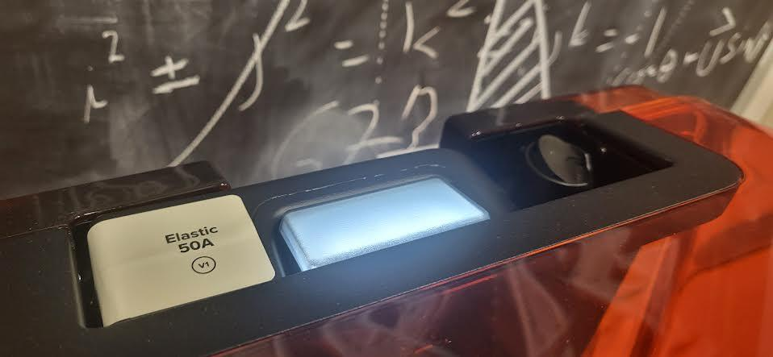

Then, grab the tank from the sides without touching any film on bottom and pull towards you until you can not anymore and then pull up

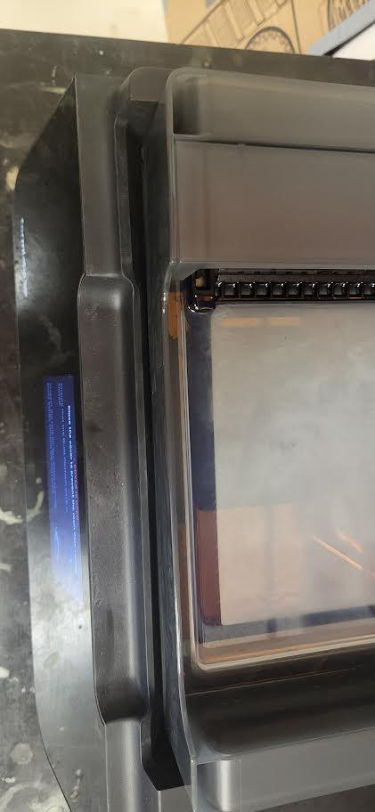

Grab the resin box, and inside there is a box with an orange UV cover. Set the tank in there and set both old resin and the tank in their respective boxes.

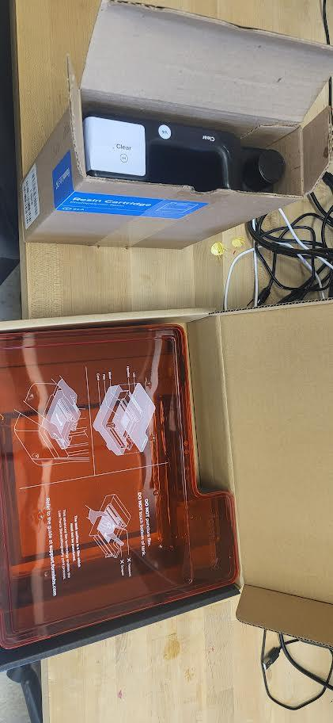

Then get the new resin cartridge and tank and put them back as you took the old ones. Open the valve of the cartridge and set the tank by going down and pushing forward until it clicks (requires more force than expected)

### Running a print

1. Ensure the resin cartridge is in its place and open the valve on top of the cartridge

2. You can start making the file before entering to print or during

* If you want to start before, you can download the [program preform](<https://www.google.com/url?q=https://formlabs.com/software/preform/&sa=D&source=editors&ust=1776804195163007&usg=AOvVaw2ePT2Q_BueLQuuSZ2FAZ1Y>) 

3. To start the print or start slicing in the lab, first send your files to the Fab Lab email [meloy.FabLab@email.com](<mailto:meloy.FabLab@email.com>)[[a]](<#cmnt1>)[[b]](<#cmnt2>), then access those files on the Lab’s computers.

* Get the sliced file prepared, and connect the computer to the preform program

* 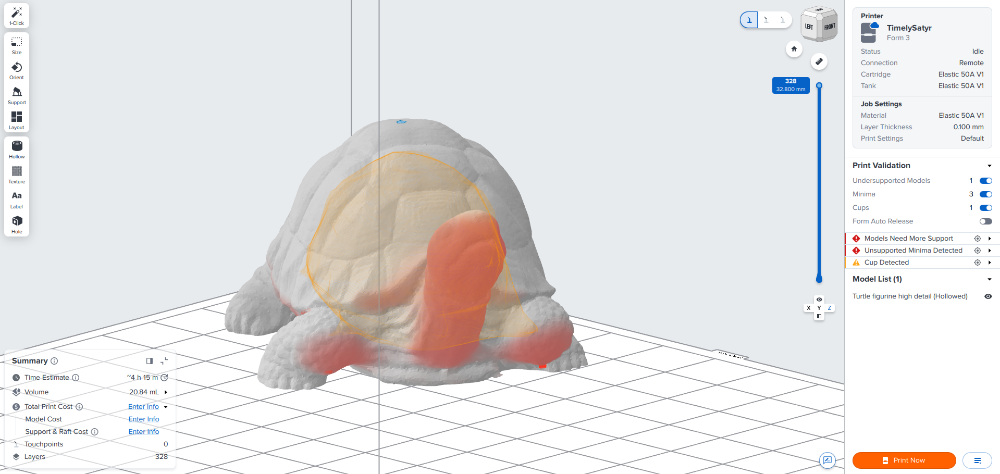
* Make sure the printer with the correct name is selected in the top right corner, and the resin material and settings are correct.
* If Ready, click the bottom right button to send the file to the printer

4. Observe the printing process for the initiating sequence and first 3 layers of resin
5. During operation, confirm that:

* First sequence calibrations work as intended and continue to print
* Resin remains on the tank and does not vibrate abnormally.
* The build platform is dropping and going up in an effective range without problems.
* Resin print stays on the build platform and does not let any piece onto the resin tank.

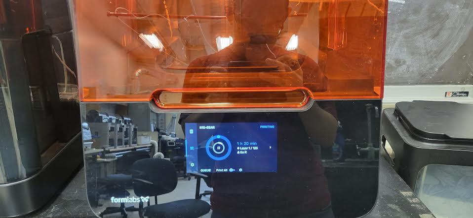

6. Once the print has already started, as soon as the previous step checks are done, presence is not required until at least 5 to 10 minutes before the end of the print

### End-of-Job 

These are the finishing tools used for cleaning and other purposes:

1\. Finish station \- do not use for rinse

2 and 3. Finish buckets \- 

4\. Rinse bottle - Filled with alcohol to add to paper towels for cleaning

5\. Finishing tray - tray to clean and work on print post-processing

6\. Tweezers - Use to remove small parts from pieces or machines NOT USE ON RESIN TANK

7\. Metal Scraper \- use to remove or break supports - not to use on build platform  

8\. Removal tool - use to remove or break supports - not to use on the build platform

9\. Build platform jig - Jig to hold the build plate at an angle and free the prints

10\. Flush cutters - Cut the supports flush with the print

11\. Non-reactive nitrile gloves - Nitrile gloves that will not react with resin

(more information on the [cleaning manual](<../Wasing and Curing Machines/Formlabs Cleaning Manual.md>))

1. Shake slowly the build platform to break the leftover resin left on the print and wait  2 to 3 minutes to let some of the resin naturally drip onto the tank.

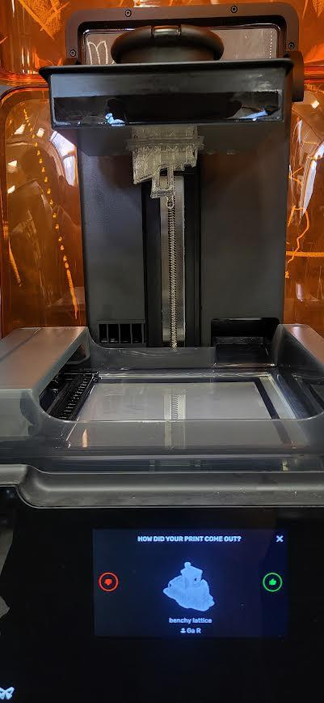

2. Take out the build platform and set it on the build platform Jig as on picture on the Finishing Tray

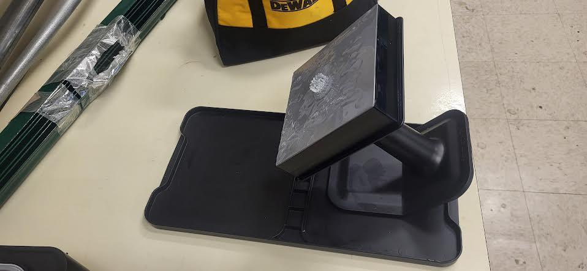

3. Using ONLY PLASTIC SCRAPERS, use a low angle and start pushing to remove the print from the platform

1. Go all around of the print, prying the object, trying to create an air gap
2. Always point to a wall or non-populated area when prying the object to minimize spilling.

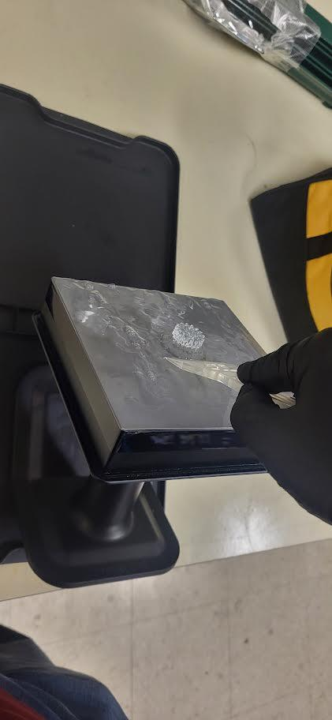

4. After removing the object, send the print to the washer, and after finishing to the curing machine
5. While the print is washing and curing, clean the build platform and the workspace (refer to [Cleaning Manual](<../Wasing and Curing Machines/Formlabs Cleaning Manual.md>))

6. Once finished post-processing, ensure the printer, washer, and currer are cleaned. Also, tools should be on their respective stations.
7. Finally, Go to settings -> sleep -> and click to sleep mode to set the Formlabs 3 printer to sleep.

## User Responsibilities After Use

After using this machine, you are responsible for:

Note: For cleaning sections, refer to  [Formlabs Cleaning Manual](<../Wasing and Curing Machines/Formlabs Cleaning Manual.md>)to learn how to clean

* Clean the Build Platform of Pieces and resin
* Clean the used tools and set them back on their respective hold stations
* If any issue or abnormal thing occurs, report to a staff member and wait for instructions
* Clean the space used and ensure everything is in its respective place

## Stop Conditions

Stop immediately and notify Fab Lab staff if:

* If any printed object, support, etc., is on the resin tank besides the resin and the resin mixer.
* If resin starts to overflow or any leaking appears
* If any of the moving parts start to make a clash or an abnormal sound

Do not attempt to troubleshoot major issues yourself; contact a staff member.

## Common Issues & What To Do

* Issue: If the print fails and objects fall onto the Plate  
Action: abort print and notify staff to perform a cleaning mesh (refer to [cleaning manual](<../Wasing and Curing Machines/Formlabs Cleaning Manual.md>)) and clean the working area before restarting.
* Issue: If the print starts to make abnormal noises(clashing, scratching,banging, etc)  
Action:  Pause the print, abort if an issue is apparent or dangerous to the user or machine, and notify the staff.
* Issue: If the print starts to get low on resin or none is left  
Action: Notify a staff member to search if resin of the same type is available.

## How to slice or prepare a file for printing

To prepare a file to print, first make sure that whatever you are preparing is the version and qualities you want to print.

1. Save your designs and save a copy into one of the formats the software was designed to work effectively: STL, OBJ, 3MF, and FORM. 
2. Go to the top section of the app preform for formlabs and click on file -> open and select the files to print. 

## 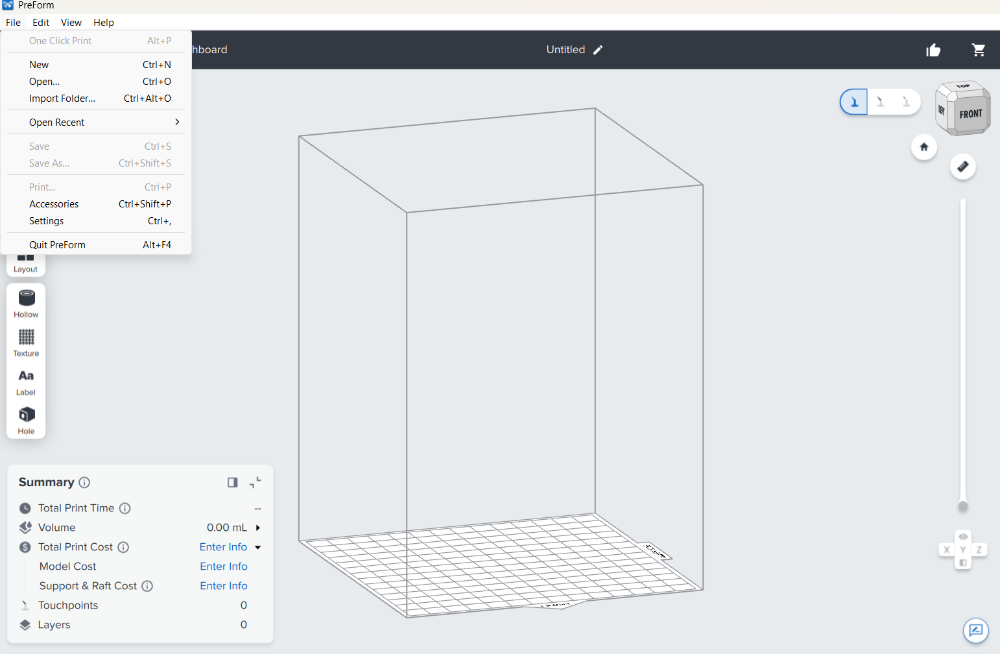

3. There are 3 sections for processing: the tools on the left side, information on the bottom left, and movement and analysis tools on the right.

1. Tools left side: These are the tools used to modify and alter the design printing style. Size and orient serve to scale and rotate the moves, respectively. Hollow makes the design piece chosen hollow(carefully see each piece affected by this mode for structural failures). Hole makes a hole in the piece for draining.

2. Supports are the most important part of the design as complex pieces may not be unable to be printed without these supports. For most designs, the auto-generated supports may suffice, but analyze and research what you need for your designs.

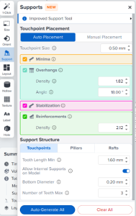

3. On the bottom left, information about the print, such as time, volume, layers, and others, will appear, and it is important that this is reviewed to ensure the piece can be created within the limits of your time and the machine availability.

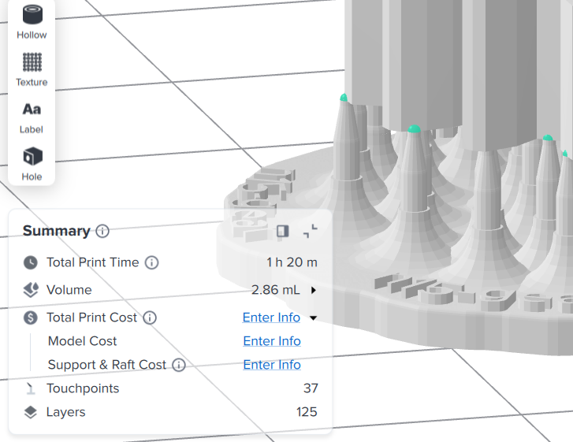

        For all the prints, if the piece is hollow, it is required for the piece to have either a design implementation or a hole from the software to drain the resin and ensure no resin is trapped on the print.

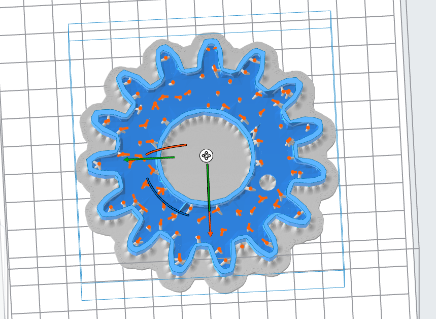

Furthermore, all pieces (unless discussed with a Staff member) need to be supported and have a slanted raft(base) to ensure the piece's ease of removal. Make accommodations to ensure the piece can be removed from the raft.

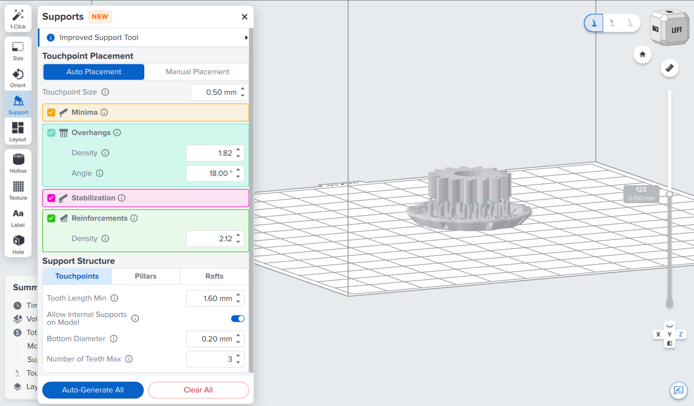

4. Before sending to print, check that the accuracy and resin type is correct. Click on the top right section of the Slicer.

Then, from the selection choose the resin and accuracy of it.Once done click apply

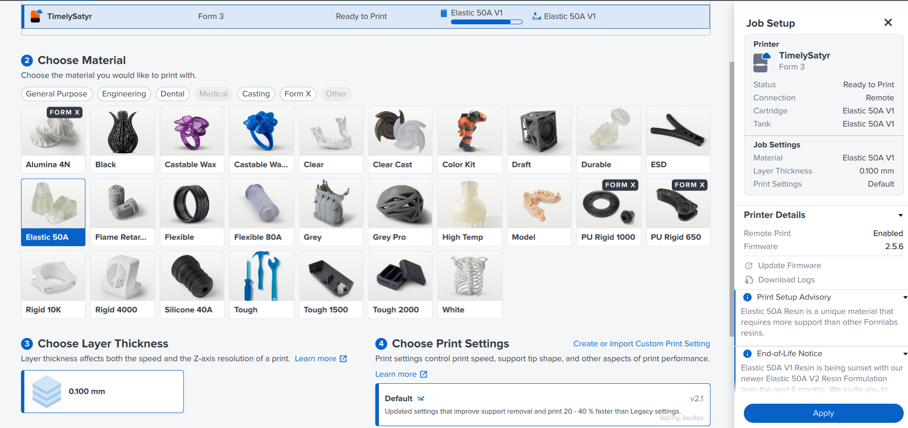

5. Finally, if done correctly, contact a staff member to connect to the system or save the file, give it to them, and click print on the right side of the software.

## External Resources

For more detailed information, refer to:
* [Formlabs 3 User manual](<https://www.google.com/url?q=https://support.formlabs.com/s/topic/0TO1Y000000IvrVWAS/form-3?language%3Den_US&sa=D&source=editors&ust=1776804195171176&usg=AOvVaw0g9uTbDvbBgpc2Z8TbMs4z>)
* Formlabs 3 [Maintenance](<https://www.google.com/url?q=https://support.formlabs.com/s/article/Schedule-of-maintenance-Form-3?language%3Den_US&sa=D&source=editors&ust=1776804195171308&usg=AOvVaw3got4bAAJf0ZwwmGAEwG27>)
* The[ Formlabs](<https://www.google.com/url?q=https://www.youtube.com/watch?v%3DkqiCJYrhZB8%26list%3DPLwr52gp_JAadIj1iXYAQhuzGxdDURfPm6&sa=D&source=editors&ust=1776804195171405&usg=AOvVaw3YnSKn0yVVHaGo6vqMx_xq>) YouTube channel(search for the Formlabs 3 playlist)