Formlabs Cleaning Manual

Machine Name:  Form Wash and Form Cure

Location: The Fab Lab

Version: v1.0

Last Updated: 03/26/2026

Responsible Student Worker: Gael Ramos

Linked Operations Manual: 

Linked Safety Manual: [Formlabs Resin Printer Safety Manual ](<../Operations & Safety Manuals/Formlabs Resin Printer Safety Manual.md>)

Cleaning Manual: [Formlabs Cleaning Manual](<Formlabs Cleaning Manual.md>)

Required Materials:

  * Nitrile gloves (required)
  * Isopropyl Alcohol (IPA) 99%
  * Blue shop paper towels
  * Plastic or silicone scraper (NOT metal)
  * Finishing tools 

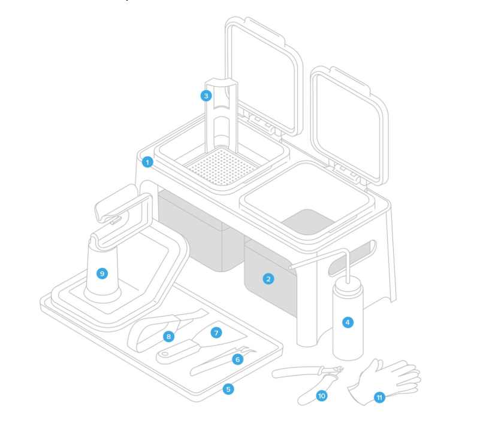

These are the finishing tools used for cleaning and other purposes:

1\. Finish station \- do not use for rinse

2 and 3. Finish buckets \- 

4\. Rinse bottle - Filled with alcohol to add to paper towels for cleaning

5\. Finishing tray - tray to clean and work on print post-processing

6\. Tweezers - Use to remove small parts from pieces or machines NOT USE ON RESIN TANK

7\. Metal Scraper \- use to remove or break supports - not to use on build platform  

8\. Removal tool - use to remove or break supports - not to use on the build platform

9\. Build platform jig - Jig to hold the build plate at an angle and free the prints

10\. Flush cutters - Cut the supports flush with the print

11\. Non-reactive nitrile gloves - Nitrile gloves that will not react with resin

##   
1\. Safety Precautions

  * Always wear gloves when handling anything with resin 
  * Avoid skin contact with liquid resin
  * Keep IPA away from flames
  * Never pour resin or IPA down the drain

## 2\. When to Clean

  * Basic Cleaning Procedure -  usual procedure, if nothing went wrong and parts are not missing
  * Failure Cleaning Procedure- special procedures - if print failed or dealing with a lot of small parts 

## 3\. Basic Cleaning Procedure

Basic Cleaning Procedure after each print consists of 5 steps: Preparation check, removal of print, workstation cleaning, Washer cleaning, and Curer Cleaning.

### 3.1 Preparation check

Before every print, it is necessary to check that our workspace and tools is clean.

Tools 

        While wearing gloves, to clean the tools used in resin, we will use two paper towels. First, get one and get all the leftover resin on the tools, taking care of where we let the paper towel. 

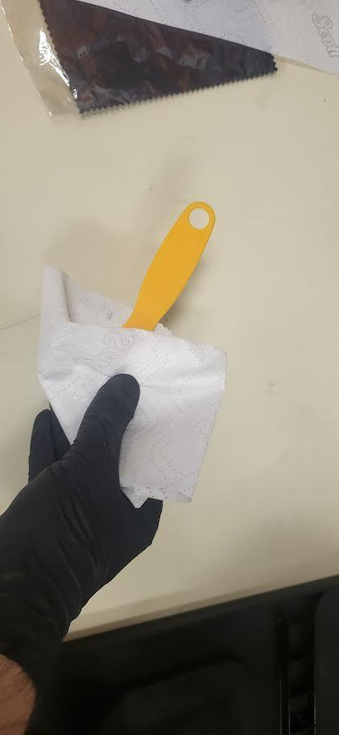

If it is not enough, use the rinse bottle, get the second paper towel and spray a little amount of alcohol, and wipe the tools to remove the thin layer of resin.

Make sure to let the tools fully dry before using them again

3.2 Build Platform

        For the Build Platform, the same technique of 2 paper towels will be used. First, remove the platform and put it on the Finishing Tray. 

Using a plastic scraper, remove all the excess resin and bits and collect them using a paper towel.

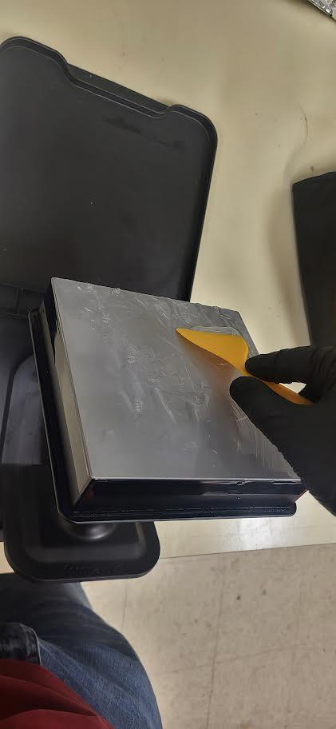

Then, using the rinse bottle, add a little to a second paper towel and clean the excess with it.

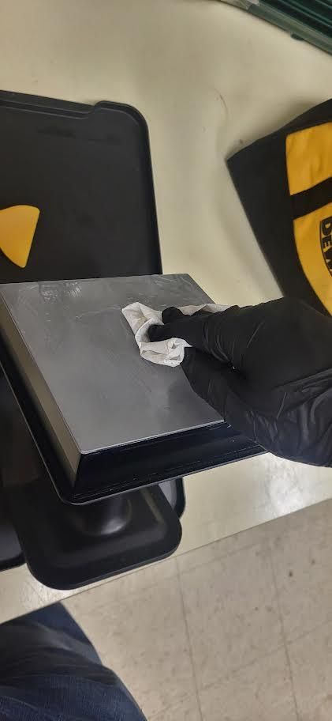

Make sure that the plate is completely dry before next use. If it will be used immediately after with the same resin, only scrape the excess resin and do a deeper cleaning at the end.

3.3 Work station 

For any resin spill, either on the finishing tray or furniture, use a paper towel to clean it as soon as possible

        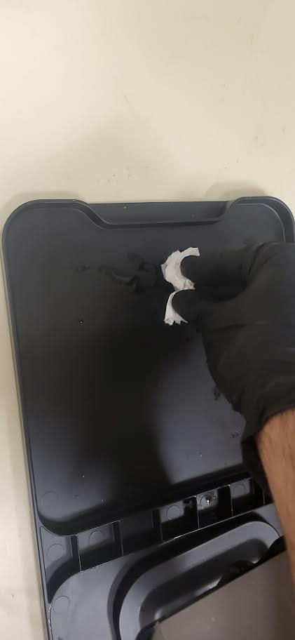

If the resin left a residue or sticky area, use a paper towel with some soap to clean it and remove any excess soap on the furniture.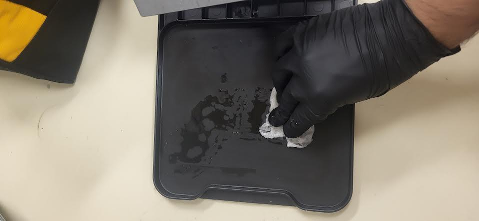

### 3.4 Removal of print

As a print is finished and the part has sat on the platform for 2- 3 minutes, unlock the build platform and set it on the jig in the finishing tray.

USING ONLY PLASTIC SCRAPERS, move around the print on a low angle, pressing the junction of the print and the bed to free it.

Do not remove the supports and set the object on the washer first.

### 3.5 Workstation cleaning

For this step, repeat the steps 3.1 to 3.4 to clean the build platform, tools, and workstation as in the pre-check.

### 3.6 Washer cleaning

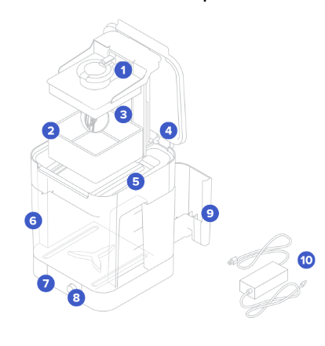

Do not remove any material from numbers 4 to 10 unless specifically allowed

  1. Platform mount: Holds the build platform when washing parts on the build platform.
  2. Basket: Holds parts to wash without the build platform.
  3. Basket mount: A single hook secures the basket to raise and lower.
  4. Outer lid: Limits solvent evaporation. Keep the outer lid closed when not in use.
  5. Inner lid: A hinged, secondary lid opens and closes to contain solvent while allowing parts to be lowered or raised from the bucket.
  6. Wash bucket: Removable container holds a maximum of 8.6 L of solvent. A rotating impeller at the bottom circulates the solvent.
  7. Display: Shows status, time, and options for configuring the Form Wash.
  8. Knob: Turn or push to adjust time and to start, pause, or end a wash cycle.
  9. Tool storage: Each side has designated locations for storing each tool.
  10. Power supply: Provides power to the Form Wash. Specifications: 24 V, 2 A.

To clean the object, first move the object to the washer and click on the knob on the section labeled "open” to lift the basket. 

Set the object on the basket and select the time according to the [manual](<Formlabs Washing Machines Operations Manual.md>) for Formlabs resins or according to the manufacturer.(for more info refer to the manual)

With the washer finished, wait 1 to 2 minutes for the pieces to dry the leftover alcohol and then set to the curer.

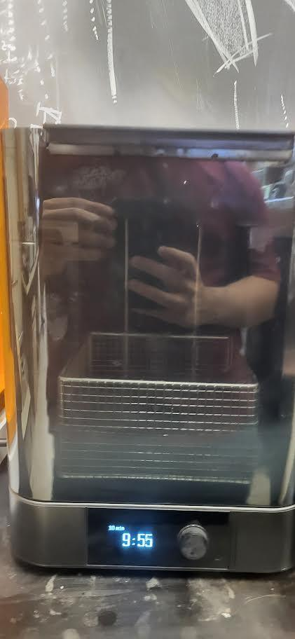

While the washer is cleaning, inspect the basket [[a]](<#cmnt1>)for any leftover pieces of cured resin and remove it with the tweezers. After finishing on the space where the open section was located, click sleep to move the basket down.

### 3.7 Cure Cleaning.

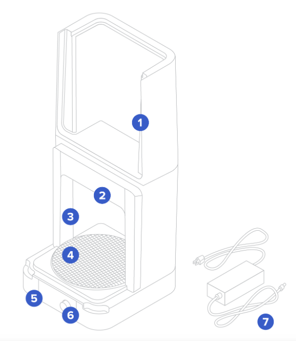

Do not remove any material unless specifically allowed

  1. Cover: Double walls insulate the cure chamber and internal surfaces reflect light.
  2. Heater: 100 W heating module can heat the chamber up to 80 °C/176 °F.
  3. LEDs: An array of thirteen (13) 405 nm LEDs help to post-cure parts. Secondary lights illuminate the turntable when the cover is open and during heating.
  4. Turntable: Rotating plate ensures balanced post-curing across all exposed surfaces.
  5. Display: Shows status, time, temperature, and options for configuring the Form Cure.
  6. Knob: Turn or press to adjust time and temperature settings and to start, pause, or stop post-curing.
  7. Power supply: Provides power to the Form Cure. Specifications: 24 V, 6 A.

First, set a time and temperature (see reference on the cure and [washer manual](<Formlabs Washing Machines Operations Manual.md>)) and set the object or objects as close to the center as possible.

Wait the time specified, and when it finishes, take the print, and if there is no wet section, you are done. If it does not, repeat the same procedure with less time.

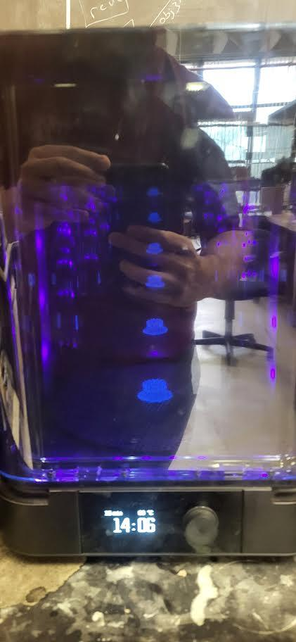

If any wet area is seen on the curer, get a paper towel and clean it, ensuring it does not leave any residue on the center cylinder area.

### 4 Failure Cleaning

When a print fails, the procedure for cleaning is the same as normal cleaning, with the added steps of tank mesh clean and Printer Clean.

4.1 Tank Mesh Clean

If a print fails, there is a high chance that debris has fallen onto the tank. To remove this, we are using a cleaning mesh. 

First, go to settings -> maintenance -> cleaning mesh

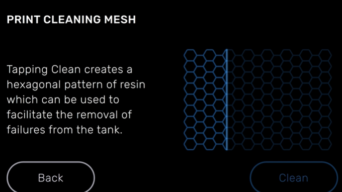

Then click “clean” and wait for it to finish doing the mesh. In the meanwhile, ask a staff member for the resin storage boxes and search for the box of the respective resin being used and set the tank in it.

(To remove the tank refer to the [operations manual](<../Operations & Safety Manuals/FormLabs 3 Resin Printer Operations Manual.md>) 5.1.1 Change Resin)

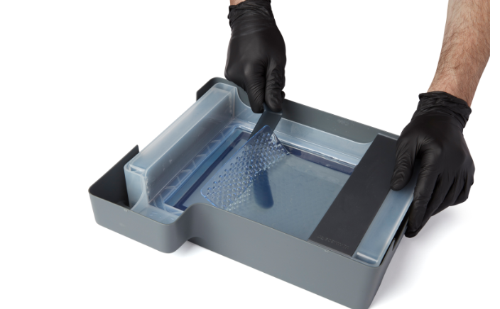

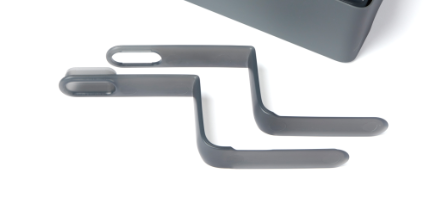

With the tank on the box, grab the tool shown and separate them, get the end with the neck and pass it down as shown and the upper end on top of the mesh to clip it. With the mesh, proceed with the cleaning process as if it were a print, and after it finishes, dispose of it in the trash.

You can now set the tank back on the printer.

4.2 Printer Clean

In the case of a resin spill, try to clean  if the resin spill is minimal. Grab a paper towel, remove any excess resin, and if there is a sticky residue, use a paper towel with some alcohol to remove any excess with a dry paper towel.

If the spill is on the optic bridge or on the rods or cables, notify a staff member and stop any procedure being done.  

* * *

## 5\. External Resources

For more detailed information, refer to:

  * [Formlabs 3 User manual](<https://www.google.com/url?q=https://support.formlabs.com/s/topic/0TO1Y000000IvrVWAS/form-3?language%3Den_US&sa=D&source=editors&ust=1776804202589566&usg=AOvVaw2PHCupH76oMbu7Guasm_mM>)
  * The[ Formlabs](<https://www.google.com/url?q=https://www.youtube.com/watch?v%3DkqiCJYrhZB8%26list%3DPLwr52gp_JAadIj1iXYAQhuzGxdDURfPm6&sa=D&source=editors&ust=1776804202589996&usg=AOvVaw0Iv_JwryBk4Z1QYPEeDKAH>) YouTube channel(search for the Formlabs 3 playlist)

## 6 . Questions or Help

If you have questions or need assistance at any point, ask a Fab Lab staff member. Staff are always present during operating hours.

* * *

End of Operations Manual

[[a]](<#cmnt_ref1>)(6) Basket mount? bold