Form Wash and Form Cure Operations Manual

**Machine Name:** Form Wash and Form Cure

**Location:** The Fab Lab

**Version:** v1.0

**Last Updated:** 03/20/2026

**Responsible Student Worker:** Gael Ramos

**Linked Safety Manual:** [The Fab Lab Formlabs Resin Printer Safety Manual ](../Operations & Safety Manuals/Formlabs Resin Printer Safety Manual.md)

## 1\. What This Machine Is For

Use the Form washer to:

  * Clean printed objects from any SLA Resin
  * Clean some of the tools used in SLA Resin

Use the Form Curer to:

  * Remove any excess alcohol from the prints.
  * Set the rest of the not-cured resin on the prints using UV light.

## 2\. What This Machine Is _Not_ For

Do **not** use this machine for:

  * Hold objects for other prints
  * Cure or wash objects bigger than their operation sizes
  * Any procedures that require alterations to security measures

## 3\. What You Need Before You Start

Before operating this machine, ensure:

  * There is trained Fab Lab staff present
  * The Fab Lab Resin Printer Safety Manual Master was acknowledged
  * The required PPE is being used: 
    * Nitrile Gloves
    * Mask (optional)
  * No loose hanging garments or jewelry that is at risk of catching in pinch points
  * STL file that has been properly sliced in Pre-Form, given to the staff in time

## 4\. Form Wash

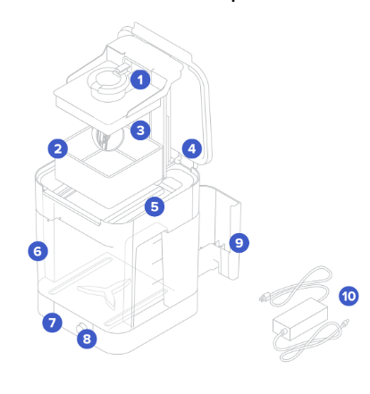

**Do not remove any material from numbers 4 to 10 unless specifically allowed**

  1. **Platform mount:** Holds the build platform when washing parts on the build platform.
  2. **Basket:** Holds parts to wash without the build platform.
  3. **Basket mount:** A single hook secures the basket to raise and lower.
  4. **Outer lid:** Limits solvent evaporation. Keep the outer lid closed when not in use.
  5. **Inner lid:** A hinged, secondary lid opens and closes to contain solvent while allowing parts to be lowered or raised from the bucket.
  6. **Wash bucket:** Removable container holds a maximum of 8.6 L of solvent. A rotating impeller at the bottom circulates the solvent.
  7. **Display:** Shows status, time, and options for configuring the Form Wash.
  8. **Knob:** Turn or push to adjust time and to start, pause, or end a wash cycle.
  9. **Tool storage:** Each side has designated locations for storing each tool.
  10. **Power supply:** Provides power to the Form Wash. Specifications: 24 V, 2 A.

This is the Form Washer that uses isopropyl alcohol to clean the residue of prints. The machine has three sections: Start, Time, and open/sleep

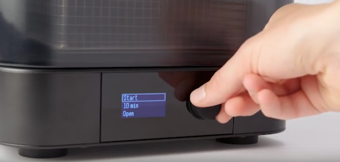

By turning the knob and pushing it in you can select between the three. In order to use it you will select a time(refer to 4.1 of this section for more info) and click open to lift the basket.

Set the objects to wash inside the basket and turn the knob to start to lower the basket. Once on the washing cycle, there will be more modes if you turn the knob consisting of: **back** to go to timer, **Edit** add more time, **Pause** lift basket and pause timer, and **End wash** to end early the wash.

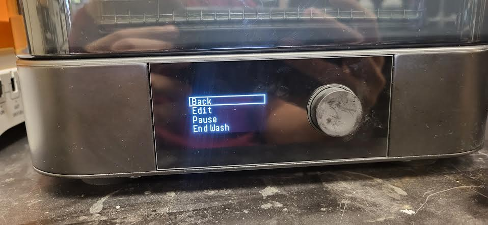

As soon as it finishes, the basket will lift, objects can be taken out(if not needing another cycle), and pass to the career. For any cleaning, refer to the [cleaning manual](Formlabs Cleaning Manual.md)

**4.1 Clean Time for Resins**

**** For all prints using Formlabs resins, specified times are given in the [manual](https://support.formlabs.com/s/article/Form-Wash-Time-Settings?language=en_US). If not using a Formlabs resin, choose between two options: Search for a resin with similar properties or do 10 to 20 minute intervals until ready.

The Resins in the Fab Lab will use:

Tough 2000 Resin V1| 10 minutes + 10 minutes**| Part surfaces may become tacky if washed in IPA with more than 5% resin concentration. Use fresh solvent if your parts remain tacky after washing.  
---|---|---  
Durable Resin V2| 20 minutes| 

  * Tackiness has been observed on part surfaces when washed in IPA with more than 10% resin concentration. Use fresh solvent if your parts remain tacky after washing.
  * Do not leave Durable Resin in solvent for longer than 20 minutes total, as excessive solvent exposure affects the quality of the final part.

  
Elastic 50A Resin V1| 10 minutes + 10 minutes**| 

  * Wash Elastic 50A Resin for 10 minutes on the build platform. Remove parts from the build platform, then wash for 10 more minutes using fresh solvent.
  * Avoid washing Elastic 50A Resin for longer than 20 minutes, as this may degrade parts.

  
Clear Resin V4/V4.1| 10 minutes| When using a single wash bucket, residue from previously washed parts deposits on part surfaces. If washing darker-colored materials like Black Resin in the same wash bucket as lighter-colored materials like White Resin or Clear Resin, some color transfer may occur.  
  
4.2 Staff - IPA testing

In order to know when the alcohol needs a change, we are able to use the hydrometer that comes with the washer. 

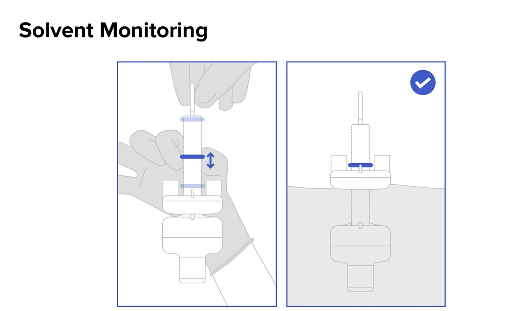

To use it poor a new batch of IPA and before any use, set the hydrometer inside. Then move the band to the position barely above the buoyant section and retire the hydrometer. 

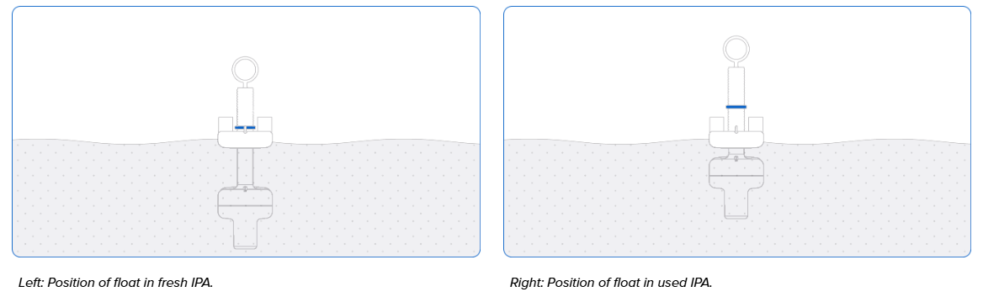

In the case that the alcohol needs to be tested, set the device inside, and depending on the difference of the buoyant section and the band is the difference on the ideal pollution of the IPA

## 5\. Form Cure

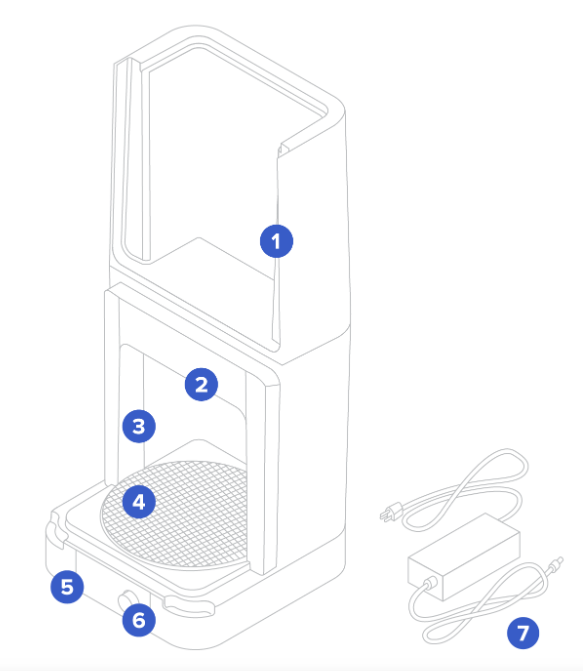

**Do not remove any material unless specifically allowed**

  1. **Cover:** Double walls insulate the cure chamber and internal surfaces reflect light.
  2. **Heater:** 100 W heating module can heat the chamber up to 80 °C/176 °F.
  3. **LEDs:** An array of thirteen (13) 405 nm LEDs help to post-cure parts. Secondary lights illuminate the turntable when the cover is open and during heating.
  4. **Turntable:** Rotating plate ensures balanced post-curing across all exposed surfaces.
  5. **Display:** Shows status, time, temperature, and options for configuring the Form Cure.
  6. **Knob:** Turn or press to adjust time and temperature settings and to start, pause, or stop post-curing.
  7. **Power supply:** Provides power to the Form Cure. Specifications: 24 V, 6 A.

The Form Curer is a Heat and UV exposure machine in orther to set the washed prints to their ideal states.

The machine has only 3 sections: start, time, and temperature. Move the knob and push it in to use them.

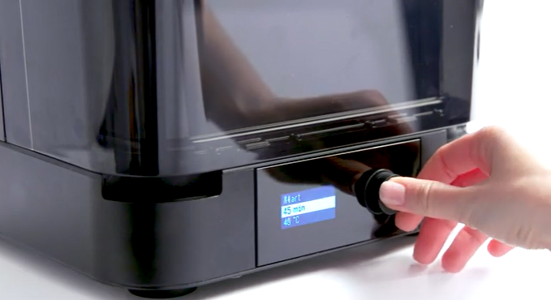

First, set the time and temperature according to section 5.1, open the cover from the corners shown in the picture, and set the object or objects as close to the center as possible. During Cure there will be 4 modes: consisting of: **back** to go to timer, **Edit** add more time or temp, **Pause** pause timer, and **End Cure** to end early the cure. 

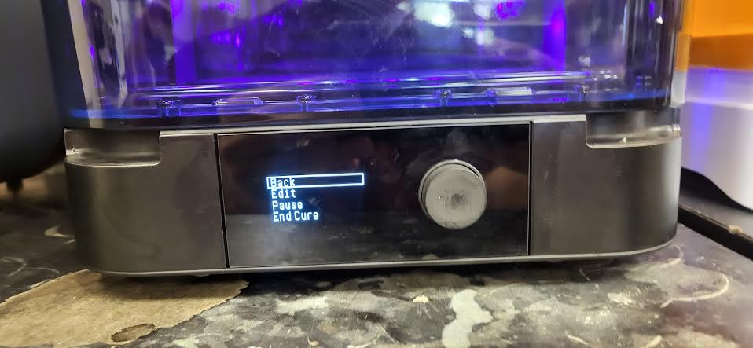

After it ends, remove the object, and everything is done. For any cleaning, refer to [cleaning manual](Formlabs Cleaning Manual.md)

**5.1 Resin Temperature and Time**

**** Different resins require different times and temperatures according to their individual properties. If using a Formlabs resin, use the [manual](https://support.formlabs.com/s/article/Form-Cure-Time-and-Temperature-Settings?language=en_US), and for others, search for a resin of the same type or see the manufacturer's information.

For the Formlabs resins

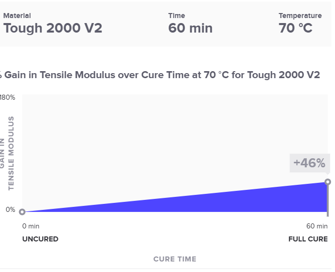

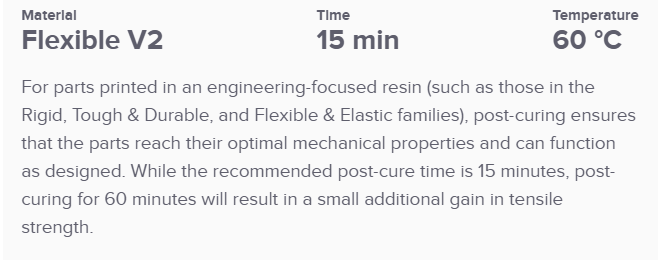

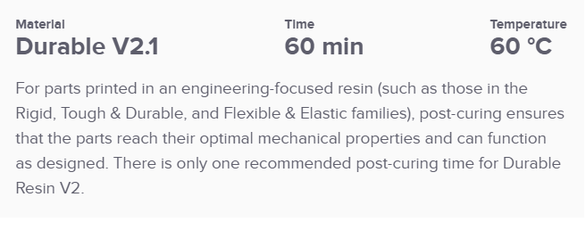

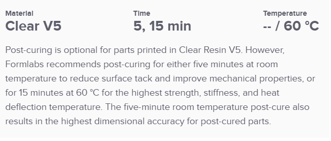

## 6\. Questions or Help

If you have questions or need assistance at any point, ask a **Fab Lab staff member**. Staff are always present during operating hours.

**End of Operations Manual**
