The Fab Lab Electrical Workbench Operations Manual

Machine Name: Electrical Workbench

Location: The Fab Lab

Version: v1.0

Last Updated: 2/2/26

Responsible Student Worker: Michael Allen, Joshua Russell

Linked Safety Manual: [Link Here](<Electrical Workbench PPS Machine Safety Manual.md>)

## 1\. What Are These Machines Used For

Use this work bench to:

  * Assemble, solder, and test electronic circuits and prototypes
  * Measure voltage, current, resistance, and signal waveforms for diagnostics and troubleshooting
  * Rework, repair, or modify PCBs and electronic components

## 2\. What Are These Machines Not Used For

Do not use this work bench for:

  * Non-electronic, mechanical, or plumbing repairs
  * Testing or powering circuits beyond rated voltage or current of bench equipment
  * Work involving hazardous, flammable, or non-electronic materials

## 3\. What You Need Before You Start

Before operating this work bench, ensure:

  * Workspace and equipment have been inspected for visible damage
  * Safety guidelines and manuals have been reviewed and acknowledged
  * Appropriate personal protective equipment (PPE) is available, e.g., safety glasses, ventilation if using leaded solder
  * Circuits, tools, and materials are prepared and organized for your task

## 4\. Basic Operating Workflow

  1. Inspect workspace and all equipment (soldering station, oscilloscope, multimeter, hot air station, power supply) for visible damage
  2. Power on required tools, allowing each to reach stable operating condition (temperature, initialization, display check)
  3. Confirm correct settings for each machine:

  * Soldering station (temperature)
  * Oscilloscope (scales, trigger, probe attenuation)
  * Multimeter (measurement mode and range)
  * Hot air station (temperature, air flow)
  * Power supply (output voltage and current limit)

  4. Verify all probe, lead, and nozzle connections are clean, securely attached, and suitable for the specific tasks

### 5\. Running a Job

  1. Assemble or connect circuit and components to the work bench as needed
  2. Set essential parameters for all equipment according to the requirements of your application
  3. Begin task, soldering components, making measurements, applying power, and/or reworking as planned
  4. Monitor instrument displays, readings, and visual cues continuously as you work

During operation, confirm that:

  1. No equipment, circuit, or components are overheating, burning, or showing signs of distress
  2. No unexpected sparks, smoke, smells, or melting occurs
  3. Measurements and readings remain within expected and safe ranges
  4. All equipment operates normally (steady displays, correct functionality, no error messages or malfunctions)[[a]](<#cmnt1>)

### 6\. End-of-Job / Shutdown

  1. Disable power supply output and turn off all powered equipment
  2. Allow all tools, circuit components, and solder joints to cool as necessary
  3. Disconnect probes, leads, and circuits safely
  4. Clean workspace, remove debris, stray wires, solder, and reworked components
  5. Return all tools, probes, leads, nozzles, and accessories to their designated storage locations
  6. Leave work bench tidy and ready for next use

## 7\. Multimeter Overview - Fluke Multimeter 17B

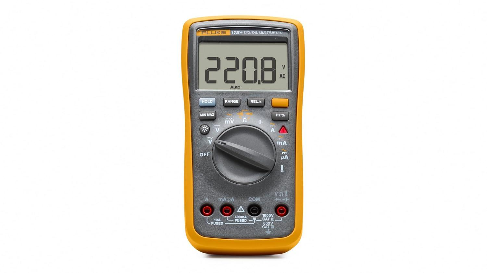

## 7.1 What This Machine Is For

Use this machine to:

  * Can measure both DC voltage (like from batteries) and AC voltage (like from wall outlets)
  * Works as an Ampmeter, measures the amount of current flowing through a circuit
  * Measures the resistance of electronic components
  * Testing batteries and power supplies
  * Checking fuses and continuity in wires or circuits
  * Identification of faulty components on a circuit board

## 7.2 What This Machine Is Not For

Do not use this machine for:

  * Measuring non-electrical properties
  * Testing live circuits beyond rated voltage/current mention later in section #[[b]](<#cmnt2>)
  * Checking high-frequency signals
  * Substitution for safety equipment
  * Direct measurement of capacitors/inductors

## 7.3 What You Need Before You Start

Before operating this machine, ensure:

  * Verify meter operation by measuring a known voltage or current
  * Use only with CAT III or CAT IV rated test leads
  * Probe assemblies to be used for MAINS measurements should meet EN61010-031 standard, rated CATIII 600V, 10A or better[[c]](<#cmnt3>)
  * Meter leads are fully seated, and keep fingers away from the metal probe contacts when making measurements
  * Do not open the meter to replace batteries while the probes are connected
  * Use caution when working with voltages above 25V AC RMS or 60V DC. Such voltages pose a shock hazard
  * Do not attempt to measure resistance or continuity on a live circuit

## 7.4 Specs and Instructions

7.4.1 Multimeter LCD

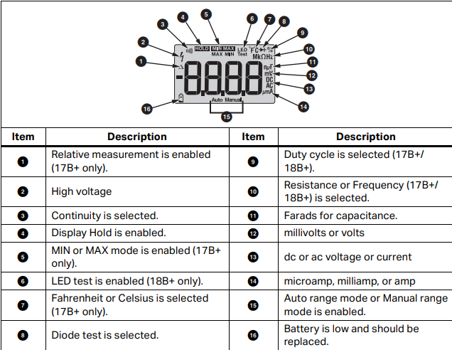

  1. Relative measurement is enabled
  2. High voltage
  3. Continuity is selected.
  4. Display Hold is enabled.
  5. MIN or MAX mode is enabled
  6. LED test is enabled
  7. Fahrenheit or Celsius is selected
  8. Diode test is selected.
  9. Duty cycle is selected
  10. Resistance or Frequency is selected.
  11. Farads for capacitance
  12. millivolts or volts
  13. dc or ac voltage or current[[d]](<#cmnt4>)
  14. microamp, milliamp, or amp
  15. Auto range mode or Manual range mode is enabled.
  16. The battery is low and should be replaced.

7.4.2 Multimeter Dial

  1. Off
  2. AC Voltage
  3. DC Voltage
  4. DC Milli Volts/AC Milli Volts
  5. Continuity and Resistance
  6. Capacitance Meter
  7. AC/DC Amps andAC/DC Milliamps
  8. AC/DC Microamps
  9. Temperature

7.4.3 Multimeter Buttons

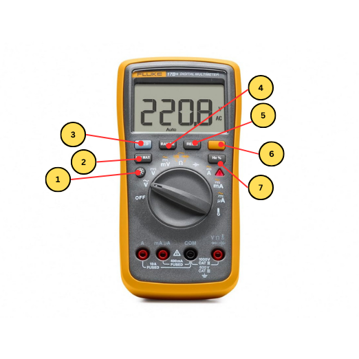

  1. Backlight
  2. Min/Maxmode
  3. Range Mode
  4. Relative Measurement Mode
  5. Shift Button
  6. Frequency Counter Duty Cycle

7.4.4 Terminals

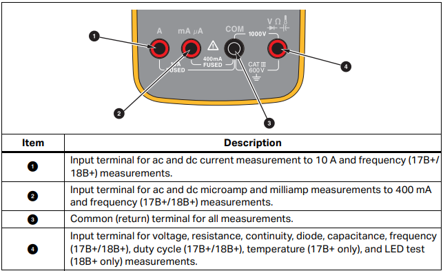

  1. Input terminal for ac and dc current measurement to 10 A and frequency measurements
  2. Input terminal for ac and dc microamp and milliamp measurements to 400 mA and frequency measurements.
  3. Common (return) terminal for all measurements.
  4. Input terminal for voltage, resistance, continuity, diode, capacitance, frequency, duty cycle , temperature, and LED test measurements.

## 

## 7.5 Basic Operating Workflow

## 7.5.1 Start-Up

  1. Make sure the testing leads are properly connected to the multimeter

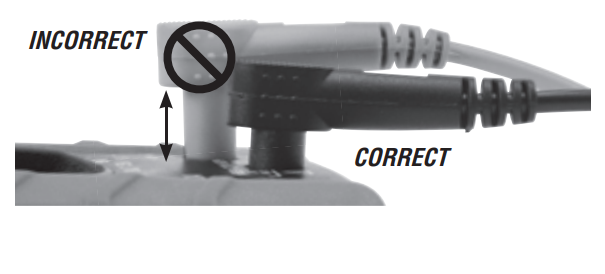

  2. Ensure the test lead shield is pressed firmly in place. Failure to use the CAT III / CAT IV shield increases arc-flash risk.

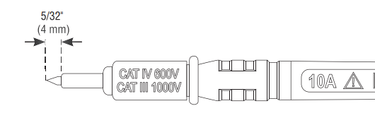

  3. CAT III / CAT IV shields may be removed for CAT II locations. This will allow testing on recessed conductors such as standard wall outlets. Take care not to lose the shields.

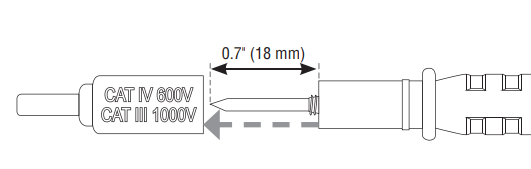

### 7.5.2 Running a Job

### Measuring AC and DC Voltage

  1. Turn the rotary switch to v, V, or mV to choose ac or dc [[e]](<#cmnt5>)
  2.  Push shift button to toggle between mVac or mVdc voltage measurement.
  3. Connect the red test lead to the test terminal and the black test lead to the COM terminal.
  4. Touch the probes to the correct test points of the circuit to measure the voltage
  5. Read the measured voltage on the display.

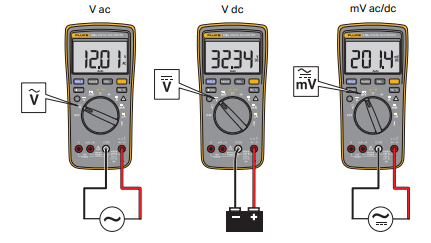

Measure AC or DC Current

  1. Turn the rotary switch to a, A, or mA
  2.  Push shift to toggle between ac or dc current measurement.
  3.  Connect the red test lead to the A or mA μA terminal based on the current to be measured and connect the black test lead to the COM terminal
  4. Break the circuit path to be measured. Then connect the test leads across the break and apply power.Read the measured current on the display.

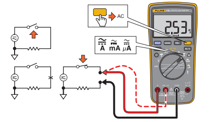

Measure Resistance

  1. Turn the rotary switch to Continuity and Resistance.[[f]](<#cmnt6>) Make sure power is disconnected from the circuit to be measured
  2. Connect the red test lead to the W terminal and the black test lead to the COM terminal.
  3. Measure the resistance by touching the probes to the desired test points of the circuit.
  4. Read the measured resistance on the display

Test for Continuity

  1. With the resistance mode selected, push the shift button once to activate the continuity beeper. If the resistance is <70 Ω, the beeper will sound continuously, designating a short circuit. 

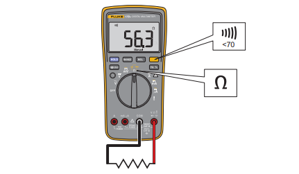

Test Diodes

  1. Turn the rotary switch to Continuity and Resistance[[g]](<#cmnt7>)
  2. Push D twice to activate Diode Test.
  3. Connect the red test lead to the W terminal and the black test lead to the COM terminal.
  4. Connect the red probe to the anode side and the black test lead to the cathode side of the diode being tested.
  5.  Read the forward bias voltage value on the display.

### 7.5.3 End-of-Job / Shutdown

  1. Turn off the multimeter[[h]](<#cmnt8>)
  2. Remove test leads from the multimeter and circuit
  3. Allow any tested components to cool or relax if necessary
  4. Clean up any debris or stray wires from the workspace
  5. Tidy workspace and store multimeter and test leads in their designated places

### 8. Weller 70 Watt Digital Soldering Station | WE1010NA

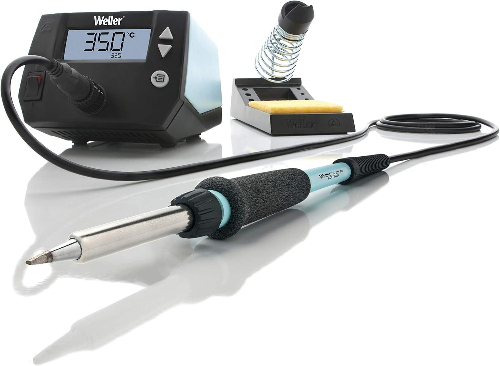

## 8.1 What This Machine Is For

Use this machine to:

  * Solder electronic components onto circuit boards
  * Remove (desolder) components from PCBs for repair or rework
  * Repair loose wires and connections
  * Install connectors and terminals
  * Create reliable solder joints for hobbyist and professional projects
  * Perform small metal joining tasks suitable for electronics
  * Heat shrink tubing (with caution, using the soldering iron as a heat source)

## 

## 8.2 What This Machine Is Not For

Do not use this machine for:

  * Soldering or joining large metal objects or heavy gauge wire beyond its rated capacity
  * Working on plumbing pipes or thick metal parts
  * Using as a general-purpose heat gun
  * Melting plastics, wood, or non-electronic materials
  * Substitution for welding equipment
  * Direct operation in environments with flammable gases or liquids

## 8.3 What You Need Before You Start

Before operating this machine, ensure:

  * Iron tip is clean and properly tinned before starting a job
  * Soldering station is placed on a stable, heat-resistant surface
  * Iron is securely placed in its holder when not in use
  * Use only lead-free solder or appropriate leaded solder, ensure ventilation if using leaded solder
  * Do not leave the soldering iron unattended while powered on
  * Avoid direct contact with the heated tip or metal parts
  * Use eye protection if necessary, especially when dealing with solder splashes
  * Disconnect power and let the station cool before changing tips or performing any maintenance
  * Work in a well-ventilated area to avoid inhaling fumes

### 

### 8.4 Specs

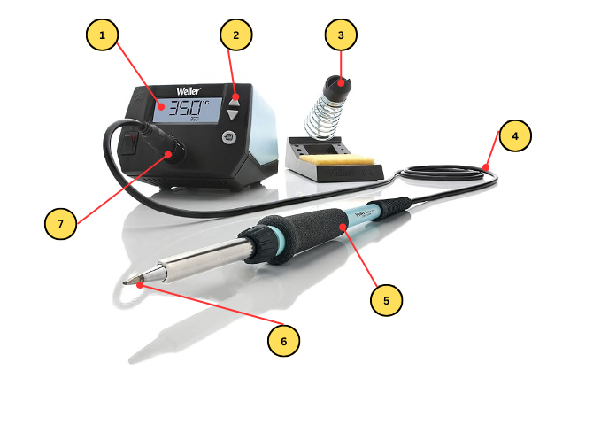

  1. Soldering Screen Display
  2. Temperature Parameter Switch
  3. Soldering Iron Stand
  4. High Temperature Resistant Wire
  5. Soldering Pen/Heating Core
  6. Soldering Iron Tip
  7. Soldering Pen Jack

## 8.5 Basic Operating Workflow

## 8.5.1 Start-Up

  1. Inspect workspace and soldering equipment for visible damage
  2. Power on the soldering station and allow it to reach the desired temperature
  3. Confirm correct temperature setting for your soldering job (typically 320–370°C for most electronics)
  4. Verify that the soldering iron tip is clean, properly tinned, and securely attached

### 8.5.2 Running a Job

  1. Prepare or position components for soldering on a breadboard or PCB
  2. Set the soldering station temperature to the appropriate level for your components and solder type
  3. Begin soldering; apply solder as required to component leads and pads
  4. Monitor solder joints visually and avoid prolonged heating

During operation, confirm that:

  1. No components are overheating or discoloring
  2. No unexpected smoke, burning, or unusual smells are present
  3. Solder joints are forming properly (shiny, solid, and not cold or cracked)
  4. Soldering station and iron operate normally (steady temperature, no equipment malfunction)

### 8.5.3 End-of-Job / Shutdown

  1. Turn off the soldering station and unplug if necessary
  2. Place iron in holder; allow tip and components to cool
  3. Clean soldering iron tip and remove any solder debris
  4. Disconnect circuit if needed
  5. Tidy workspace and store soldering equipment and tools in their designated places

### 

### 

### 9\. Oscilloscope

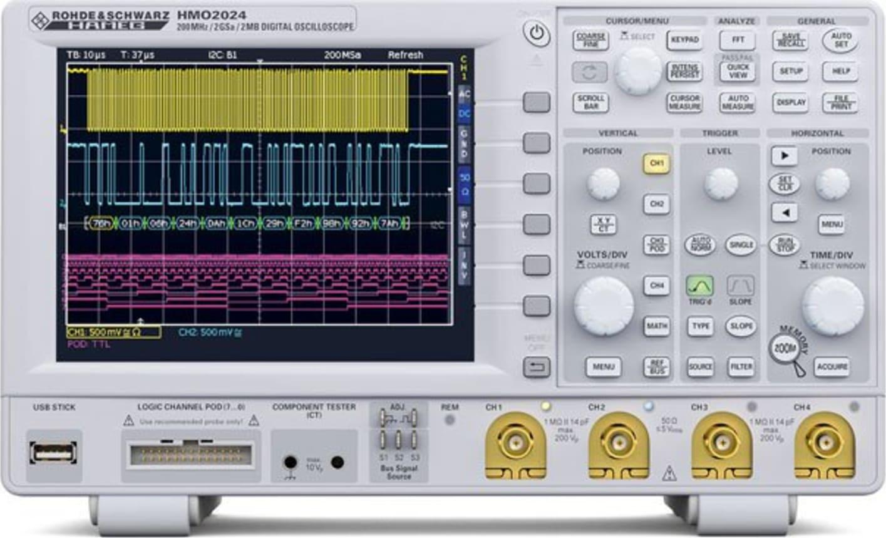

## 9.1 What This Machine Is For

Use this machine to:

  * Observe and visualize electrical signals (DC and AC waveforms) in electronic circuits
  * Analyze voltage over time to measure signal amplitude, frequency, and waveform shape
  * Diagnose timing, noise, or signal distortion issues in circuit operation
  * Compare multiple signals for troubleshooting and analysis (multi-channel operation)
  * Measure pulse widths, rise/fall times, and propagation delays
  * Detect glitches, anomalies, or unexpected transitions in digital or analog circuits

## 9.2 What This Machine Is Not For

Do not use this machine for:

  * Measuring non-electrical or mechanical properties
  * Testing circuits beyond rated voltage/current input (refer to section # for limits)
  * Precise measurement of resistance, current, capacitance, or inductance (use a multimeter or LCR meter)
  * Substitution for electrical safety equipment
  * Measuring signals outside the oscilloscope’s input bandwidth or voltage rating
  * Direct measurement on live mains power without proper, isolated probes

## 9.3 What You Need Before You Start

Before operating this machine, ensure:

  * Verify oscilloscope operation by checking a known signal (such as the calibration output)
  * Use only probes rated for your expected voltage and signal type
  * Probe assemblies intended for mains-level signals must meet EN61010-031 standards and be appropriately rated
  * Connect probes securely, and avoid touching probe metal contacts when measuring live signals
  * Do not open the oscilloscope while connected to live signals
  * Exercise caution when measuring voltages above 25V AC RMS or 60V DC; these pose a shock hazard
  * Do not attempt continuity or resistance measurements with the oscilloscope

## 9.4 Specs

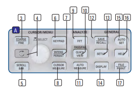

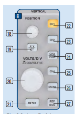

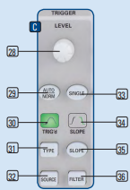

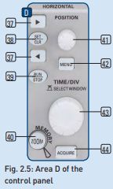

## 9.5 Basic Operating Workflow

## 9.5.1 Start-Up

  1. Inspect workspace and oscilloscope for visible damage
  2. Power on the oscilloscope and allow it to initialize
  3. Confirm correct settings (vertical/horizontal scales, trigger mode, probe attenuation) for your measurement
  4. Verify that oscilloscope probes are clean, intact, and securely connected to the correct channels

### 9.5.2 Running a Job

  1. Assemble or connect the circuit you wish to measure
  2. Set the oscilloscope parameters (voltage/div, time/div, trigger level, channel selection) for your application
  3. Connect probes to test points in the circuit; ensure proper grounding and safe probe placement
  4. Observe and monitor waveform readings on the display continuously

During operation, confirm that:

  1. No components, circuit, or oscilloscope are overheating
  2. No unexpected sparks, smoke, or unusual smells occur
  3. Waveforms are within expected ranges for amplitude, frequency, and shape
  4. Oscilloscope operates normally (stable display, no error codes or malfunctions)

### 9.5.3 End-of-Job / Shutdown

  1. Disconnect the probes from both the circuit and oscilloscope
  2. Turn off the oscilloscope
  3. Allow any components or probes to cool if necessary
  4. Clean and organize workspace, return probes and accessories to designated storage
  5. Tidy workspace and store oscilloscope in its designated place

10\. Benchtop Power Supplies

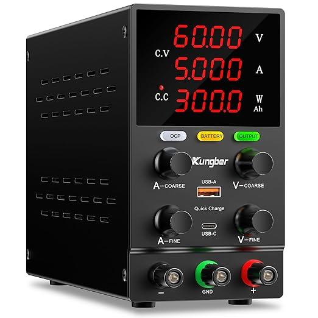

## 10.1 What This Machine Is For

Use this machine to:

  * Supply adjustable DC voltage and current to electronic circuits, devices, and prototypes
  * Test electronic components, modules, and systems with controlled power conditions
  * Simulate and troubleshoot circuit behavior at different voltage/current levels
  * Power breadboards, development boards, and microcontrollers during assembly and testing
  * Limit current to prevent overloading or damaging sensitive electronics
  * Check device power consumption by monitoring output voltage and current values

## 10.2 What This Machine Is Not For

Do not use this machine for:

  * Supplying AC voltage (not designed for AC loads)
  * Powering devices beyond the supply’s rated voltage/current output capacity
  * Charging batteries without a proper battery management circuit
  * Replacing safety equipment or circuit protection devices
  * Powering life-support, safety-critical, or high-power industrial systems
  * Using in environments with flammable gases or liquids

## 10.3 What You Need Before You Start

Before operating this machine, ensure:

  * Set output voltage and current limits according to your circuit requirements before enabling the supply
  * Use only cables and connectors rated for the expected voltage and current
  * Connect all loads securely and check for proper polarity before powering on
  * Verify the power supply operation with a known circuit or load
  * Do not touch exposed terminals when the machine is powered on
  * Avoid short circuits between output terminals; these can damage the supply or your circuit
  * Turn off and unplug the supply before making adjustments or performing maintenance

## 10.4 Specs

## 10.5 Basic Operating Workflow

## 10.5.1 Start-Up

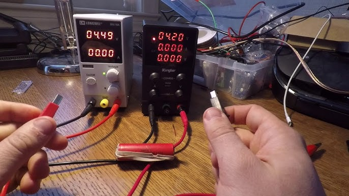

  1. Inspect workspace and bench top power supply for visible damage
  2. Power on the power supply and check for normal operation (display, indicator lights)
  3. Confirm correct settings (output voltage and current limits) for your intended application
  4. Verify that all output terminals, cables, and connectors are clean, securely attached, and properly insulated

### 10.5.2 Running a Job

  1. Assemble or connect your circuit to the power supply output terminals
  2. Set voltage and current limit parameters appropriate for your circuit
  3. Enable the power supply output (e.g., press ON or OUTPUT button)
  4. Monitor voltage and current readings on the display as your circuit operates

During operation, confirm that:

  1. No components, wires, or the power supply itself are overheating
  2. No unexpected sparks, smoke, or unusual smells are present
  3. Output voltage and current remain within expected and safe ranges
  4. Power supply operates normally (steady display, no error codes or malfunctions)

### 10.5.3 End-of-Job / Shutdown

  1. Disable power supply output
  2. Turn off the power supply
  3. Allow components and load devices to cool if needed
  4. Disconnect the circuit and tidy cables/connectors
  5. Clean workspace; return cables and power supply to designated storage

### 11\. SWM Hot Air Rework Station

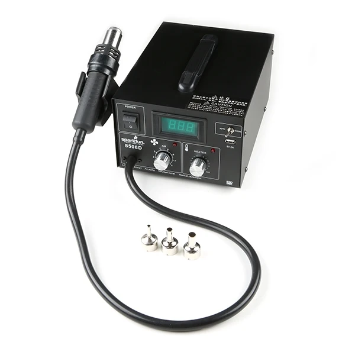

## 11.1 What This Machine Is For

Use this machine to:

  * Remove surface-mount components from printed circuit boards (PCBs)
  * Install surface-mount electronic parts using reflow soldering
  * Rework or repair faulty solder joints without direct contact
  * Shrink heat shrink tubing on wires and connectors
  * Loosen adhesives or soften plastics in electronics
  * Perform localized heating for electronics assembly and repair

## 11.2 What This Machine Is Not For

Do not use this machine for:

  * Heating large metal objects or performing general metalworking
  * Soldering through-hole components (use a soldering iron instead)
  * Melting plastics, wood, or materials not intended for electronics repair
  * Substitution for hot air guns in industrial or household tasks
  * Direct operation in environments with flammable gases or liquids
  * Heating batteries or sensitive components that may be damaged by high temperatures

## 11.3 What You Need Before You Start

Before operating this machine, ensure:

  * Set desired temperature and airflow according to the requirements of your components and materials
  * Use the appropriate nozzle for precision and safety
  * Work in a well-ventilated area to avoid inhaling fumes
  * Place the unit on a stable, heat-resistant surface
  * Make sure all nearby sensitive components are shielded from excess heat
  * Avoid direct contact with hot air nozzle and heated parts
  * Allow the station to cool down before changing nozzles or cleaning
  * Keep flammable materials away from the work area

## 11.4 Specs

## 11.5 Basic Operating Workflow

## 11.5.1 Start-Up

  1. Inspect workspace and hot air rework station for visible damage
  2. Power on the hot air rework station and allow it to initialize; check display (if present)
  3. Confirm correct settings for temperature and airflow for your intended application
  4. Verify that the hot air nozzle is clean, securely attached, and appropriate for the task

### 11.5.2 Running a Job

  1. Position components or circuit board for rework, removal, or installation
  2. Set the hot air station’s temperature and airflow to suit the component or solder type
  3. Begin rework—apply hot air to the targeted area, keeping nozzle at an appropriate distance
  4. Monitor affected components visually, and avoid excessive heat exposure

During operation, confirm that:

  1. No components or PCB areas are overheating, burning, or discoloring
  2. No unexpected smoke, smell, or melting occurs
  3. Solder joints flow properly (for installation), and parts come off cleanly (for removal)
  4. Hot air station operates normally (stable airflow and temperature, no malfunctions)

### 11.5.3 End-of-Job / Shutdown

  1. Turn off the hot air rework station and allow nozzle and components to cool
  2. Remove the nozzle if necessary, and safely store
  3. Clean workspace of any debris or removed components
  4. Disconnect circuit or PCB as needed
  5. Return hot air station and accessories to their designated storage locations

## 12\. User Responsibilities After Use

After using this machine, you are responsible for:

  * Cleaning the workspace (remove solder, clipped leads, wire scraps)
  * Returning tools, probes, and equipment to proper storage
  * Making sure equipment is turned off
  * Reporting any damaged equipment, abnormal behavior from equipment to staff
  * Logging usage is required by Fab Lab policy
  * Logging what was consumed is required

## 13\. Stop Conditions

Stop immediately and notify Fab Lab staff if:

  * You hear abnormal buzzing, popping, or crackling sound
  * You observe smoke, sparks, overheating, or burning odors
  * Equipment displays unexpected behavior or error messages
  * A fuse blows or equipment shuts off unexpectedly
  * You are unsure how to proceed safely

Do not attempt to troubleshoot major issues yourself.

## 14\. Common Issues & What To Do

Multimeter

  * Issue: Incorrect function/range selected
  * Action: Double-check and set proper function/range before measuring
  * Issue: Poor probe contact or damaged leads
  * Action: Inspect and replace probes/leads if damaged
  * Issue: Reading fluctuates or is inaccurate
  * Action: Zero/calibrate meter and verify connections

Oscilloscope 

  * Issue: No signal displayed
  * Action: Confirm signal source, probe, channel, and trigger settings
  * Issue: Signal noise/interference
  * Action: Adjust probe grounding and vertical/horizontal scales
  * Issue: Faulty probes or probe ground connection
  * Action: Replace or repair probes and ensure proper grounding
  * Issue: Calibration drift/accuracy loss
  * Action: Calibrate as per manufacturer’s instructions

Rework Station

  * Issue: Hot air gun temperature unstable or weak airflow
  * Action: Clean or replace air filters, check settings, replace damaged components
  * Issue: Damaged tips/nozzles
  * Action: Clean or replace tips/nozzles as required
  * Issue: Fume extraction inadequate
  * Action: Use or upgrade external fume extractor

Soldering Kit

  * Issue: Iron not reaching desired temperature
  * Action: Verify power and adjust temperature; replace element if needed
  * Issue: Dirty or worn-out tips
  * Action: Clean tip with brass wool/sponge or replace
  * Issue: Solder not flowing (poor wetting)
  * Action: Use correct solder and flux, ensure tip is clean and hot

Benchtop Power Supply

  * Issue: No output or unstable voltage/current
  * Action: Confirm settings and output connections; troubleshoot circuit
  * Issue: Overload/short-circuit protection triggers unexpectedly
  * Action: Check for shorts or overload and adjust current limit
  * Issue: Displays inaccurate values
  * Action: Calibrate or verify accuracy with a multimeter
  * Issue: Excessive heating or fan noise
  * Action: Ensure proper ventilation; clean fan/filter

## 15\. External Resources

For more detailed information, refer to:

## 16\. Questions or Help

If you have questions or need assistance at any point, ask a Fab Lab staff member. Staff are always present during operating hours.

* * *

End of Operations Manual

[[a]](<#cmnt_ref1>)wrong section

[[b]](<#cmnt_ref2>)number

[[c]](<#cmnt_ref3>)link these if mentioned

[[d]](<#cmnt_ref4>)reword

[[e]](<#cmnt_ref5>)select your blank, or something

[[f]](<#cmnt_ref6>)bold don't change font type

[[g]](<#cmnt_ref7>)formatting

[[h]](<#cmnt_ref8>)mention the off position, thats the whole point of that section. ofc this a very simple example